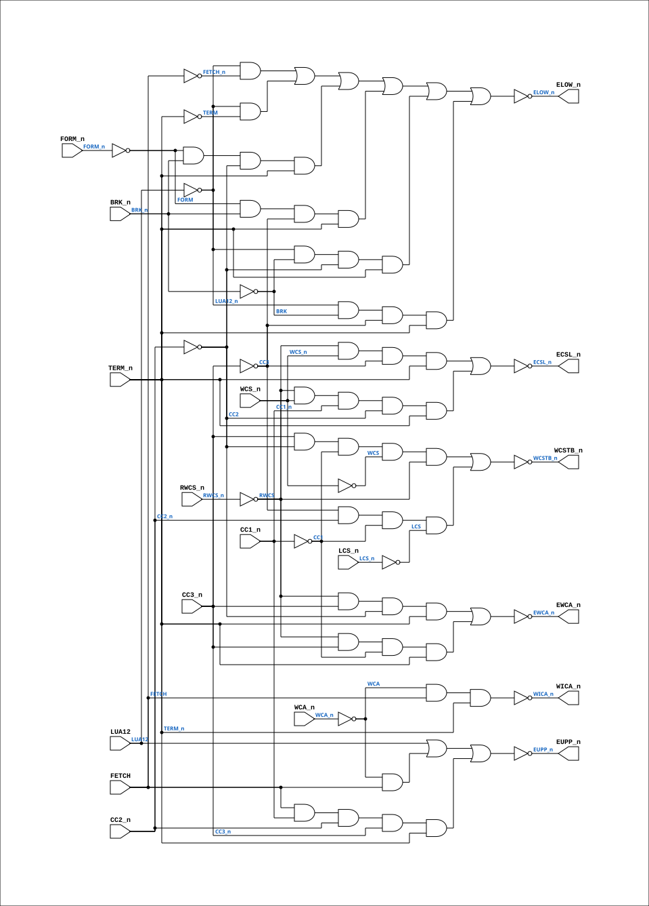

# PAL_44305D

Source: `Verilog/PAL/PAL_44305D.v`

<!-- Generated by Verilog/tests/module_doc.py from the //! comments in the source. Do not edit by hand - edit the RTL comments and regenerate. -->

<!-- HIERARCHY-NAV:BEGIN - written by Verilog/tests/gen_hierarchy.py, do not edit -->

**Where it sits** (Simulation): [ND120_TOP](../../doc/ND120_TOP.md) > [ND120_CORE](../../doc/ND120_CORE.md) > [ND3202D](../../CPU-BOARD-3202/circuit/doc/ND3202D.md) > [CPU_15](../../CPU-BOARD-3202/circuit/doc/CPU_15.md) > [CPU_CS_16](../../CPU-BOARD-3202/circuit/doc/CPU_CS_16.md) > [CPU_CS_CTL_18](../../CPU-BOARD-3202/circuit/doc/CPU_CS_CTL_18.md) > **PAL_44305D**
- instance path: `CORE.CPU_BOARD.CPU.CS.CTL.PAL_44305_UCSCTL`

**Used in:** [CPU_CS_CTL_18](../../CPU-BOARD-3202/circuit/doc/CPU_CS_CTL_18.md) (all tops)

**Contains:** no other modules.

[Module hierarchy](../../HIERARCHY.md) - [All modules](../../MODULES.md)

<!-- HIERARCHY-NAV:END -->


<!-- SCHEMATIC:BEGIN - written by Verilog/tests/gen_schematics.py, do not edit -->

## Schematic

Drawn from the Verilog: the yosys netlist of the Simulation (Verilator) build, instance `CORE.CPU_BOARD.CPU.CS.CTL.PAL_44305_UCSCTL`. Sub-modules are boxes (click the picture to open it full size; there every sub-module box links to its page, and every wire shows its Verilog name).

[](PAL_44305D.svg)

<!-- SCHEMATIC:END -->

## Description

ND120 PALASM CODE CONVERTED TO VERILOG
Component PAL 44305D
Last reviewed: 2-FEB-2025
Ronny Hansen

## Ports

| Direction | Width | Name | Description |
|---|---|---|---|
| input | `1` | `FORM_n` *(active low)* | I0 |
| input | `1` | `CC1_n` *(active low)* | I1 - Cycle Control 1 (b+c+d+e+j+k+l+m) |
| input | `1` | `CC2_n` *(active low)* | I2 - Cycle control 2 (e+f+g+h+i+j+k) |
| input | `1` | `CC3_n` *(active low)* | I3 - Cycle Control 3 (h+i+j+k+l+m+n+o) |
| input | `1` | `LCS_n` *(active low)* | I4 - Load Control Store (negated) |
| input | `1` | `RWCS_n` *(active low)* | I5 - Read/Write Control Store (low=write) |
| input | `1` | `WCS_n` *(active low)* | I6 - Write Control Store (negated) |
| input | `1` | `FETCH` | I7 - Fetch macrocode |
| input | `1` | `BRK_n` *(active low)* | I8 - Break signal, active low, used to interrupt normal operation for debugging or error handling. |
| input | `1` | `TERM_n` *(active low)* | I9 - Terminate signal, active-low |
| output | `1` | `WICA_n` *(active low)* | Y0_n - WRITE PULSE TO MICROINSTRUCTION CACHE |
| output | `1` | `WCSTB_n` *(active low)* | Y1_n - (e+f) WRITE PULSE TO WRITEABLE \| (m+n) WRITE PULSE DURING LOAD CONTROL |
| output | `1` | `ECSL_n` *(active low)* | Enable Control Store LOWER (CSL negated)  B0_n - READ CONTROL STORE HOLD \| HOLD OVERLAP WITH EWCA_n |
| output | `1` | `EWCA_n` *(active low)* | Enable WCA reg in mic onto MA       B1_n - ENABLE WCA REG. IN MIC ONTO MA \|  AVOID BLIP ON NEXT CYCLE |
| output | `1` | `EUPP_n` *(active low)* | Enable Upper                        B2_n - NORMAL ADDRESSING \| WRITE INTO MICROINSTRUCTION CACHE \| ENABLE IN THE FIRST 50NS |
| output | `1` | `ELOW_n` *(active low)* | Enable Low                          B3_n - NORMAL ADDRESSING. ON FETCH EITHER MI \|  ENABLE ACCORDING TO LUA12 BEFORE FETCH \| OR A MAP IS USED. \|  DO A MAP \| ON BRK: USE BANK SELECTED BY LUA12. |
| input | `1` | `WCA_n` *(active low)* | B4_n - WRITE INTO MICROINSTRUCTION CACHE (negated) |
| input | `1` | `LUA12` | B5_n - Low Unit Address. Select RAM bank (0=lower,1=upper) |

## Verilog source

[`Verilog/PAL/PAL_44305D.v`](https://github.com/RetroCoreLabs/nd-120/blob/main/Verilog/PAL/PAL_44305D.v) on GitHub.

<details markdown="1">
<summary>Show the Verilog of PAL_44305D (101 lines)</summary>

```verilog
/**********************************************************************************************************
** ND120 PALASM CODE CONVERTED TO VERILOG                                                                **
**                                                                                                       **
** Component PAL 44305D                                                                                  **
**                                                                                                       **
** Last reviewed: 2-FEB-2025                                                                             **
** Ronny Hansen                                                                                          **
***********************************************************************************************************/


// PAL16L8
// JLB 26NOV86
// PAL 44305D,15F,CSCTL (CONTROL STORE CONTROL)

module PAL_44305D (
    input FORM_n,  //! I0
    input CC1_n,   //! I1 - Cycle Control 1 (b+c+d+e+j+k+l+m)
    input CC2_n,   //! I2 - Cycle control 2 (e+f+g+h+i+j+k)
    input CC3_n,   //! I3 - Cycle Control 3 (h+i+j+k+l+m+n+o)
    input LCS_n,   //! I4 - Load Control Store (negated)
    input RWCS_n,  //! I5 - Read/Write Control Store (low=write)
    input WCS_n,   //! I6 - Write Control Store (negated)
    input FETCH,   //! I7 - Fetch macrocode
    input BRK_n,   //! I8 - Break signal, active low, used to interrupt normal operation for debugging or error handling.
    input TERM_n,  //! I9 - Terminate signal, active-low

    output WICA_n,  //! Y0_n - WRITE PULSE TO MICROINSTRUCTION CACHE
    output WCSTB_n, //! Y1_n - (e+f) WRITE PULSE TO WRITEABLE | (m+n) WRITE PULSE DURING LOAD CONTROL

    output ECSL_n,  //! Enable Control Store LOWER (CSL negated)  B0_n - READ CONTROL STORE HOLD | HOLD OVERLAP WITH EWCA_n
    output EWCA_n,  //! Enable WCA reg in mic onto MA       B1_n - ENABLE WCA REG. IN MIC ONTO MA |  AVOID BLIP ON NEXT CYCLE
    output EUPP_n,  //! Enable Upper                        B2_n - NORMAL ADDRESSING | WRITE INTO MICROINSTRUCTION CACHE | ENABLE IN THE FIRST 50NS 
    output ELOW_n,  //! Enable Low                          B3_n - NORMAL ADDRESSING. ON FETCH EITHER MI |  ENABLE ACCORDING TO LUA12 BEFORE FETCH | OR A MAP IS USED. |  DO A MAP | ON BRK: USE BANK SELECTED BY LUA12.

    input WCA_n,  //! B4_n - WRITE INTO MICROINSTRUCTION CACHE (negated)
    input LUA12   //! B5_n - Low Unit Address. Select RAM bank (0=lower,1=upper)
);

  // Inverted input signals for active-high usage
  wire FORM = ~FORM_n;
  wire CC1 = ~CC1_n;
  wire CC2 = ~CC2_n;
  wire CC3 = ~CC3_n;
  wire LCS = ~LCS_n;
  wire RWCS = ~RWCS_n;
  wire WCS = ~WCS_n;
  wire BRK = ~BRK_n;
  wire WCA = ~WCA_n;
  wire TERM = ~TERM_n;

  wire FETCH_n = ~FETCH;
  wire LUA12_n = ~LUA12;

  // Logic for WICA_n (active-low)
  assign WICA_n = ~(WCA & FETCH & TERM_n);  // WRITE PULSE TO MICROINSTRUCTION CACHE

  // Logic for WCSTB_n (active-low)
  assign WCSTB_n = ~((CC3_n & CC2 & CC1 & WCS & RWCS) |     // e+f WRITE PULSE TO WRITEABLE
      (CC3 & CC2_n & CC1 & LCS));                           // m+n WRITE PULSE DURING LOAD CONTROL

  // Logic for ECSL_n (active-low)
  assign ECSL_n = ~((RWCS & WCS_n & CC3 & TERM_n) |     // READ CONTROL STORE HOLD
      (RWCS & WCS_n & CC1_n & CC2 & TERM_n));           // HOLD OVERLAP WITH EWCA_n

  // Logic for EWCA_n (active-low)
  assign EWCA_n = ~((RWCS & CC3_n & CC2 & TERM_n) |     // ENABLE WCA REG. IN MIC ONTO MA
      (RWCS & CC3_n & CC1 & TERM_n));                  // AVOID BLIP ON NEXT CYCLE

  // Logic for EUPP_n (active-low)
  assign EUPP_n = ~(LUA12 |                     // NORMAL ADDRESSING
      (WCA & FETCH) |                           // WRITE INTO MICROINSTRUCTION CACHE
      (FETCH & CC1_n & CC2_n & CC3_n & TERM_n)  // ENABLE IN THE FIRST 50NS
      );  // + HOLD TIME = 75NS

  // Logic for ELOW_n (active-low)
  assign ELOW_n = ~((LUA12_n & FETCH_n) |   // NORMAL ADDRESSING. ON FETCH EITHER MI
      (LUA12_n & TERM) |                    // ENABLE ACCORDING TO LUA12 BEFORE FETCH
      (FORM & BRK_n & CC2 & TERM_n) |       // OR A MAP IS USED.
      (FORM & BRK_n & CC3 & TERM_n) |       // DO A MAP
      (LUA12_n & BRK & CC2 & TERM_n) |      // ON BRK: USE BANK SELECTED BY LUA12.
      (LUA12_n & BRK & CC3 & TERM_n));      //

endmodule

/*
DESCRIPTION

; 130387 JLB: ELOW ALWAYS ENABLED ON TERM IF LUA12 IS LOW.
; MAY SPEED UP NON FETCH CYCLES.

; 180587 3202B
; 090687 JLB: EWCA MUST NOT BE ENABLED DURING a AND b. WILL CREATE BLIP ON
; NEXT CYCLE.
; 090687 JLB: ECSL HOLD IN g AND h.
; 030987 JLB: WRITE IN CONTROL STORE DOES NOT WORK. WRITE PULSE STARTS TOO
; SOON. WCSTB CHANGED TO e+f IN THIS CASE, AND TO m+n DURING LCS
; TO BE ABLE TO USE 250ns PROMS.


*/
```

</details>
