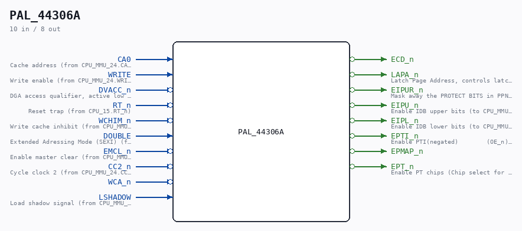

# PAL_44306A

Source: `Verilog/PAL/PAL_44306A.v`

> Generated by `Verilog/tests/module_doc.py` from the `//!`
> comments in the source. Do not edit by hand - edit the RTL comments and regenerate.

<!-- HIERARCHY-NAV:BEGIN - written by Verilog/tests/gen_hierarchy.py, do not edit -->

**Where it sits** (Simulation): [ND120_TOP](../../doc/ND120_TOP.md) > [ND120_CORE](../../doc/ND120_CORE.md) > [ND3202D](../../CPU-BOARD-3202/circuit/doc/ND3202D.md) > [CPU_15](../../CPU-BOARD-3202/circuit/doc/CPU_15.md) > [CPU_MMU_24](../../CPU-BOARD-3202/circuit/doc/CPU_MMU_24.md) > **PAL_44306A**
- instance path: `CORE.CPU_BOARD.CPU.MMU.PAL_44306_UNOCTL`

**Used in:** [CPU_MMU_24](../../CPU-BOARD-3202/circuit/doc/CPU_MMU_24.md) (all tops)

**Contains:** no other modules.

[Module hierarchy](../../HIERARCHY.md) - [All modules](../../MODULES.md)

<!-- HIERARCHY-NAV:END -->

## Description

ND120 PALASM CODE CONVERTED TO VERILOG
Component PAL 44306A
Last reviewed: 19-JAN-2025
Ronny Hansen

## Ports

| Direction | Width | Name | Description |
|---|---|---|---|
| input | `1` | `CA0` |  |
| input | `1` | `WRITE` |  |
| input | `1` | `DVACC_n` *(active low)* |  |
| input | `1` | `RT_n` *(active low)* |  |
| input | `1` | `WCHIM_n` *(active low)* |  |
| input | `1` | `DOUBLE` |  |
| input | `1` | `EMCL_n` *(active low)* |  |
| input | `1` | `CC2_n` *(active low)* |  |
| input | `1` | `WCA_n` *(active low)* |  |
| input | `1` | `LSHADOW` |  |
| output | `1` | `ECD_n` *(active low)* |  |
| output | `1` | `LAPA_n` *(active low)* |  |
| output | `1` | `EIPUR_n` *(active low)* |  |
| output | `1` | `EIPU_n` *(active low)* |  |
| output | `1` | `EIPL_n` *(active low)* |  |
| output | `1` | `EPTI_n` *(active low)* |  |
| output | `1` | `EPMAP_n` *(active low)* |  |
| output | `1` | `EPT_n` *(active low)* |  |
