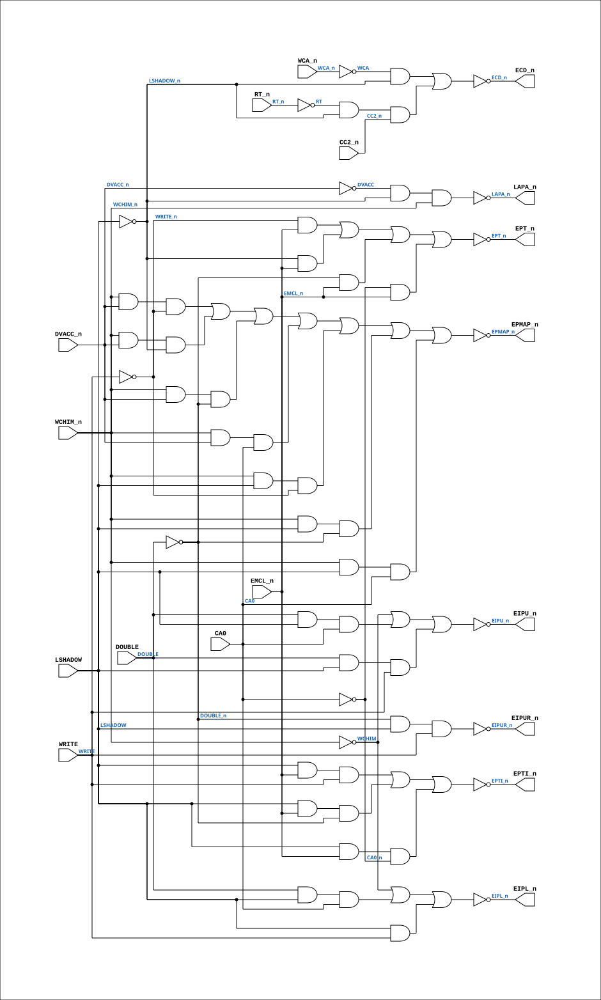

# PAL_44306A

Source: `Verilog/PAL/PAL_44306A.v`

<!-- Generated by Verilog/tests/module_doc.py from the //! comments in the source. Do not edit by hand - edit the RTL comments and regenerate. -->

<!-- HIERARCHY-NAV:BEGIN - written by Verilog/tests/gen_hierarchy.py, do not edit -->

**Where it sits** (Simulation): [ND120_TOP](../../doc/ND120_TOP.md) > [ND120_CORE](../../doc/ND120_CORE.md) > [ND3202D](../../CPU-BOARD-3202/circuit/doc/ND3202D.md) > [CPU_15](../../CPU-BOARD-3202/circuit/doc/CPU_15.md) > [CPU_MMU_24](../../CPU-BOARD-3202/circuit/doc/CPU_MMU_24.md) > **PAL_44306A**
- instance path: `CORE.CPU_BOARD.CPU.MMU.PAL_44306_UNOCTL`

**Used in:** [CPU_MMU_24](../../CPU-BOARD-3202/circuit/doc/CPU_MMU_24.md) (all tops)

**Contains:** no other modules.

[Module hierarchy](../../HIERARCHY.md) - [All modules](../../MODULES.md)

<!-- HIERARCHY-NAV:END -->


<!-- SCHEMATIC:BEGIN - written by Verilog/tests/gen_schematics.py, do not edit -->

## Schematic

Drawn from the Verilog: the yosys netlist of the Simulation (Verilator) build, instance `CORE.CPU_BOARD.CPU.MMU.PAL_44306_UNOCTL`. Sub-modules are boxes (click the picture to open it full size; there every sub-module box links to its page, and every wire shows its Verilog name).

[](PAL_44306A.svg)

<!-- SCHEMATIC:END -->

## Description

ND120 PALASM CODE CONVERTED TO VERILOG
Component PAL 44306A
Last reviewed: 19-JAN-2025
Ronny Hansen

## Ports

| Direction | Width | Name | Description |
|---|---|---|---|
| input | `1` | `CA0` | Cache address (from CPU_MMU_24.CA_10_0[0]) |
| input | `1` | `WRITE` | Write enable (from CPU_MMU_24.WRITE) |
| input | `1` | `DVACC_n` *(active low)* | DGA access qualifier, active low (see comment above) (from CPU_MMU_24.DVACC_n) |
| input | `1` | `RT_n` *(active low)* | Reset trap (from CPU_15.RT_n) |
| input | `1` | `WCHIM_n` *(active low)* | Write cache inhibit (from CPU_MMU_24.WCHIM_n) |
| input | `1` | `DOUBLE` | Extended Adressing Mode (SEXI) (from CPU_MMU_24.DOUBLE) |
| input | `1` | `EMCL_n` *(active low)* | Enable master clear (from CPU_MMU_24.EMCL_n) |
| input | `1` | `CC2_n` *(active low)* | Cycle clock 2 (from CPU_MMU_24.CC2_n) |
| input | `1` | `WCA_n` *(active low)* |  |
| input | `1` | `LSHADOW` | Load shadow signal (from CPU_MMU_24.LSHADOW) |
| output | `1` | `ECD_n` *(active low)* |  |
| output | `1` | `LAPA_n` *(active low)* | Latch Page Address, controls latching of the page address (to CPU_MMU_24.LAPA_n) |
| output | `1` | `EIPUR_n` *(active low)* | Mask away the PROTECT BITS in PPN (PPN 25:19 == 000000) (to CPU_MMU_PPNX_28.EIPUR_n) |
| output | `1` | `EIPU_n` *(active low)* | Enable IDB upper bits (to CPU_MMU_PPNX_28.EIPU_n) |
| output | `1` | `EIPL_n` *(active low)* | Enable IDB lower bits (to CPU_MMU_PPNX_28.EIPL_n) |
| output | `1` | `EPTI_n` *(active low)* | Enable PTI(negated)        (OE_n) (to CPU_MMU_PTIDB_30.EPTI_n) |
| output | `1` | `EPMAP_n` *(active low)* |  |
| output | `1` | `EPT_n` *(active low)* | Enable PT chips (Chip select for PT chips). (to CPU_MMU_PT_29.EPT_n) |

## Verilog source

[`Verilog/PAL/PAL_44306A.v`](https://github.com/RetroCoreLabs/nd-120/blob/main/Verilog/PAL/PAL_44306A.v) on GitHub.

<details markdown="1">
<summary>Show the Verilog of PAL_44306A (99 lines)</summary>

```verilog
/**********************************************************************************************************
** ND120 PALASM CODE CONVERTED TO VERILOG                                                                **
**                                                                                                       **
** Component PAL 44306A                                                                                  **
**                                                                                                       **
** Last reviewed: 19-JAN-2025                                                                            **
** Ronny Hansen                                                                                          **
**
***********************************************************************************************************/

// 44306A,21G,MMUCTL - MMU CONTROL LOGIC

module PAL_44306A (
    input CA0,  //! Cache address (from CPU_MMU_24.CA_10_0[0])
    input WRITE,  //! Write enable (from CPU_MMU_24.WRITE)
    input DVACC_n,  //! DGA access qualifier, active low (see comment above) (from CPU_MMU_24.DVACC_n)
    input RT_n,  //! Reset trap (from CPU_15.RT_n)
    input WCHIM_n,  //! Write cache inhibit (from CPU_MMU_24.WCHIM_n)
    input DOUBLE,  //! Extended Adressing Mode (SEXI) (from CPU_MMU_24.DOUBLE)
    input EMCL_n,  //! Enable master clear (from CPU_MMU_24.EMCL_n)
    input CC2_n,  //! Cycle clock 2 (from CPU_MMU_24.CC2_n)
    input WCA_n,
    input LSHADOW,  //! Load shadow signal (from CPU_MMU_24.LSHADOW)

    output ECD_n,
    output LAPA_n,  //! Latch Page Address, controls latching of the page address (to CPU_MMU_24.LAPA_n)
    output EIPUR_n,  //! Mask away the PROTECT BITS in PPN (PPN 25:19 == 000000) (to CPU_MMU_PPNX_28.EIPUR_n)
    output EIPU_n,  //! Enable IDB upper bits (to CPU_MMU_PPNX_28.EIPU_n)
    output EIPL_n,  //! Enable IDB lower bits (to CPU_MMU_PPNX_28.EIPL_n)
    output EPTI_n,  //! Enable PTI(negated)        (OE_n) (to CPU_MMU_PTIDB_30.EPTI_n)
    output EPMAP_n,
    output EPT_n  //! Enable PT chips (Chip select for PT chips). (to CPU_MMU_PT_29.EPT_n)
);

  // Creating non-negated wires for active-low inputs
  wire DVACC = ~DVACC_n;
  wire RT = ~RT_n;
  wire WCHIM = ~WCHIM_n;
  wire DOUBLE_n = ~DOUBLE;
  wire WCA = ~WCA_n;

  wire CA0_n = ~CA0;
  wire WRITE_n = ~WRITE;
  wire LSHADOW_n = ~LSHADOW;


  // MEMORY MANAGEMENT CONTROL

  // Logic for ECD_n (active-low)
  assign ECD_n = ~((WCA & LSHADOW_n) |  // DISABLE CACHE ON SHADOW ACCESSES
      (RT & LSHADOW_n & CC2_n));  // ENABLE WHEN WRITING IN CACHE

  // Logic for LAPA_n (active-low)
  assign LAPA_n = ~(DVACC & LSHADOW_n & WCHIM_n);  // LA TO PPN WHEN VIRTUAL ACCESSES ARE DISABLED

  // Logic for EIPUR_n (active-low)
  assign EIPUR_n = ~(DOUBLE_n & LSHADOW & WRITE);     // WRITING IN SHADOW IN REX MODE WILL MASK AWAY THE PROTECT BITS

  // Logic for EIPU_n (active-low)
  assign EIPU_n = ~((WCHIM) |  // PASS PAGE NUMBER TO BE INHIBITED FROM IDB
      (DOUBLE & LSHADOW & CA0) |  // SHADOW ACCESSES IN SEX MODE
      (DOUBLE & LSHADOW & WRITE));      // WRITING IN SHADOW IN SEX MODE WILL WRITE A FULL BIT PAGE NUMBER

  // Logic for EIPL_n (active-low)
  // PALASM 44306A: third term is LSHADOW * WRITE (no DOUBLE) - the lower PPN
  // byte is written on every shadow write, REX and SEX alike. An extra
  // DOUBLE term here left the PPN map RAM unwritten in REX mode (physical
  // page always 0 when paging is on).
  assign EIPL_n = ~((WCHIM) |  // PASS PAGE NUMBER TO BE INHIBITED FROM IDB
      (DOUBLE & LSHADOW & CA0) |  // SHADOW ACCESSES IN SEX MODE
      (LSHADOW & WRITE));  // WRITING LOWER BYTE (SAME FOR REX AND SEX)

  // Logic for EPTI_n (active-low)
  assign EPTI_n = ~((LSHADOW & EMCL_n & WRITE) |  // DISABLE DURING EMCL TO AVOID JAMMING THE IDB
      (LSHADOW & EMCL_n & DOUBLE_n) |  // ENABLE ONLY WHEN IN SHADOW
      (LSHADOW & EMCL_n & CA0_n));  // DISABLE WHEN IN SEX MODE WE ARE READ/FETCHING ADDRESSES

  // Logic for EPMAP_n (active-low) - Enable PAGE MAP RAM (PPN23-10) in PT module
  assign EPMAP_n = ~
  (
      (WCHIM_n & DVACC_n & WRITE_n)   |  // DISABLE WHEN WRITING THE CACHE INHIBIT MAP
      (WCHIM_n & DVACC_n & LSHADOW_n) |  // DISABLE WHEN VIRTUAL ACCESS IS DISABLED
      (WCHIM_n & DVACC_n & DOUBLE_n)  |  // ACCESSING SHADOW MEMORY
      (WCHIM_n & DVACC_n & CA0)       |  // DISABLE ON SHADOW MEMORY WRITE IN SEX MODE
      (WCHIM_n & LSHADOW & WRITE_n)   |  // ADDRESSES
      (WCHIM_n & LSHADOW & DOUBLE_n)  |
      (WCHIM_n & LSHADOW & CA0)
);

  // Logic for EPT_n (active-low) - Enable "Page Table" RAM in PT module
  assign EPT_n = ~
  (
    (WRITE_n & EMCL_n)   |  // DISABLE ON EMCL OR
    (LSHADOW_n & EMCL_n) |  // WRITING IN OTHER HALF
    (DOUBLE_n & EMCL_n)  |  // WHEN IN SEX MODE
    (CA0_n & EMCL_n)
  );

endmodule
```

</details>
