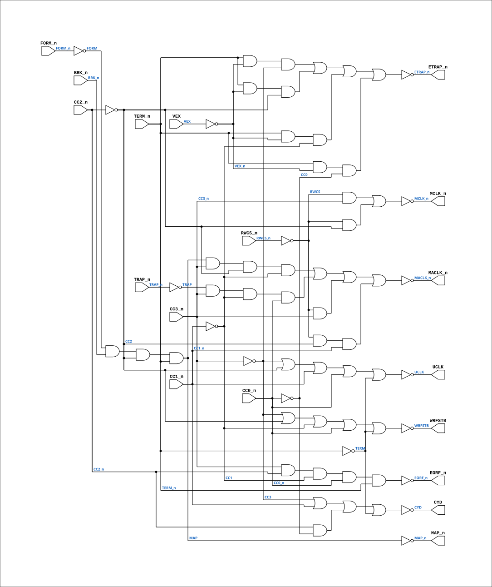

# PAL_44307C

Source: `Verilog/PAL/PAL_44307C.v`

<!-- Generated by Verilog/tests/module_doc.py from the //! comments in the source. Do not edit by hand - edit the RTL comments and regenerate. -->

<!-- HIERARCHY-NAV:BEGIN - written by Verilog/tests/gen_hierarchy.py, do not edit -->

**Where it sits** (Simulation): [ND120_TOP](../../doc/ND120_TOP.md) > [ND120_CORE](../../doc/ND120_CORE.md) > [ND3202D](../../CPU-BOARD-3202/circuit/doc/ND3202D.md) > [CYC_36](../../CPU-BOARD-3202/circuit/doc/CYC_36.md) > **PAL_44307C**
- instance path: `CORE.CPU_BOARD.CYC.PAL_44307_UCYCLK_NEXT`

**Used in:** [CYC_36](../../CPU-BOARD-3202/circuit/doc/CYC_36.md) (all tops)

**Contains:** no other modules.

[Module hierarchy](../../HIERARCHY.md) - [All modules](../../MODULES.md)

<!-- HIERARCHY-NAV:END -->


<!-- SCHEMATIC:BEGIN - written by Verilog/tests/gen_schematics.py, do not edit -->

## Schematic

Drawn from the Verilog: the yosys netlist of the Simulation (Verilator) build, instance `CORE.CPU_BOARD.CYC.PAL_44307_UCYCLK_NEXT`. Sub-modules are boxes (click the picture to open it full size; there every sub-module box links to its page, and every wire shows its Verilog name).

[](PAL_44307C.svg)

<!-- SCHEMATIC:END -->

## Description

ND120 PALASM CODE CONVERTED TO VERILOG
Component PAL 44307C
Last reviewed: 22-MAR-2025
Ronny Hansen

## Ports

| Direction | Width | Name | Description |
|---|---|---|---|
| input | `1` | `TERM_n` *(active low)* | I0 Bus Cycle Terminate |
| input | `1` | `CC0_n` *(active low)* | I1 Cycle Clock 0 |
| input | `1` | `CC1_n` *(active low)* | I2 Cycle Clock 1 |
| input | `1` | `CC2_n` *(active low)* | I3 Cycle Clock 2 |
| input | `1` | `CC3_n` *(active low)* | I4 Cycle Clock 3 |
| input | `1` | `FORM_n` *(active low)* | I5 Form |
| input | `1` | `BRK_n` *(active low)* | I6 Break |
| input | `1` | `RWCS_n` *(active low)* | I7 Read Write Cycle Start |
| input | `1` | `TRAP_n` *(active low)* | I8 Trap |
| input | `1` | `VEX` | I9 Vector Exception (Disable Traps) |
| output | `1` | `MCLK_n` *(active low)* | Y0_n - MCLK_n    Microcycle clock (negated). = TERM outside RWCS; stretched during RWCS. |
| output | `1` | `MACLK_n` *(active low)* | Y1_n - MACLK_n   Micro-address latch strobe (negated). Latch enable for the control-store address latches (ACAL). |
| output | `1` | `WRFSTB` | B0_n - WRFSTB    UNKNOWN function. Fires in state 0001 of most cycle kinds. |
| output | `1` | `CYD` | B1_n - CYD_n     UNKNOWN function. Listing comment: "WRITE PULSE USED IN WMAP AND WCA" (the memory map and the microinstruction cache |

## Verilog source

[`Verilog/PAL/PAL_44307C.v`](https://github.com/RetroCoreLabs/nd-120/blob/main/Verilog/PAL/PAL_44307C.v) on GitHub.

<details markdown="1">
<summary>Show the Verilog of PAL_44307C (154 lines)</summary>

```verilog
/**********************************************************************************************************
** ND120 PALASM CODE CONVERTED TO VERILOG                                                                **
**                                                                                                       **
** Component PAL 44307C                                                                                  **
**                                                                                                       **
** Last reviewed: 22-MAR-2025                                                                            **
** Ronny Hansen                                                                                          **
***********************************************************************************************************/

// PAL16L8
// JLB 26NOV86
// 44307C,13D,CYCLK


// 10 Bit input signals (I0-I9)
//

//   /TERM /CC0 /CC1 /CC2 /CC3 /FORM /BRK /RWCS /TRAP GND
//   VEX /MACLK /MAP /ETRAP UCLK /EORF CYD WRFSTB /MCLK VCC

module PAL_44307C(
    input TERM_n,    //! I0 Bus Cycle Terminate
    input CC0_n,     //! I1 Cycle Clock 0
    input CC1_n,     //! I2 Cycle Clock 1
    input CC2_n,     //! I3 Cycle Clock 2
    input CC3_n,     //! I4 Cycle Clock 3
    input FORM_n,    //! I5 Form
    input BRK_n,     //! I6 Break
    input RWCS_n,    //! I7 Read Write Cycle Start
    input TRAP_n,    //! I8 Trap
    input VEX,       //! I9 Vector Exception (Disable Traps)

    // NAMING (corrected 08-AUG-2026 - the old names were guesses and they
    // actively misled debugging of the control-store readback path):
    //
    //   MCLK  = MICROCYCLE CLOCK, not "Main Clock". Its equation below has
    //           ONLY RWCS terms, so outside a RWCS cycle the PAL never
    //           asserts it and the board's MCLK = ~(TERM_n & MCLK_n)
    //           collapses to plain TERM - one pulse per microinstruction
    //           cycle. The RWCS terms STRETCH it so the gate array sees a
    //           single long cycle while MA is used twice (first the control
    //           store address to be read, then the address to be executed).
    //           This PAL is named CYCLK on the board for that reason.
    //
    //   MACLK = MICRO-ADDRESS LATCH STROBE, not "Memory Access Clock". It has
    //           nothing to do with memory cycles. Its ONLY consumer on the
    //           whole board is CPU_CS_ACAL_17's control-store address latches
    //           (CHIP_30H 74373 pin C, CHIP_31F AM29841 pin LE), reached via
    //           CPU_15 -> CPU_CS_16. All three of its product terms do the
    //           same job from different sources - "CAPTURE CD FROM MEMORY
    //           THROUGH MAP", "CAPTURE TRAP VECTOR", "CAPTURE MICROADDRESS" -
    //           latch whatever is currently on MA into those latches. The
    //           latches are TRANSPARENT while MACLK is high and HOLD when it
    //           falls, so MACLK's FALLING edge is the capture.
    output MCLK_n,   //! Y0_n - MCLK_n    Microcycle clock (negated). = TERM outside RWCS; stretched during RWCS.
    output MACLK_n,  //! Y1_n - MACLK_n   Micro-address latch strobe (negated). Latch enable for the control-store address latches (ACAL).
    // The four below have UNKNOWN function - nobody has traced what consumes
    // them. The names are the pin names off the listing; any expansion of them
    // ("Write Strobe", "Cycle Done", "End of Read Flag", "Update Clock") was a
    // guess and has been removed. Their TIMING is measured and regression-
    // gated - see Verilog/docs/SIGNALS.md and, for the per-state waveform,
    // CPU-BOARD-3202/circuit/sim :: make test-cycle-timeline.
    output WRFSTB,   //! B0_n - WRFSTB    UNKNOWN function. Fires in state 0001 of most cycle kinds.
    output CYD,      //! B1_n - CYD_n     UNKNOWN function. Listing comment: "WRITE PULSE USED IN WMAP AND WCA" (the memory map and the microinstruction cache); wired to CPU_MMU_24 / CPU_MMU_CACHE_25.
    output EORF_n,   //! B2_n - EORF_n    UNKNOWN function. Listing comment: "MISC WRITE PULSE", on state d only.
    output UCLK,     //! B3_n - UCLK      UNKNOWN function. Listing comment: "ON ALL MEMORY REQUESTS. USED TO UPDATE USED BITS".
    output ETRAP_n,  //! B4_n - ETRAP_n   Enable Trap signals
    output MAP_n     //! B5_n - MAP_n
);


// Creating non-negated wires for active-low inputs
wire TERM = ~TERM_n;
wire CC0 = ~CC0_n;
wire CC1 = ~CC1_n;
wire CC2 = ~CC2_n;
wire CC3 = ~CC3_n;
wire FORM = ~FORM_n;
wire RWCS = ~RWCS_n;
wire TRAP = ~TRAP_n;
wire MAP = ~MAP_n;
wire VEX_n = ~VEX;

// Logic for MCLK
assign MCLK_n = ~(
                   (RWCS & CC3_n) |  // BECAUSE THE CONTROL STORE ADDRESS TO B
                   (RWCS & CC2)      // IN PRESENTED ONTO MA. THEN THE ADDRESS
);                                  // STORE LOCATION TO BE EXECUTED IS PRESE

// Logic for WRFSTB
assign WRFSTB = ~(CC3 | CC2 | CC1 | CC0_n | TERM); // b ON 75NS CYCLES TO PROVIDE A WRITE PU

// Logic for CYD_n (active-low)
assign CYD = ~(
                  (CC3)         | // d + e + f WRITE PULSE USED IN WMAP AND WCA
                  (CC1_n)       |
                  (CC2_n & CC0) |
                  (TERM)
);

// Logic for EORF
assign EORF_n = ~(CC3_n & CC2_n & CC1 & CC0_n & TERM_n); // d MISC WRITE PULSE.

// Logic for UCLK_n (active-low)
assign UCLK = ~(
                 (CC3)   | // ON c ON ALL MEMORY REQUESTS.
                 (CC2)   | // USED TO UPDATE USED BITS AND CLOCK TRA
                 (CC1_n) |
                 (CC0_n) |
                 (TERM)
);

// Logic for MAP
assign MAP_n = ~(FORM & BRK_n & CC2 & TERM_n); // MUST NOT COME BEFORE ALL SHORT CYCLES

// Logic for MACLK
assign MACLK_n = ~(
                    (MAP & CC3_n & CC2 & CC1)    |   // e+f CAPTURE CD FROM MEMORY THROUGH M
                    (TRAP & CC3_n & CC1 & CC0_n) |   // d+e CAPTURE TRAP VECTOR
                    (RWCS & CC3_n)               |   //     CAPTURE MICROADDRESS AFTER EWCA
                    (RWCS & CC2 & CC1_n)             //     TURNED OFF
);

// Logic for ETRAP_n (active-low)
assign ETRAP_n = ~(
                    (TERM_n & VEX_n & CC3)  |   // ENABLE TRAPS ONLY OUTSIDE t OR a
                    (TERM_n & VEX_n & CC2)  |   // UNSTABLE TRAP IN THIS PERIOD
                    (TERM_n & VEX_n & CC1)  |   // CAN DESTROY MA !
                    (TERM_n & VEX_n & CC0)      // DISABLE TRAPS DURING VEX
                  );

endmodule


/*

DESCRIPTION

;280287 JLB: ECREQ TO LOCAL MEMORY GIVES TWO CGNTS. A SHORTER EORF.
; I.E. ONLY ON e AND NOT ON f, WILL MAKE ECREQ GO OFF 25NS SOONER
;AND HOPEFULLY CURE THIS.
;010387 JLB: ETRAP NEW OUTPUT. WILL DISABLE TRAP ON t AND a.
;080387 JLB: REMOVED UCLK ON CACHE HIT CYCLES.
;160387 JLB: REMOVED TERM IN MCLK AND MACLK TO PROVIDE SYMMETRICAL
;            CLOCKS IN 50 NS CYCLES.
;170387 JLB/CJTC: REMOVED MREQ - NEEDED THE INPUT FOR NEW SIGNAL VEX.
;            VEX SHOULD DISABLE TRAPS.
;180387 JLB: EORF ON d ONLY. MACLK ON e + f ON MAP.
;
; 270487 : M3202B
;B 300687 JLB: CYD POSITIVE POLARITY.
;C 130787 JLB: CYD FROM d TO f.

*/
```

</details>
