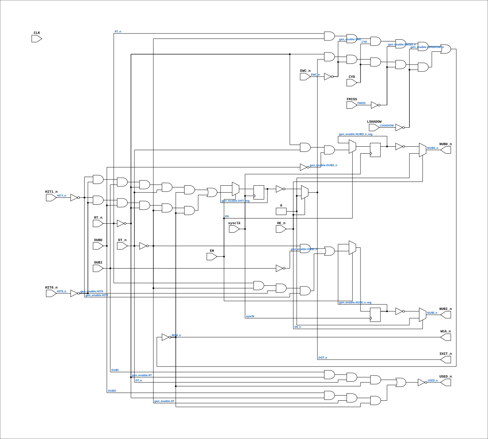

# PAL_44402D_EN

Source: `Verilog/PAL/PAL_44402D_EN.v`

<!-- Generated by Verilog/tests/module_doc.py from the //! comments in the source. Do not edit by hand - edit the RTL comments and regenerate. -->

<!-- HIERARCHY-NAV:BEGIN - written by Verilog/tests/gen_hierarchy.py, do not edit -->

**Where it sits** (Simulation): [ND120_TOP](../../doc/ND120_TOP.md) > [ND120_CORE](../../doc/ND120_CORE.md) > [ND3202D](../../CPU-BOARD-3202/circuit/doc/ND3202D.md) > [CPU_15](../../CPU-BOARD-3202/circuit/doc/CPU_15.md) > [CPU_MMU_24](../../CPU-BOARD-3202/circuit/doc/CPU_MMU_24.md) > [CPU_MMU_CACHE_25](../../CPU-BOARD-3202/circuit/doc/CPU_MMU_CACHE_25.md) > **PAL_44402D_EN**
- instance path: `CORE.CPU_BOARD.CPU.MMU.CACHE.PAL_44402_UBITS`

**Used in:** [CPU_MMU_CACHE_25](../../CPU-BOARD-3202/circuit/doc/CPU_MMU_CACHE_25.md) (Simulation, Nexys, MEGA65 R6, MEGA65 R3, QMTECH, Basys3, Cmod)

**Contains:** no other modules.

[Module hierarchy](../../HIERARCHY.md) - [All modules](../../MODULES.md)

<!-- HIERARCHY-NAV:END -->


<!-- SCHEMATIC:BEGIN - written by Verilog/tests/gen_schematics.py, do not edit -->

## Schematic

Drawn from the Verilog: the yosys netlist of the Simulation (Verilator) build, instance `CORE.CPU_BOARD.CPU.MMU.CACHE.PAL_44402_UBITS`. Sub-modules are boxes (click the picture to open it full size; there every sub-module box links to its page, and every wire shows its Verilog name).

[](PAL_44402D_EN.svg)

<!-- SCHEMATIC:END -->

## Description

ND120 PALASM CODE CONVERTED TO VERILOG
Component PAL 44402D - clock-enable variant
Equation copy of PAL_44402D.v (which stays untouched) with an optional
sysclk+enable capture mode for the four registered outputs.
USE_ENABLE=0 (default): instantiates the original PAL_44402D - posedge
CLK, original behaviour.
USE_ENABLE=1: the registers capture on posedge sysclk when EN is high
(P3 UCLK-domain conversion mode, docs/plan-fix-unconstrained-clocks.md).
EN must be the rise-aligned UCLK enable (CYC_36 UCLK_EN).
Last reviewed: 10-JUL-2026
Ronny Hansen

## Parameters

| Parameter | Default |
|---|---|
| `USE_ENABLE` | `0` |

## Ports

| Direction | Width | Name | Description |
|---|---|---|---|
| input | `1` | `sysclk` | FPGA system clock (used only when USE_ENABLE=1) |
| input | `1` | `EN` | Clock enable     (used only when USE_ENABLE=1) |
| input | `1` | `CLK` | Clock signal (used only when USE_ENABLE=0) |
| input | `1` | `OE_n` *(active low)* | OUTPUT ENABLE (active-low) for Q0-Q3 |
| input | `1` | `DT_n` *(active low)* | I0 |
| input | `1` | `RT_n` *(active low)* | I1 |
| input | `1` | `LSHADOW` | I2 |
| input | `1` | `FMISS` | I3 |
| input | `1` | `CYD` | I4 |
| input | `1` | `HIT0_n` *(active low)* | I5 |
| input | `1` | `HIT1_n` *(active low)* | I6 |
| input | `1` | `EWC_n` *(active low)* | I7 |
| output | `1` | `USED_n` *(active low)* | B0_n |
| output | `1` | `WCA_n` *(active low)* | B1_n (new input for 44404D) |
| input | `1` | `OUBI` | B2_n (Signal input from CHIP 21F) |
| input | `1` | `OUBD` | B3_n (Signal input from CHIP 21F) |
| output | `1` | `NUBI_n` *(active low)* | Q0_n |
| output | `1` | `NUBD_n` *(active low)* | Q1_n |
| output | `1` | `IHIT_n` *(active low)* | Q3_n (not connected signal?) |

## Verilog source

[`Verilog/PAL/PAL_44402D_EN.v`](https://github.com/RetroCoreLabs/nd-120/blob/main/Verilog/PAL/PAL_44402D_EN.v) on GitHub.

<details markdown="1">
<summary>Show the Verilog of PAL_44402D_EN (139 lines)</summary>

```verilog
/**********************************************************************************************************
** ND120 PALASM CODE CONVERTED TO VERILOG                                                                **
**                                                                                                       **
** Component PAL 44402D - clock-enable variant                                                           **
**                                                                                                       **
** Equation copy of PAL_44402D.v (which stays untouched) with an optional                                **
** sysclk+enable capture mode for the four registered outputs.                                           **
**                                                                                                       **
** USE_ENABLE=0 (default): instantiates the original PAL_44402D - posedge                                **
**   CLK, original behaviour.                                                                            **
** USE_ENABLE=1: the registers capture on posedge sysclk when EN is high                                 **
**   (P3 UCLK-domain conversion mode, docs/plan-fix-unconstrained-clocks.md).                            **
**   EN must be the rise-aligned UCLK enable (CYC_36 UCLK_EN).                                           **
**                                                                                                       **
** Last reviewed: 10-JUL-2026                                                                            **
** Ronny Hansen                                                                                          **
***********************************************************************************************************/

module PAL_44402D_EN #(
    parameter integer USE_ENABLE = 0
) (
    input sysclk,  //! FPGA system clock (used only when USE_ENABLE=1)
    input EN,      //! Clock enable     (used only when USE_ENABLE=1)

    input CLK,  //! Clock signal (used only when USE_ENABLE=0)
    input OE_n, //! OUTPUT ENABLE (active-low) for Q0-Q3

    input DT_n,     //! I0
    input RT_n,     //! I1
    input LSHADOW,  //! I2
    input FMISS,    //! I3
    input CYD,      //! I4
    input HIT0_n,   //! I5
    input HIT1_n,   //! I6
    input EWC_n,    //! I7

    output USED_n,  //! B0_n
    output WCA_n,   //! B1_n (new input for 44404D)
    input  OUBI,    //! B2_n (Signal input from CHIP 21F)
    input  OUBD,    //! B3_n (Signal input from CHIP 21F)

    output NUBI_n,  //! Q0_n
    output NUBD_n,  //! Q1_n
                    //! Q2_n (not connected, no signal)
    output IHIT_n   //! Q3_n (not connected signal?)
);

  generate
    if (USE_ENABLE == 1) begin : gen_enable
      /* verilator lint_off UNUSEDSIGNAL */
      wire unused_clk = CLK;
      /* verilator lint_on UNUSEDSIGNAL */

      // Registers for CLOCKED signals
      reg NUBI_n_reg = 1'b0;
      reg NUBD_n_reg = 1'b0;
      reg IHIT_reg = 1'b0;

      // Creating non-negated wires for active-low inputs
      wire DT = ~DT_n;
      wire HIT0 = ~HIT0_n;
      wire HIT1 = ~HIT1_n;
      wire EWC = ~EWC_n;

      // Creating negated wires for active-high inputs
      wire OUBI_n = ~OUBI;
      wire OUBD_n = ~OUBD;
      wire RT = ~RT_n;
      wire FMISS_n = ~FMISS;
      wire LSHADOW_n = ~LSHADOW;

      // Registered equations - identical to PAL_44402D, trigger swapped to
      // posedge sysclk gated by the rise-aligned UCLK enable.
      always @(posedge sysclk) begin
        if (EN) begin
          // Logic for NUBI_n (Q0 - active-low)
          NUBI_n_reg <= (DT & OUBI_n) |  // READ OR WRITE KEEP OLD VALUE
          (RT_n & DT & HIT0 & HIT1);  // CLEAR IF WRITE WITH HIT

          // Logic for NUBD_n (Q1 - active-low)
          NUBD_n_reg <= (RT & DT_n & OUBD_n);  // IF FETCH KEEP OLD VALUE

          // Logic for IHIT (Q3)
          IHIT_reg <= (HIT1 & HIT0 & OUBI & RT & DT_n & WCA_n) |  // FETCH
          (HIT1 & HIT0 & OUBD & RT & DT & WCA_n);  // READ
        end
      end

      // Q0
      // Pin = ~register (PAL16R4 inverts; see PAL_44402D.v 30-JUL audit note)
      assign NUBI_n = OE_n ? 1'b0 : ~NUBI_n_reg;

      // Q1
      assign NUBD_n = OE_n ? 1'b0 : ~NUBD_n_reg;

      // Q3
      assign IHIT_n = OE_n ? 1'b0 : ~IHIT_reg;

      // Logic for USED_n (active-low)
      assign USED_n = ~((OUBI & RT & DT_n & WCA_n) |  // FETCH
          (OUBD & RT & DT & WCA_n)  // READ
          );

      // Logic for WCA_n (active-low)
      assign WCA_n = ~((RT_n & DT & EWC & CYD & FMISS_n & LSHADOW_n) |  // WRITE OUTSIDE SHADOW
          (RT & IHIT_n & EWC & CYD & FMISS_n & LSHADOW_n)  // FETCH/READ WITHOUT HIT OUTSIDE SHADOW
          );

    end else begin : gen_orig
      /* verilator lint_off UNUSEDSIGNAL */
      wire unused_sys = sysclk & EN;
      /* verilator lint_on UNUSEDSIGNAL */

      PAL_44402D PAL (
          .CLK (CLK),
          .OE_n(OE_n),

          .DT_n(DT_n),
          .RT_n(RT_n),
          .LSHADOW(LSHADOW),
          .FMISS(FMISS),
          .CYD(CYD),
          .HIT0_n(HIT0_n),
          .HIT1_n(HIT1_n),
          .EWC_n(EWC_n),

          .USED_n(USED_n),
          .WCA_n (WCA_n),
          .OUBI  (OUBI),
          .OUBD  (OUBD),

          .NUBI_n(NUBI_n),
          .NUBD_n(NUBD_n),
          .IHIT_n(IHIT_n)
      );
    end
  endgenerate

endmodule
```

</details>
