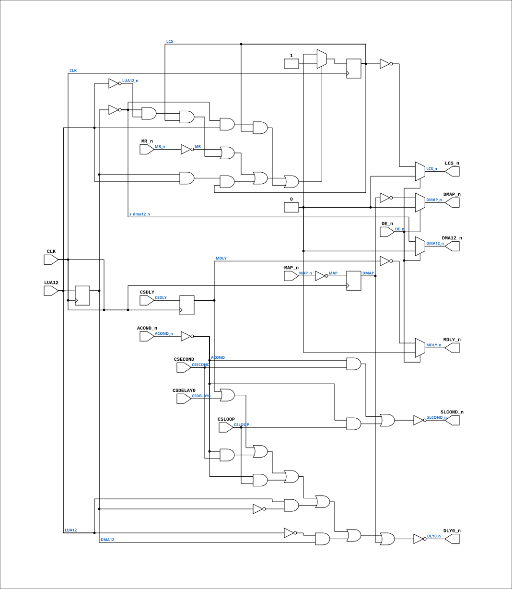

# PAL_44403C

Source: `Verilog/PAL/PAL_44403C.v`

<!-- Generated by Verilog/tests/module_doc.py from the //! comments in the source. Do not edit by hand - edit the RTL comments and regenerate. -->

<!-- HIERARCHY-NAV:BEGIN - written by Verilog/tests/gen_hierarchy.py, do not edit -->

**Hierarchy:** not instantiated by any of the 9 build tops (elaborated by yosys).

[Module hierarchy](../../HIERARCHY.md) - [All modules](../../MODULES.md)

<!-- HIERARCHY-NAV:END -->


<!-- SCHEMATIC:BEGIN - written by Verilog/tests/gen_schematics.py, do not edit -->

## Schematic

Drawn from the Verilog: no build top uses this module, so it was elaborated from its own file with no defines and default parameters. Sub-modules are boxes (click the picture to open it full size; there every sub-module box links to its page, and every wire shows its Verilog name).

[](PAL_44403C.svg)

<!-- SCHEMATIC:END -->

## Description

ND120 PALASM CODE CONVERTED TO VERILOG
Component PAL 44403C
Last reviewed: 2-FEB-2025
Ronny Hansen

## Ports

| Direction | Width | Name | Description |
|---|---|---|---|
| input | `1` | `CLK` | Clock signal |
| input | `1` | `OE_n` *(active low)* | OUTPUT ENABLE (active-low) for Q0-Q3 |
| input | `1` | `CSDELAY0` | I0 |
| input | `1` | `CSDLY` | I1 |
| input | `1` | `CSECOND` | I2 |
| input | `1` | `CSLOOP` | I3 |
| input | `1` | `ACOND_n` *(active low)* | I4 |
| input | `1` | `MR_n` *(active low)* | I5 |
| input | `1` | `LUA12` | I6 |
| input | `1` | `MAP_n` *(active low)* | I7 |
| output | `1` | `LCS_n` *(active low)* | Q0_n |
| output | `1` | `MDLY_n` *(active low)* | Q1_n |
| output | `1` | `DMA12_n` *(active low)* | Q2_n |
| output | `1` | `DMAP_n` *(active low)* | Q3_n |
| output | `1` | `DLY0_n` *(active low)* | B0_n |
| output | `1` | `SLCOND_n` *(active low)* | B2_n |

## Verilog source

[`Verilog/PAL/PAL_44403C.v`](https://github.com/RetroCoreLabs/nd-120/blob/main/Verilog/PAL/PAL_44403C.v) on GitHub.

<details markdown="1">
<summary>Show the Verilog of PAL_44403C (136 lines)</summary>

```verilog
/**********************************************************************************************************
** ND120 PALASM CODE CONVERTED TO VERILOG                                                                **
**                                                                                                       **
** Component PAL 44403C                                                                                  **
**                                                                                                       **
** Last reviewed: 2-FEB-2025                                                                             **
** Ronny Hansen                                                                                          **
***********************************************************************************************************/


// PAL16R4 (
// JLB 26NOV86
// 44403C,15D,CYIN0

// PAL16R4D (https://rocelec.widen.net/view/pdf/c6dwcslffz/VANTS00080-1.pdf)

// I/O 1,2, 7 and 8 (Pins B0 to B3) is not controlled by OE_n, only O3,O4,O5 and O6 (Pin's Q0-Q3)

// Four D flip-flops controlled by CLK signal (and reads input to flip-flop O3,O4,O5 and O6) when transision from LOW to HIGH.
// O3-O6 output is controlled by OE_n (HIGH signal means output is three-state)


// CLK CSDELAY0 CSDLY CSECOND CSLOOP /ACOND /MR LUA12 /MAP GND
// /OE /NC12 /SLCOND /DMAP /DMA12 /MDLY /LCS /NC18 /DLYO VCC

module PAL_44403C (
    input CLK,  //! Clock signal
    input OE_n, //! OUTPUT ENABLE (active-low) for Q0-Q3

    input CSDELAY0,  //! I0
    input CSDLY,     //! I1
    input CSECOND,   //! I2
    input CSLOOP,    //! I3
    input ACOND_n,   //! I4
    input MR_n,      //! I5
    input LUA12,     //! I6
    input MAP_n,     //! I7


    output LCS_n,    //! Q0_n
    output MDLY_n,   //! Q1_n
    output DMA12_n,  //! Q2_n
    output DMAP_n,   //! Q3_n

    output DLY0_n,   //! B0_n
    output SLCOND_n  //! B2_n
);

  // CLK and /OE impacts signals:
  //  Q0 = /LCS, Q1=/MDLY, Q2=/DMA12, Q3=/DMAP


  reg  LCS;
  reg  MDLY;
  reg  DMA12;
  reg  DMAP;

  // PCB 3202D sheet 36:
  //
  // PAL input signal PD1 is connected to PAL OE_n (and PD1 to PD4 is ALWAYS 0/FALSE in the 3202 circuit board)
  //     input signal CLK is connectec to PAL CK pin


  // Creating non-negated wires for active-low inputs
  wire ACOND = ~ACOND_n;
  wire MR = ~MR_n;
  wire MAP = ~MAP_n;
  wire LUA12_n = ~LUA12;

  wire s_dma12_n = ~DMA12;

  // Flip-flop logic for Q0, Q1, Q2 and Q3
  always @(posedge CLK) begin

    // Q0 flip-flop
    // Logic for LCS_n (active-low)
`ifdef SKIP_WCS_LOAD
    // WCS is pre-loaded (see docs/skip-wcs-load.md): never enter the load phase.
    // LCS stays 0 -> LCS_n stays 1 (execute) from cycle 0; MR_n is untouched so
    // the microcode PC still resets to 0 and master-clear init still runs.
    LCS <= 1'b0;
`else
    if (
        (MR)
        | (s_dma12_n & LUA12_n & LCS)  // LCS FROM MR AND UNTIL MA12 HAS GONE HIGH AND
        | (DMA12 & LUA12 & LCS)        // I.E. LMA COUNTED FROM 0 to 8K.
        | (s_dma12_n & LUA12 & LCS))
      LCS <= 1'b1;
    else LCS <= 1'b0;
`endif


    // Q1 flip-flop
    // Logic for MDLY
    MDLY  <= CSDLY;

    // Q2 flip-flop
    // Logic for DMA12
    DMA12 <= LUA12;

    // Q3 flip-flop
    // Logic for DMAP
    DMAP  <= MAP;
  end

  // Output logic for Q0_n, Q1_n, Q2_n
  assign LCS_n = OE_n ? 1'b0 : ~LCS;
  assign MDLY_n = OE_n ? 1'b0 : ~MDLY;
  assign DMA12_n = OE_n ? 1'b0 : s_dma12_n;
  assign DMAP_n = OE_n ? 1'b0 : ~DMAP;


  // B0 pin
  // Logic for DLY0_n (active-low)
  // PALASM 44403C: DLY0 = MDLY + CSDELAY0 + ACOND*CSECOND + ACOND*CSLOOP
  //                     + LUA12*/DMA12 + /LUA12*DMA12 + DMAP
  // Three literals were transcribed wrong (found by the 30-JUL PAL audit):
  // MDLY_n for MDLY (asserted feedback), the LUA12/DMA12 pair as XNOR
  // instead of XOR (fired when LUA12 was STABLE, i.e. almost always), and
  // the raw MAP input for the registered one-clock-delayed DMAP. Together
  // they held DLY0 asserted nearly every cycle - every microcycle took the
  // delayed path.
  assign DLY0_n = ~(MDLY |  // 25NS DELAY ON MICROCODE REQUEST
      CSDELAY0 |  // 25NS DELAY ON PREVIOUS CYCLE ON MICROCODE REQ
      (ACOND & CSECOND) |  // CONDITIONAL MICROSEQUENCING
      (ACOND & CSLOOP) |  // USING ALU RESULT
      (LUA12 & ~DMA12) |  // CHANGING FROM LOWER TO UPPER CONTROL STORE A
      (~LUA12 & DMA12) |  // (one clock after LUA12 changes - XOR)
      DMAP);  // AFTER MAP TO AVOID CSDELAY BEING TOO LATE

  // B2 pin
  // Logic for SLCOND_n (active-low)
  assign SLCOND_n = ~(ACOND & CSECOND |  //
      ACOND & CSLOOP);  //

endmodule
```

</details>
