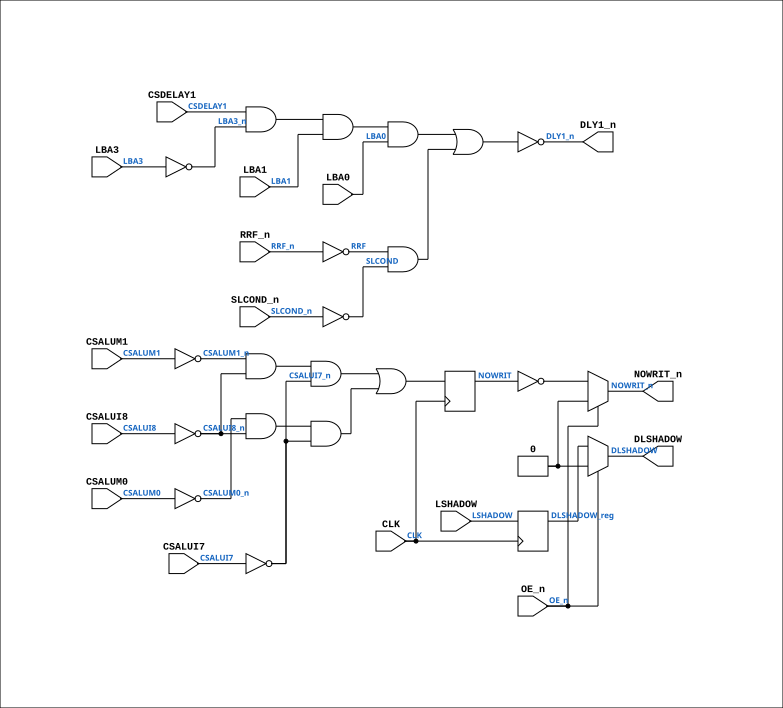

# PAL_44404C

Source: `Verilog/PAL/PAL_44404C.v`

<!-- Generated by Verilog/tests/module_doc.py from the //! comments in the source. Do not edit by hand - edit the RTL comments and regenerate. -->

<!-- HIERARCHY-NAV:BEGIN - written by Verilog/tests/gen_hierarchy.py, do not edit -->

**Hierarchy:** not instantiated by any of the 9 build tops (elaborated by yosys).

[Module hierarchy](../../HIERARCHY.md) - [All modules](../../MODULES.md)

<!-- HIERARCHY-NAV:END -->


<!-- SCHEMATIC:BEGIN - written by Verilog/tests/gen_schematics.py, do not edit -->

## Schematic

Drawn from the Verilog: no build top uses this module, so it was elaborated from its own file with no defines and default parameters. Sub-modules are boxes (click the picture to open it full size; there every sub-module box links to its page, and every wire shows its Verilog name).

[](PAL_44404C.svg)

<!-- SCHEMATIC:END -->

## Description

ND120 PALASM CODE CONVERTED TO VERILOG
Component PAL 44404C
Last reviewed: 2-FEB-2025
Ronny Hansen

## Ports

| Direction | Width | Name | Description |
|---|---|---|---|
| input | `1` | `CLK` | Clock signal |
| input | `1` | `OE_n` *(active low)* | OUTPUT ENABLE (active-low) for Q0-Q3 |
| input | `1` | `CSDELAY1` | I0 |
| input | `1` | `CSALUM1` | I1 |
| input | `1` | `CSALUM0` | I2 |
| input | `1` | `CSALUI8` | I3 |
| input | `1` | `CSALUI7` | I4 |
| input | `1` | `LBA3` | I5 |
| input | `1` | `LBA1` | I6 |
| input | `1` | `LBA0` | I7 |
| output | `1` | `NOWRIT_n` *(active low)* | Q0_n |
| output | `1` | `DLSHADOW` | Q1_n (new output for 44404D) |
| input | `1` | `RRF_n` *(active low)* | B0_n |
| input | `1` | `LSHADOW` | B1_n (new input for 44404D) |
| input | `1` | `SLCOND_n` *(active low)* | B2_n |
| output | `1` | `DLY1_n` *(active low)* | B3_n |

## Verilog source

[`Verilog/PAL/PAL_44404C.v`](https://github.com/RetroCoreLabs/nd-120/blob/main/Verilog/PAL/PAL_44404C.v) on GitHub.

<details markdown="1">
<summary>Show the Verilog of PAL_44404C (101 lines)</summary>

```verilog
/**********************************************************************************************************
** ND120 PALASM CODE CONVERTED TO VERILOG                                                                **
**                                                                                                       **
** Component PAL 44404C                                                                                  **
**                                                                                                       **
** Last reviewed: 2-FEB-2025                                                                             **
** Ronny Hansen                                                                                          **
***********************************************************************************************************/


// PAL16R4
// JLB 26NOV86
// 44404C,14D,CYIN1

// PAL16R4D (https://rocelec.widen.net/view/pdf/c6dwcslffz/VANTS00080-1.pdf)

// I/O 1,2, 7 and 8 (Pins B0 to B3) is not controlled by OE_n, only O3,O4,O5 and O6 (Pin's Q0-Q3)
// NOTE: B0 to B3 is input OR output depending on PALASM code.

// Four D flip-flops controlled by CLK signal (and reads input to flip-flop O3,O4,O5 and O6) when transision from LOW to HIGH.
// O3-O6 output is controlled by OE_n (HIGH signal means output is three-state)

module PAL_44404C (
    input CLK,  //! Clock signal
    input OE_n, //! OUTPUT ENABLE (active-low) for Q0-Q3

    input CSDELAY1,  //! I0
    input CSALUM1,   //! I1
    input CSALUM0,   //! I2
    input CSALUI8,   //! I3
    input CSALUI7,   //! I4
    input LBA3,      //! I5
    input LBA1,      //! I6
    input LBA0,      //! I7

    output NOWRIT_n,  //! Q0_n
    output DLSHADOW,  //! Q1_n (new output for 44404D)


    input  RRF_n,     //! B0_n
    input  LSHADOW,   //! B1_n (new input for 44404D)
    input  SLCOND_n,  //! B2_n
    output DLY1_n     //! B3_n

    // pin Q2 and Q3 is not used in 44404C
);


  // CLK and /OE impacts signals:
  //  Q0 = /NOWRIT, Q1=DLSHADOW, Q2= n.c., Q3= n.c.

  reg  NOWRIT;
  reg  DLSHADOW_reg;

  // PCB 3202D sheet 36:
  //
  // PAL input signal PD1 is connected to PAL OE_n (and PD1 to PD4 is ALWAYS 0/FALSE in the 3202 circuit board)
  //     input signal CLK is connectec to PAL CK pin


  // Creating non-negated wires for active-low inputs
  wire SLCOND = ~SLCOND_n;
  wire RRF = ~RRF_n;


  // Creating negated wires for active-high inputs
  wire CSALUM1_n = ~CSALUM1;
  wire CSALUM0_n = ~CSALUM0;
  wire CSALUI8_n = ~CSALUI8;
  wire CSALUI7_n = ~CSALUI7;
  wire LBA3_n = ~LBA3;

  // Flip-flop logic for Q0, Q1, Q2 and Q3 (Asyncronous D flip-flop)
  always @(posedge CLK) begin

    // Logic for NOWRIT
    NOWRIT <= (CSALUM1_n & CSALUI8_n & CSALUI7_n) |  //
    (CSALUM0_n & CSALUI8_n & CSALUI7_n);  //

    // Logic for DLSHADOW(missing PALASM for 44404D where this is described ?)
    // Ronny: Guessing that the implementation is makeing DLSHADOW being a "delayed" signal based on the CLK signal
    DLSHADOW_reg <= LSHADOW;
  end

  // Output logic for Q0_n, Q1_n, Q2_n
  //Q0
  assign NOWRIT_n = OE_n ? 1'b0 : ~NOWRIT;

  // Q1
  assign DLSHADOW = OE_n ? 1'b0 : DLSHADOW_reg;


  // Logic for DLY1_n (active-low)
  assign DLY1_n = ~((CSDELAY1 & LBA3_n & LBA1 & LBA0) |  // 25NS DELAY OF PREVIOUS CYCLE
      (RRF & SLCOND)  // ON MICROCODE REQUEST IN ADDITION TO DLY0
      );


endmodule
```

</details>
