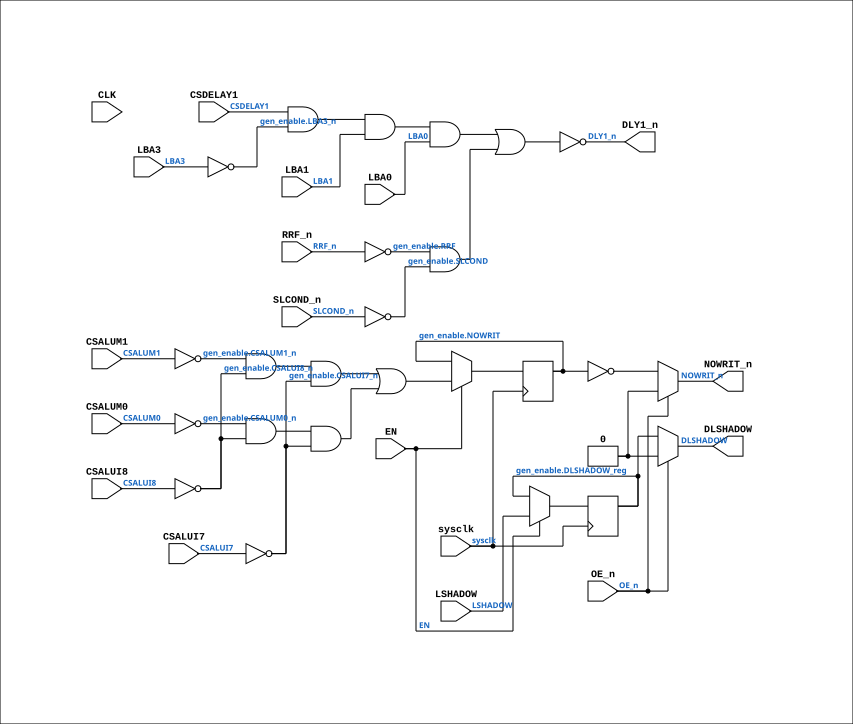

# PAL_44404C_EN

Source: `Verilog/PAL/PAL_44404C_EN.v`

<!-- Generated by Verilog/tests/module_doc.py from the //! comments in the source. Do not edit by hand - edit the RTL comments and regenerate. -->

<!-- HIERARCHY-NAV:BEGIN - written by Verilog/tests/gen_hierarchy.py, do not edit -->

**Where it sits** (Simulation): [ND120_TOP](../../doc/ND120_TOP.md) > [ND120_CORE](../../doc/ND120_CORE.md) > [ND3202D](../../CPU-BOARD-3202/circuit/doc/ND3202D.md) > [CYC_36](../../CPU-BOARD-3202/circuit/doc/CYC_36.md) > **PAL_44404C_EN**
- instance path: `CORE.CPU_BOARD.CYC.PAL_44404_UCYIN1`

**Used in:** [CYC_36](../../CPU-BOARD-3202/circuit/doc/CYC_36.md) (all tops)

**Contains:** no other modules.

[Module hierarchy](../../HIERARCHY.md) - [All modules](../../MODULES.md)

<!-- HIERARCHY-NAV:END -->


<!-- SCHEMATIC:BEGIN - written by Verilog/tests/gen_schematics.py, do not edit -->

## Schematic

Drawn from the Verilog: the yosys netlist of the Simulation (Verilator) build, instance `CORE.CPU_BOARD.CYC.PAL_44404_UCYIN1`. Sub-modules are boxes (click the picture to open it full size; there every sub-module box links to its page, and every wire shows its Verilog name).

[](PAL_44404C_EN.svg)

<!-- SCHEMATIC:END -->

## Description

ND120 PALASM CODE CONVERTED TO VERILOG
Component PAL 44404C - clock-enable wrapper
USE_ENABLE=0 (default): instantiates the original PAL_44404C untouched
(posedge CLK registered outputs).
USE_ENABLE=1: structural copy of PAL_44404C with the registered
equations captured on `posedge sysclk + if (EN)` (P2 clock-domain
conversion, docs/plan-fix-unconstrained-clocks.md - EN is CYC_36's
CLK_EN pulse aligned with the CLK rise). Equations are line-for-line
identical to PAL_44404C.v; only the flop trigger changes.
The original PAL_44404C.v is generated from PALASM and is never
modified - keep the equations here in sync with it.
Last reviewed: 10-JUL-2026
Ronny Hansen

## Parameters

| Parameter | Default |
|---|---|
| `USE_ENABLE` | `0` |

## Ports

| Direction | Width | Name | Description |
|---|---|---|---|
| input | `1` | `sysclk` | FPGA system clock (used only when USE_ENABLE=1) |
| input | `1` | `EN` | Clock enable    (used only when USE_ENABLE=1) |
| input | `1` | `CLK` | Clock signal (used only when USE_ENABLE=0) |
| input | `1` | `OE_n` *(active low)* | OUTPUT ENABLE (active-low) for Q0-Q3 |
| input | `1` | `CSDELAY1` | I0 |
| input | `1` | `CSALUM1` | I1 |
| input | `1` | `CSALUM0` | I2 |
| input | `1` | `CSALUI8` | I3 |
| input | `1` | `CSALUI7` | I4 |
| input | `1` | `LBA3` | I5 |
| input | `1` | `LBA1` | I6 |
| input | `1` | `LBA0` | I7 |
| output | `1` | `NOWRIT_n` *(active low)* | Q0_n |
| output | `1` | `DLSHADOW` | Q1_n (new output for 44404D) |
| input | `1` | `RRF_n` *(active low)* | B0_n |
| input | `1` | `LSHADOW` | B1_n (new input for 44404D) |
| input | `1` | `SLCOND_n` *(active low)* | B2_n |
| output | `1` | `DLY1_n` *(active low)* | B3_n |

## Verilog source

[`Verilog/PAL/PAL_44404C_EN.v`](https://github.com/RetroCoreLabs/nd-120/blob/main/Verilog/PAL/PAL_44404C_EN.v) on GitHub.

<details markdown="1">
<summary>Show the Verilog of PAL_44404C_EN (117 lines)</summary>

```verilog
/**********************************************************************************************************
** ND120 PALASM CODE CONVERTED TO VERILOG                                                                **
**                                                                                                       **
** Component PAL 44404C - clock-enable wrapper                                                           **
**                                                                                                       **
** USE_ENABLE=0 (default): instantiates the original PAL_44404C untouched                                **
**   (posedge CLK registered outputs).                                                                   **
** USE_ENABLE=1: structural copy of PAL_44404C with the registered                                       **
**   equations captured on `posedge sysclk + if (EN)` (P2 clock-domain                                   **
**   conversion, docs/plan-fix-unconstrained-clocks.md - EN is CYC_36's                                  **
**   CLK_EN pulse aligned with the CLK rise). Equations are line-for-line                                **
**   identical to PAL_44404C.v; only the flop trigger changes.                                           **
**                                                                                                       **
** The original PAL_44404C.v is generated from PALASM and is never                                       **
** modified - keep the equations here in sync with it.                                                   **
**                                                                                                       **
** Last reviewed: 10-JUL-2026                                                                            **
** Ronny Hansen                                                                                          **
***********************************************************************************************************/

module PAL_44404C_EN #(
    parameter integer USE_ENABLE = 0
) (
    input sysclk,  //! FPGA system clock (used only when USE_ENABLE=1)
    input EN,      //! Clock enable    (used only when USE_ENABLE=1)

    input CLK,  //! Clock signal (used only when USE_ENABLE=0)
    input OE_n, //! OUTPUT ENABLE (active-low) for Q0-Q3

    input CSDELAY1,  //! I0
    input CSALUM1,   //! I1
    input CSALUM0,   //! I2
    input CSALUI8,   //! I3
    input CSALUI7,   //! I4
    input LBA3,      //! I5
    input LBA1,      //! I6
    input LBA0,      //! I7

    output NOWRIT_n,  //! Q0_n
    output DLSHADOW,  //! Q1_n (new output for 44404D)

    input  RRF_n,     //! B0_n
    input  LSHADOW,   //! B1_n (new input for 44404D)
    input  SLCOND_n,  //! B2_n
    output DLY1_n     //! B3_n
);

  generate
    if (USE_ENABLE == 1) begin : gen_enable
      /* verilator lint_off UNUSEDSIGNAL */
      wire unused_clk = CLK;
      /* verilator lint_on UNUSEDSIGNAL */

      reg NOWRIT = 1'b0;
      reg DLSHADOW_reg = 1'b0;

      // Creating non-negated wires for active-low inputs
      wire SLCOND = ~SLCOND_n;
      wire RRF = ~RRF_n;

      // Creating negated wires for active-high inputs
      wire CSALUM1_n = ~CSALUM1;
      wire CSALUM0_n = ~CSALUM0;
      wire CSALUI8_n = ~CSALUI8;
      wire CSALUI7_n = ~CSALUI7;
      wire LBA3_n = ~LBA3;

      // Flip-flop logic for Q0, Q1 - equations identical to PAL_44404C.v,
      // captured on the enable instead of posedge CLK.
      always @(posedge sysclk) begin
        if (EN) begin
          // Logic for NOWRIT
          NOWRIT <= (CSALUM1_n & CSALUI8_n & CSALUI7_n) |  //
          (CSALUM0_n & CSALUI8_n & CSALUI7_n);  //

          // Logic for DLSHADOW (see PAL_44404C.v comment)
          DLSHADOW_reg <= LSHADOW;
        end
      end

      // Output logic for Q0_n, Q1_n
      //Q0
      assign NOWRIT_n = OE_n ? 1'b0 : ~NOWRIT;

      // Q1
      assign DLSHADOW = OE_n ? 1'b0 : DLSHADOW_reg;

      // Logic for DLY1_n (active-low)
      assign DLY1_n = ~((CSDELAY1 & LBA3_n & LBA1 & LBA0) |  // 25NS DELAY OF PREVIOUS CYCLE
          (RRF & SLCOND)  // ON MICROCODE REQUEST IN ADDITION TO DLY0
          );
    end else begin : gen_orig
      /* verilator lint_off UNUSEDSIGNAL */
      wire unused_sys = sysclk & EN;
      /* verilator lint_on UNUSEDSIGNAL */
      PAL_44404C PAL (
          .CLK(CLK),
          .OE_n(OE_n),
          .CSDELAY1(CSDELAY1),
          .CSALUM1(CSALUM1),
          .CSALUM0(CSALUM0),
          .CSALUI8(CSALUI8),
          .CSALUI7(CSALUI7),
          .LBA3(LBA3),
          .LBA1(LBA1),
          .LBA0(LBA0),
          .NOWRIT_n(NOWRIT_n),
          .DLSHADOW(DLSHADOW),
          .RRF_n(RRF_n),
          .LSHADOW(LSHADOW),
          .SLCOND_n(SLCOND_n),
          .DLY1_n(DLY1_n)
      );
    end
  endgenerate

endmodule
```

</details>
