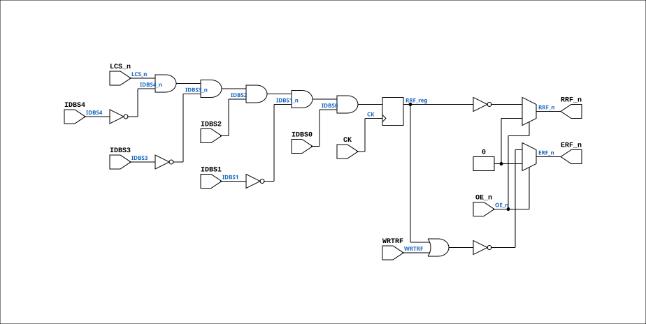

# PAL_44407A

Source: `Verilog/PAL/PAL_44407A.v`

<!-- Generated by Verilog/tests/module_doc.py from the //! comments in the source. Do not edit by hand - edit the RTL comments and regenerate. -->

<!-- HIERARCHY-NAV:BEGIN - written by Verilog/tests/gen_hierarchy.py, do not edit -->

**Hierarchy:** not instantiated by any of the 9 build tops (elaborated by yosys).

[Module hierarchy](../../HIERARCHY.md) - [All modules](../../MODULES.md)

<!-- HIERARCHY-NAV:END -->


<!-- SCHEMATIC:BEGIN - written by Verilog/tests/gen_schematics.py, do not edit -->

## Schematic

Drawn from the Verilog: no build top uses this module, so it was elaborated from its own file with no defines and default parameters. Sub-modules are boxes (click the picture to open it full size; there every sub-module box links to its page, and every wire shows its Verilog name).

[](PAL_44407A.svg)

<!-- SCHEMATIC:END -->

## Description

ND120 PALASM CODE CONVERTED TO VERILOG
Component PAL 44407A
Last reviewed: 1-DEC-2024
Ronny Hansen

## Ports

| Direction | Width | Name | Description |
|---|---|---|---|
| input | `1` | `CK` | Clock signal |
| input | `1` | `OE_n` *(active low)* | OUTPUT ENABLE (active-low) for Q0-Q3 |
| input | `1` | `IDBS0` | I0 - CSIDBS0 |
| input | `1` | `IDBS1` | I1 - CSIDBS1 |
| input | `1` | `IDBS2` | I2 - CSIDBS2 |
| input | `1` | `IDBS3` | I3 - CSIDBS3 |
| input | `1` | `IDBS4` | I4 - CSIDBS4 |
| input | `1` | `WRTRF` | I5 - WRTRF (Write to registry file) |
| input | `1` | `LCS_n` *(active low)* | I6 - LCS_n |
| output | `1` | `ERF_n` *(active low)* | B0_n - ERF_n ((WRTRF or RRF) negated) - Enables RAM chips 34F and 35F in CPU_PROC_32.v for read or write of REG |
| output | `1` | `RRF_n` *(active low)* | Q0_n - RRF_n  (CSIDBS source 5, REG) |

## Verilog source

[`Verilog/PAL/PAL_44407A.v`](https://github.com/RetroCoreLabs/nd-120/blob/main/Verilog/PAL/PAL_44407A.v) on GitHub.

<details markdown="1">
<summary>Show the Verilog of PAL_44407A (76 lines)</summary>

```verilog
/**********************************************************************************************************
** ND120 PALASM CODE CONVERTED TO VERILOG                                                                **
**                                                                                                       **
** Component PAL 44407A                                                                                  **
**                                                                                                       **
** Last reviewed: 1-DEC-2024                                                                             **
** Ronny Hansen                                                                                          **
***********************************************************************************************************/

// PAL16R4
// JLB 25FEB87
// 44407A,19F ,ERFFIX

// PCB 3202D sheet 34:
//
// PAL input signal PD1 is connected to PAL OE_n (and PD1 to PD4 is ALWAYS 0/FALSE in the 3202 circuit board)
//     input signal CLK is connectec to PAL CK pin

module PAL_44407A (
    input CK,   //! Clock signal
    input OE_n, //! OUTPUT ENABLE (active-low) for Q0-Q3

    input IDBS0,  //! I0 - CSIDBS0
    input IDBS1,  //! I1 - CSIDBS1
    input IDBS2,  //! I2 - CSIDBS2
    input IDBS3,  //! I3 - CSIDBS3
    input IDBS4,  //! I4 - CSIDBS4
    input WRTRF,  //! I5 - WRTRF (Write to registry file)
    input LCS_n,  //! I6 - LCS_n
                  //! I7 - (not connected)

    output ERF_n,  //! B0_n - ERF_n ((WRTRF or RRF) negated) - Enables RAM chips 34F and 35F in CPU_PROC_32.v for read or write of REG
                   //! B1_n - (not connected)

    output RRF_n  //! Q0_n - RRF_n  (CSIDBS source 5, REG)
                  //! Q2_n - (not connected)
                  //! Q3_n - (not connected)
                  //! Q4_n - (not connected)

);

  // Inverted input signals
  wire IDBS4_n = ~IDBS4;
  wire IDBS3_n = ~IDBS3;
  wire IDBS1_n = ~IDBS1;

  reg  RRF_reg;  // Register for RRF_n output

  // Sequential logic triggered on the rising edge of CLK
  always @(posedge CK) begin

    // IDBS = REG FILE = 5

    // Logic for RRF
    RRF_reg <= LCS_n & IDBS4_n & IDBS3_n & IDBS2 & IDBS1_n & IDBS0;

  end

  // Tri-state control for outputs
  // High-impedance state when OE_n is high (active-low)
  assign RRF_n = OE_n ? 1'b0 : ~RRF_reg;


  // Logic for ERF_n (active-low)
  assign ERF_n = OE_n ? 1'b0 : ~(RRF_reg | WRTRF);

endmodule


/*
DESCRIPTION

; 180587 M3202B

*/
```

</details>
