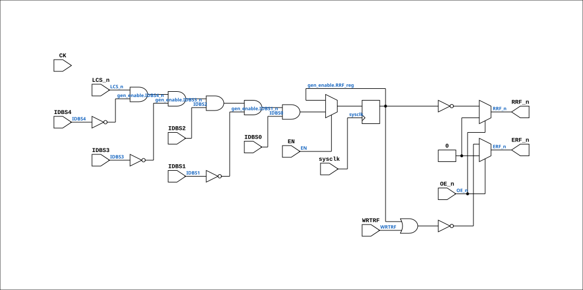

# PAL_44407A_EN

Source: `Verilog/PAL/PAL_44407A_EN.v`

<!-- Generated by Verilog/tests/module_doc.py from the //! comments in the source. Do not edit by hand - edit the RTL comments and regenerate. -->

<!-- HIERARCHY-NAV:BEGIN - written by Verilog/tests/gen_hierarchy.py, do not edit -->

**Where it sits** (Simulation): [ND120_TOP](../../doc/ND120_TOP.md) > [ND120_CORE](../../doc/ND120_CORE.md) > [ND3202D](../../CPU-BOARD-3202/circuit/doc/ND3202D.md) > [CPU_15](../../CPU-BOARD-3202/circuit/doc/CPU_15.md) > [CPU_PROC_32](../../CPU-BOARD-3202/circuit/doc/CPU_PROC_32.md) > [CPU_PROC_CMDDEC_34](../../CPU-BOARD-3202/circuit/doc/CPU_PROC_CMDDEC_34.md) > **PAL_44407A_EN**
- instance path: `CORE.CPU_BOARD.CPU.PROC.CMDDEC.PAL_44407_UERFIX`

**Used in:** [CPU_PROC_CMDDEC_34](../../CPU-BOARD-3202/circuit/doc/CPU_PROC_CMDDEC_34.md) (all tops)

**Contains:** no other modules.

[Module hierarchy](../../HIERARCHY.md) - [All modules](../../MODULES.md)

<!-- HIERARCHY-NAV:END -->


<!-- SCHEMATIC:BEGIN - written by Verilog/tests/gen_schematics.py, do not edit -->

## Schematic

Drawn from the Verilog: the yosys netlist of the Simulation (Verilator) build, instance `CORE.CPU_BOARD.CPU.PROC.CMDDEC.PAL_44407_UERFIX`. Sub-modules are boxes (click the picture to open it full size; there every sub-module box links to its page, and every wire shows its Verilog name).

[](PAL_44407A_EN.svg)

<!-- SCHEMATIC:END -->

## Description

ND120 PALASM CODE CONVERTED TO VERILOG
Component PAL 44407A (UERFIX) - clock-enable wrapper
USE_ENABLE=0 (default): instantiates the original PAL_44407A untouched
(posedge CK registered outputs).
USE_ENABLE=1: structural copy of PAL_44407A with the registered
equations captured on `posedge sysclk + if (EN)` (P2 clock-domain
conversion, docs/plan-fix-unconstrained-clocks.md - EN is CYC_36's
CLK_EN pulse aligned with the CLK rise). Equations are line-for-line
identical to PAL_44407A.v; only the flop trigger changes.
The original PAL_44407A.v is generated from PALASM and is never
modified - keep the equations here in sync with it.
Last reviewed: 10-JUL-2026
Ronny Hansen

## Parameters

| Parameter | Default |
|---|---|
| `USE_ENABLE` | `0` |

## Ports

| Direction | Width | Name | Description |
|---|---|---|---|
| input | `1` | `sysclk` | FPGA system clock (used only when USE_ENABLE=1) |
| input | `1` | `EN` | Clock enable    (used only when USE_ENABLE=1) |
| input | `1` | `CK` | Clock signal (used only when USE_ENABLE=0) |
| input | `1` | `OE_n` *(active low)* | OUTPUT ENABLE (active-low) for Q0-Q3 |
| input | `1` | `IDBS0` | I0 - CSIDBS0 |
| input | `1` | `IDBS1` | I1 - CSIDBS1 |
| input | `1` | `IDBS2` | I2 - CSIDBS2 |
| input | `1` | `IDBS3` | I3 - CSIDBS3 |
| input | `1` | `IDBS4` | I4 - CSIDBS4 |
| input | `1` | `WRTRF` | I5 - WRTRF (Write to registry file) |
| input | `1` | `LCS_n` *(active low)* | I6 - LCS_n |
| output | `1` | `ERF_n` *(active low)* | B0_n - ERF_n ((WRTRF or RRF) negated) - Enables RAM chips 34F and 35F in CPU_PROC_32.v for read or write of REG |
| output | `1` | `RRF_n` *(active low)* | Q0_n - RRF_n  (CSIDBS source 5, REG) |

## Verilog source

[`Verilog/PAL/PAL_44407A_EN.v`](https://github.com/RetroCoreLabs/nd-120/blob/main/Verilog/PAL/PAL_44407A_EN.v) on GitHub.

<details markdown="1">
<summary>Show the Verilog of PAL_44407A_EN (102 lines)</summary>

```verilog
/**********************************************************************************************************
** ND120 PALASM CODE CONVERTED TO VERILOG                                                                **
**                                                                                                       **
** Component PAL 44407A (UERFIX) - clock-enable wrapper                                                  **
**                                                                                                       **
** USE_ENABLE=0 (default): instantiates the original PAL_44407A untouched                                **
**   (posedge CK registered outputs).                                                                    **
** USE_ENABLE=1: structural copy of PAL_44407A with the registered                                       **
**   equations captured on `posedge sysclk + if (EN)` (P2 clock-domain                                   **
**   conversion, docs/plan-fix-unconstrained-clocks.md - EN is CYC_36's                                  **
**   CLK_EN pulse aligned with the CLK rise). Equations are line-for-line                                **
**   identical to PAL_44407A.v; only the flop trigger changes.                                           **
**                                                                                                       **
** The original PAL_44407A.v is generated from PALASM and is never                                       **
** modified - keep the equations here in sync with it.                                                   **
**                                                                                                       **
** Last reviewed: 10-JUL-2026                                                                            **
** Ronny Hansen                                                                                          **
***********************************************************************************************************/

module PAL_44407A_EN #(
    parameter integer USE_ENABLE = 0
) (
    input sysclk,  //! FPGA system clock (used only when USE_ENABLE=1)
    input EN,      //! Clock enable    (used only when USE_ENABLE=1)

    input CK,   //! Clock signal (used only when USE_ENABLE=0)
    input OE_n, //! OUTPUT ENABLE (active-low) for Q0-Q3

    input IDBS0,  //! I0 - CSIDBS0
    input IDBS1,  //! I1 - CSIDBS1
    input IDBS2,  //! I2 - CSIDBS2
    input IDBS3,  //! I3 - CSIDBS3
    input IDBS4,  //! I4 - CSIDBS4
    input WRTRF,  //! I5 - WRTRF (Write to registry file)
    input LCS_n,  //! I6 - LCS_n
                  //! I7 - (not connected)

    output ERF_n,  //! B0_n - ERF_n ((WRTRF or RRF) negated) - Enables RAM chips 34F and 35F in CPU_PROC_32.v for read or write of REG
                   //! B1_n - (not connected)

    output RRF_n  //! Q0_n - RRF_n  (CSIDBS source 5, REG)
                  //! Q2_n - (not connected)
                  //! Q3_n - (not connected)
                  //! Q4_n - (not connected)

);

  generate
    if (USE_ENABLE == 1) begin : gen_enable
      /* verilator lint_off UNUSEDSIGNAL */
      wire unused_clk = CK;
      /* verilator lint_on UNUSEDSIGNAL */

      // Inverted input signals
      wire IDBS4_n = ~IDBS4;
      wire IDBS3_n = ~IDBS3;
      wire IDBS1_n = ~IDBS1;

      reg  RRF_reg = 1'b0;  // Register for RRF_n output

      // Sequential logic - equations identical to PAL_44407A.v,
      // captured on the enable instead of posedge CK.
      always @(posedge sysclk) begin
        if (EN) begin

          // IDBS = REG FILE = 5

          // Logic for RRF
          RRF_reg <= LCS_n & IDBS4_n & IDBS3_n & IDBS2 & IDBS1_n & IDBS0;

        end
      end

      // Tri-state control for outputs
      // High-impedance state when OE_n is high (active-low)
      assign RRF_n = OE_n ? 1'b0 : ~RRF_reg;


      // Logic for ERF_n (active-low)
      assign ERF_n = OE_n ? 1'b0 : ~(RRF_reg | WRTRF);
    end else begin : gen_orig
      /* verilator lint_off UNUSEDSIGNAL */
      wire unused_sys = sysclk & EN;
      /* verilator lint_on UNUSEDSIGNAL */
      PAL_44407A PAL (
          .CK(CK),
          .OE_n(OE_n),
          .IDBS0(IDBS0),
          .IDBS1(IDBS1),
          .IDBS2(IDBS2),
          .IDBS3(IDBS3),
          .IDBS4(IDBS4),
          .WRTRF(WRTRF),
          .LCS_n(LCS_n),
          .ERF_n(ERF_n),
          .RRF_n(RRF_n)
      );
    end
  endgenerate

endmodule
```

</details>
