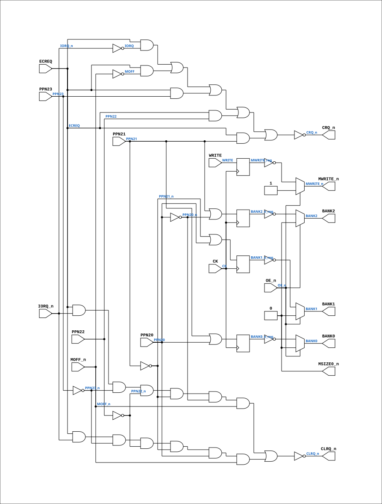

# PAL_44445B

Source: `Verilog/PAL/PAL_44445B.v`

<!-- Generated by Verilog/tests/module_doc.py from the //! comments in the source. Do not edit by hand - edit the RTL comments and regenerate. -->

<!-- HIERARCHY-NAV:BEGIN - written by Verilog/tests/gen_hierarchy.py, do not edit -->

**Hierarchy:** not instantiated by any of the 9 build tops (elaborated by yosys).

[Module hierarchy](../../HIERARCHY.md) - [All modules](../../MODULES.md)

<!-- HIERARCHY-NAV:END -->


<!-- SCHEMATIC:BEGIN - written by Verilog/tests/gen_schematics.py, do not edit -->

## Schematic

Drawn from the Verilog: no build top uses this module, so it was elaborated from its own file with no defines and default parameters. Sub-modules are boxes (click the picture to open it full size; there every sub-module box links to its page, and every wire shows its Verilog name).

[](PAL_44445B.svg)

<!-- SCHEMATIC:END -->

## Description

ND120 PALASM CODE CONVERTED TO VERILOG
Component PAL 44445B
Last reviewed: 14-DEC-2024
Ronny Hansen

## Ports

| Direction | Width | Name | Description |
|---|---|---|---|
| input | `1` | `CK` | Clock signal |
| input | `1` | `OE_n` *(active low)* | OUTPUT ENABLE (active-low) for Q0-Q3 |
| input | `1` | `WRITE` | I0 - WRITE - Write to memory |
| input | `1` | `IORQ_n` *(active low)* | I1 - IORQ_n - IO Request |
| input | `1` | `MOFF_n` *(active low)* | I2 - MOFF_n - Memory Off |
| input | `1` | `PPN20` | I4 - PPN20 |
| input | `1` | `PPN21` | I5 - PPN21 |
| input | `1` | `PPN22` | I6 - PPN22 |
| input | `1` | `PPN23` | I7 - PPN23 |
| output | `1` | `MSIZE0_n` *(active low)* | B0_n - MSIZE0_n (not connected?) |
| output | `1` | `CLRQ_n` *(active low)* | B1_n - CLRQ_n |
| output | `1` | `CRQ_n` *(active low)* | B2_n - CRQ_n |
| input | `1` | `ECREQ` | B3_n - ECREQ |
| output | `1` | `BANK2` | Q0_n - BANK2 |
| output | `1` | `BANK1` | Q1_n - BANK1 |
| output | `1` | `BANK0` | Q2_n - BANK0 |
| output | `1` | `MWRITE_n` *(active low)* | Q3_n - MWRITE_n |

## Verilog source

[`Verilog/PAL/PAL_44445B.v`](https://github.com/RetroCoreLabs/nd-120/blob/main/Verilog/PAL/PAL_44445B.v) on GitHub.

<details markdown="1">
<summary>Show the Verilog of PAL_44445B (102 lines)</summary>

```verilog
/**********************************************************************************************************
** ND120 PALASM CODE CONVERTED TO VERILOG                                                                **
**                                                                                                       **
** Component PAL 44445B                                                                                  **
**                                                                                                       **
** Last reviewed: 14-DEC-2024                                                                            **
** Ronny Hansen                                                                                          **
***********************************************************************************************************/


// PAL16R4
// ADGD 18/8/86
// 44445B,9G,CADEC
// CPU ADDRESS DECODER FOR 4MB MEMORY

// PCB 3202D sheet 45:
//
// PAL input signal CGNT_n is connected to PAL OE_n pin
//     input signal CLK is connectec to PAL CK pin

module PAL_44445B (
    input CK,   //! Clock signal
    input OE_n, //! OUTPUT ENABLE (active-low) for Q0-Q3

    input WRITE,   //! I0 - WRITE - Write to memory
    input IORQ_n,  //! I1 - IORQ_n - IO Request
    input MOFF_n,  //! I2 - MOFF_n - Memory Off
    //  input PPN19,        //! I3 - PPN19  // Not in use in logic. Uncomment when needed.
    input PPN20,   //! I4 - PPN20
    input PPN21,   //! I5 - PPN21
    input PPN22,   //! I6 - PPN22
    input PPN23,   //! I7 - PPN23

    output MSIZE0_n,  //! B0_n - MSIZE0_n (not connected?)
    output CLRQ_n,    //! B1_n - CLRQ_n
    output CRQ_n,     //! B2_n - CRQ_n
    input  ECREQ,     //! B3_n - ECREQ

    output BANK2,    //! Q0_n - BANK2
    output BANK1,    //! Q1_n - BANK1
    output BANK0,    //! Q2_n - BANK0
    output MWRITE_n  //! Q3_n - MWRITE_n
);

  // Inverted input signals
  wire PPN20_n = ~PPN20;
  wire PPN21_n = ~PPN21;
  wire PPN22_n = ~PPN22;
  wire PPN23_n = ~PPN23;
  wire MOFF = ~MOFF_n;
  wire IORQ = ~IORQ_n;

  // Internal registers
  reg  BANK0_n_reg;
  reg  BANK1_n_reg;
  reg  BANK2_n_reg;
  reg  MWRITE_reg;


  //**** Sequential logic triggered on the rising edge of CLK ****
  always @(posedge CK) begin

    // Logic for BANK0, BANK1, BANK2
    BANK0_n_reg <= PPN21 | PPN20;
    BANK2_n_reg <= PPN21 | PPN20_n;
    BANK1_n_reg <= PPN21_n | PPN20;

    // Logic for MWRITE
    MWRITE_reg  <= WRITE;
  end

  // Tri-state control for Q outputs
  // High-impedance state when OE_n is high (active-low)
  assign BANK2 = OE_n ? 1'b0 : ~BANK2_n_reg;
  assign BANK1 = OE_n ? 1'b0 : ~BANK1_n_reg;
  assign BANK0 = OE_n ? 1'b0 : ~BANK0_n_reg;
  assign MWRITE_n = OE_n ? 1'b1 : ~MWRITE_reg; // High-Z gives 1 (signal is negated)


  //**** Syncronous logic (always running) ****
  // Note: comments from original printout was "chopped of" in the PALASM print, thats why they are semi-missing

  // Logic for CLRQ_n (active-low)
  assign CLRQ_n = ~(
      (ECREQ & IORQ_n & PPN23_n & PPN22_n & PPN21_n & PPN20_n & MOFF_n) | // EACH LINE R
      // TO ALLOW MA
      (ECREQ & IORQ_n & PPN23_n & PPN22_n & PPN21_n & PPN20 & MOFF_n)  // IN THE ADDR
                                                                       // THE 4MB (2M
                                                                       // NEED NO HOL
      );

  // Logic for CRQ_n (active-low)
  assign CRQ_n = ~((ECREQ & IORQ) |  // ECREQ WILL HOLD UNTIL
      (ECREQ & MOFF) | (ECREQ & PPN23) | (ECREQ & PPN22) | (ECREQ & PPN21));


  // MSIZE0 is always high (VCC)
  assign MSIZE0_n = 0;  // Output 0 (Signal is negated)

endmodule
```

</details>
