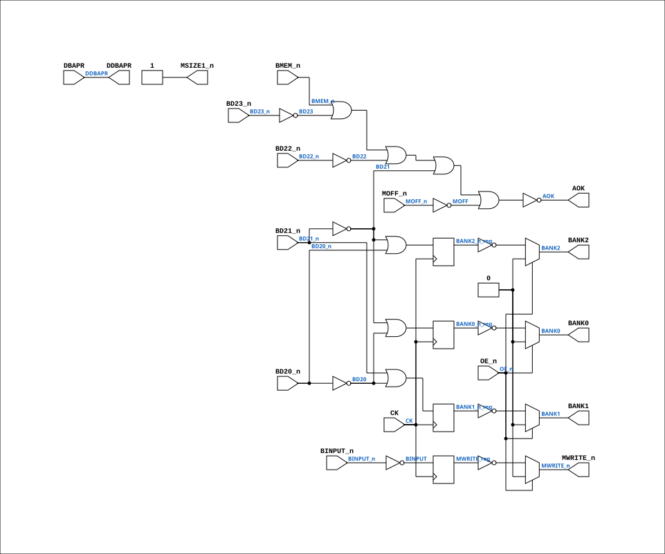

# PAL_44446B

Source: `Verilog/PAL/PAL_44446B.v`

<!-- Generated by Verilog/tests/module_doc.py from the //! comments in the source. Do not edit by hand - edit the RTL comments and regenerate. -->

<!-- HIERARCHY-NAV:BEGIN - written by Verilog/tests/gen_hierarchy.py, do not edit -->

**Hierarchy:** not instantiated by any of the 9 build tops (elaborated by yosys).

[Module hierarchy](../../HIERARCHY.md) - [All modules](../../MODULES.md)

<!-- HIERARCHY-NAV:END -->


<!-- SCHEMATIC:BEGIN - written by Verilog/tests/gen_schematics.py, do not edit -->

## Schematic

Drawn from the Verilog: no build top uses this module, so it was elaborated from its own file with no defines and default parameters. Sub-modules are boxes (click the picture to open it full size; there every sub-module box links to its page, and every wire shows its Verilog name).

[](PAL_44446B.svg)

<!-- SCHEMATIC:END -->

## Description

ND120 PALASM CODE CONVERTED TO VERILOG
Component PAL 44446B
Last reviewed: 22-MAR-2025
Ronny Hansen

## Ports

| Direction | Width | Name | Description |
|---|---|---|---|
| input | `1` | `CK` | Clock signal (connected to DBAPR) |
| input | `1` | `OE_n` *(active low)* | OUTPUT ENABLE (active-low) for Q0-Q3 (connected to BGNT_n) |
| input | `1` | `DBAPR` | I0 - DBAPR (Data Bus Address PResent) |
| input | `1` | `MOFF_n` *(active low)* | I1 - MOFF_n (memory OFF) |
| input | `1` | `BINPUT_n` *(active low)* | I2 - IBINPUT_n (Bus Input) |
| input | `1` | `BMEM_n` *(active low)* | I3 - BMEM_n |
| input | `1` | `BD20_n` *(active low)* | I4 - BD20_n |
| input | `1` | `BD21_n` *(active low)* | I5 - BD21_n |
| input | `1` | `BD22_n` *(active low)* | I6 - BD22_n |
| input | `1` | `BD23_n` *(active low)* | I7 - BD23_n |
| output | `1` | `AOK` | B0_n - AOK  (Address OK) |
| output | `1` | `DDBAPR` | B1_n - DDBAPR (Delayed Data Bus Address Present) |
| output | `1` | `MSIZE1_n` *(active low)* | B2_n - MSIZE1_n (not connected?) |
| output | `1` | `BANK2` | Q0_n - BANK2 |
| output | `1` | `BANK1` | Q1_n - BANK1 |
| output | `1` | `BANK0` | Q2_n - BANK0 |
| output | `1` | `MWRITE_n` *(active low)* | Q3_n - MWRITE_n |

## Verilog source

[`Verilog/PAL/PAL_44446B.v`](https://github.com/RetroCoreLabs/nd-120/blob/main/Verilog/PAL/PAL_44446B.v) on GitHub.

<details markdown="1">
<summary>Show the Verilog of PAL_44446B (108 lines)</summary>

```verilog
/**********************************************************************************************************
** ND120 PALASM CODE CONVERTED TO VERILOG                                                                **
**                                                                                                       **
** Component PAL 44446B                                                                                  **
**                                                                                                       **
** Last reviewed: 22-MAR-2025                                                                            **
** Ronny Hansen                                                                                          **
***********************************************************************************************************/


// PAL16R4
// ADGD 18/8/86
// 44446B, 6G, BADEC
// DMA ADDRESS DECODE FOR 4MB MEMORY

// PCB 3202D sheet 45:
//
// PAL input signal BGNT_n is connected to PAL OE_n pin
//     input signal DBAPR is connectec to PAL CK pin (AND I0)


module PAL_44446B (
    input CK,   //! Clock signal (connected to DBAPR)
    input OE_n, //! OUTPUT ENABLE (active-low) for Q0-Q3 (connected to BGNT_n)

    input DBAPR,     //! I0 - DBAPR (Data Bus Address PResent)
    input MOFF_n,    //! I1 - MOFF_n (memory OFF)
    input BINPUT_n,  //! I2 - IBINPUT_n (Bus Input)
    input BMEM_n,    //! I3 - BMEM_n
    input BD20_n,    //! I4 - BD20_n
    input BD21_n,    //! I5 - BD21_n
    input BD22_n,    //! I6 - BD22_n
    input BD23_n,    //! I7 - BD23_n

    output AOK,       //! B0_n - AOK  (Address OK)
    output DDBAPR,    //! B1_n - DDBAPR (Delayed Data Bus Address Present)
    output MSIZE1_n,  //! B2_n - MSIZE1_n (not connected?)
    //  input  BD19_n,      //! B3_n - BD19_n (not in use)

    output BANK2,    //! Q0_n - BANK2
    output BANK1,    //! Q1_n - BANK1
    output BANK0,    //! Q2_n - BANK0
    output MWRITE_n  //! Q3_n - MWRITE_n
);

  // Inverted input signals
  wire BD20 = ~BD20_n;
  wire BD21 = ~BD21_n;
  wire BD22 = ~BD22_n;
  wire BD23 = ~BD23_n;
  wire MOFF = ~MOFF_n;
  wire BINPUT = ~BINPUT_n;


  // Internal registers
  reg  BANK0_n_reg;
  reg  BANK1_n_reg;
  reg  BANK2_n_reg;
  reg  MWRITE_reg;


  //**** Sequential logic triggered on the rising edge of CLK ****
  always @(posedge CK) begin

    // Logic for BANK0, BANK1, BANK2
    BANK0_n_reg <= BD21 | BD20;
    BANK2_n_reg <= BD21 | BD20_n;
    BANK1_n_reg <= BD21_n | BD20;

    // Logic for MWRITE
    MWRITE_reg  <= BINPUT;

  end

  // Tri-state control for Q outputs
  // High-impedance state when OE_n is high (active-low)
  assign BANK2 = OE_n ? 1'b0 : ~BANK2_n_reg;
  assign BANK1 = OE_n ? 1'b0 : ~BANK1_n_reg;
  assign BANK0 = OE_n ? 1'b0 : ~BANK0_n_reg;
  assign MWRITE_n = OE_n ? 1'b0 : ~MWRITE_reg;

  //**** Syncronous logic (always running) ****

  // Logic for AOK
  assign AOK = ~(BMEM_n | BD23 | BD22 | BD21 | MOFF);  // 4 MB

  // Logic for DDBAPR_n (active-low)
  assign DDBAPR = DBAPR;


  // MSIZE1 is always low (GND) => MSIZE1_n is always HIGH
  assign MSIZE1_n = 1;  // Active-low representation of a constant low signal


endmodule

/*
DESCRIPTION

; 2/1-860LB: BOTH SIDES OF MWRITE EQUATION INVERTED
; 8/1-87JLB: NEW INPUT /MOFF TO DISBLE THE WHOLE MEMORY, BD18 AND BD19 REMOVED.
; 300387 JLB: BLRQ ASSUMED DATA HOLD TIME AFTER TRAILING EDGF OF BAPR !
; CHANGED TO AOK

; 180587 M3202B
; 060687 JLB: SWAPPED BANK1 AND BANK2 TO PROVIDE ENOUGH SPACE FOR PACKAGES.
*/
```

</details>
