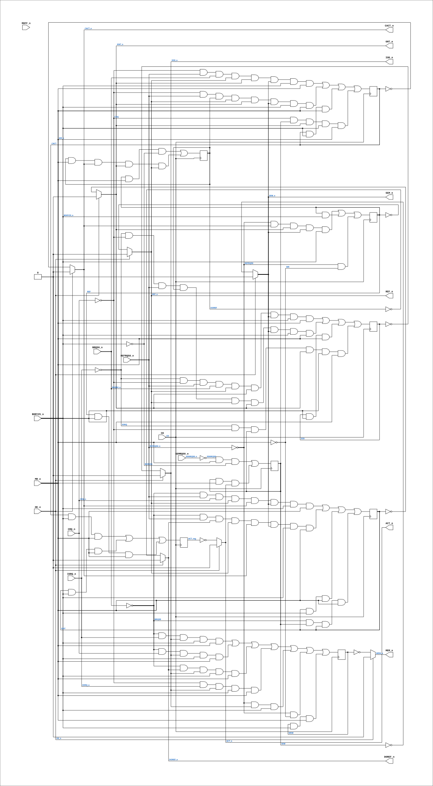

# PAL_44801A

Source: `Verilog/PAL/PAL_44801A.v`

<!-- Generated by Verilog/tests/module_doc.py from the //! comments in the source. Do not edit by hand - edit the RTL comments and regenerate. -->

<!-- HIERARCHY-NAV:BEGIN - written by Verilog/tests/gen_hierarchy.py, do not edit -->

**Where it sits** (Simulation): [ND120_TOP](../../doc/ND120_TOP.md) > [ND120_CORE](../../doc/ND120_CORE.md) > [ND3202D](../../CPU-BOARD-3202/circuit/doc/ND3202D.md) > [BIF_5](../../CPU-BOARD-3202/circuit/doc/BIF_5.md) > [BIF_BCTL_6](../../CPU-BOARD-3202/circuit/doc/BIF_BCTL_6.md) > **PAL_44801A**
- instance path: `CORE.CPU_BOARD.BIF.BCTL.PAL_44801_UBARB`

**Used in:** [BIF_BCTL_6](../../CPU-BOARD-3202/circuit/doc/BIF_BCTL_6.md) (all tops)

**Contains:** no other modules.

[Module hierarchy](../../HIERARCHY.md) - [All modules](../../MODULES.md)

<!-- HIERARCHY-NAV:END -->


<!-- SCHEMATIC:BEGIN - written by Verilog/tests/gen_schematics.py, do not edit -->

## Schematic

Drawn from the Verilog: the yosys netlist of the Simulation (Verilator) build, instance `CORE.CPU_BOARD.BIF.BCTL.PAL_44801_UBARB`. Sub-modules are boxes (click the picture to open it full size; there every sub-module box links to its page, and every wire shows its Verilog name).

[](PAL_44801A.svg)

<!-- SCHEMATIC:END -->

## Description

ND120 PALASM CODE CONVERTED TO VERILOG
Component PAL 44801A
Last reviewed: 22-MAR-2025
Ronny Hansen

## Ports

| Direction | Width | Name | Description |
|---|---|---|---|
| input | `1` | `CK` | Clock signal |
| input | `1` | `OE_n` *(active low)* | OUTPUT ENABLE (active-low) for Q0-Q5 |
| input | `1` | `CRQ_n` *(active low)* | I0 - CRQ_n (CPU Request) |
| input | `1` | `IORQ_n` *(active low)* | I1 - IORQ_n (IO Request) |
| input | `1` | `MR_n` *(active low)* | I2 - MR_n (Master Reset) |
| input | `1` | `BRQ50_n` *(active low)* | I3 - BRQ50_n (Bus Request (50ns delayed)) |
| input | `1` | `REFRQ50_n` *(active low)* | I4 - REFRQ50_n (Refresh Request (50ns delayed)) |
| input | `1` | `BDRY25_n` *(active low)* | I5 - BDRY25_n (Bus Data Ready (25ns delayed)) |
| input | `1` | `SEMRQ50_n` *(active low)* | I6 - SEMRQ50_n (Semaphore Request (50ns delayed)) |
| input | `1` | `MOFF_n` *(active low)* | I7 - MOFF_n  (not used) (Memory OFF) |
| output | `1` | `SEM_n` *(active low)* | Q0_n - SEM_n  (SEMAPHORE GRANT SIGNAL) |
| output | `1` | `ACT_n` *(active low)* | Q1_n - ACT_n (n.c.) (BUS IS ACTIVE) |
| output | `1` | `DOREF_n` *(active low)* | Q2_n - DOREF_n (n.c.) (INDICATES THAT LAST BUS CYCLE WAS A REFRESH) |
| output | `1` | `MEM_n` *(active low)* | Q3_n - MEM_n (n.c.) (MEM SIGNAL TO LAST FOR ENTIRE BUS CYCLE) |
| output | `1` | `REF_n` *(active low)* | Q4_n - REF_n  (REFRESH GRANT ON ND100 BUS) |
| output | `1` | `IOD_n` *(active low)* | Q5_n - IOD_n  (IO SIGNAL TO LAST FOR THE ENTIRE BUS CYCLE) |
| output | `1` | `GNT_n` *(active low)* | Q6_n - GNT_n  (GRANT ND100 BUS TO A DMA DEVICE OR EXTERNAL BUS CONTROLLER) |
| output | `1` | `CACT_n` *(active low)* | Q7_n - CACT_n (CPU IS ACTIVE ON THE ND100 BUS) |

## Verilog source

[`Verilog/PAL/PAL_44801A.v`](https://github.com/RetroCoreLabs/nd-120/blob/main/Verilog/PAL/PAL_44801A.v) on GitHub.

<details markdown="1">
<summary>Show the Verilog of PAL_44801A (188 lines)</summary>

```verilog
/**********************************************************************************************************
** ND120 PALASM CODE CONVERTED TO VERILOG                                                                **
**                                                                                                       **
** Component PAL 44801A                                                                                  **
**                                                                                                       **
** Last reviewed: 22-MAR-2025                                                                            **
** Ronny Hansen                                                                                          **
***********************************************************************************************************/

// PAL16R8
// JLB/CJTC 11AUG86
// 44801A,10D, BARB

//  CYCLE CONTROL STATE COUNTER. FAST VERSION (ND-120/CX).

// PAL16R8 FAMILY
// PAL16R6 has 6 flip-flips, 8 inputs, and 2 input OR output (B0 and B1)

// https://rocelec.widen.net/view/pdf/c6dwcslffz/VANTS00080-1.pdf


// PCB 3202D sheet 6:
//
// PAL input signal PD3 is connected to PAL OE_n pin
//     input signal OSC is connectec to PAL CK pin


module PAL_44801A (
    input CK,   //! Clock signal
    input OE_n, //! OUTPUT ENABLE (active-low) for Q0-Q5 

    input CRQ_n,      //! I0 - CRQ_n (CPU Request)
    input IORQ_n,     //! I1 - IORQ_n (IO Request)
    input MR_n,       //! I2 - MR_n (Master Reset)
    input BRQ50_n,    //! I3 - BRQ50_n (Bus Request (50ns delayed))
    input REFRQ50_n,  //! I4 - REFRQ50_n (Refresh Request (50ns delayed))
    input BDRY25_n,   //! I5 - BDRY25_n (Bus Data Ready (25ns delayed))
    input SEMRQ50_n,  //! I6 - SEMRQ50_n (Semaphore Request (50ns delayed))
    input MOFF_n,     //! I7 - MOFF_n  (not used) (Memory OFF)

    output SEM_n,    //! Q0_n - SEM_n  (SEMAPHORE GRANT SIGNAL)
    output ACT_n,    //! Q1_n - ACT_n (n.c.) (BUS IS ACTIVE)
    output DOREF_n,  //! Q2_n - DOREF_n (n.c.) (INDICATES THAT LAST BUS CYCLE WAS A REFRESH)
    output MEM_n,    //! Q3_n - MEM_n (n.c.) (MEM SIGNAL TO LAST FOR ENTIRE BUS CYCLE)
    output REF_n,    //! Q4_n - REF_n  (REFRESH GRANT ON ND100 BUS)
    output IOD_n,    //! Q5_n - IOD_n  (IO SIGNAL TO LAST FOR THE ENTIRE BUS CYCLE)
    output GNT_n,    //! Q6_n - GNT_n  (GRANT ND100 BUS TO A DMA DEVICE OR EXTERNAL BUS CONTROLLER)
    output CACT_n    //! Q7_n - CACT_n (CPU IS ACTIVE ON THE ND100 BUS)

);

  // Internal registers
  reg  SEM_reg;
  reg  ACT_reg;
  reg  DOREF_reg;
  reg  MEM_reg;
  reg  REF_reg;
  reg  IOD_reg;
  reg  GNT_reg;
  reg  CACT_reg;

  // negated input signals
  wire CRQ = ~CRQ_n;
  wire IORQ = ~IORQ_n;
  wire MR = ~MR_n;
  wire BRQ50 = ~BRQ50_n;
  wire REFRQ50 = ~REFRQ50_n;
  wire BDRY25 = ~BDRY25_n;
  wire SEMRQ50 = ~SEMRQ50_n;

  // Negated reg signals as wires

  wire SEM = SEM_reg;
  wire DOREF = DOREF_reg;
  wire MEM = MEM_reg;
  wire REF = REF_reg;
  wire IOD = IOD_reg;
  wire GNT = GNT_reg;
  wire CACT = CACT_reg;


  //**** Sequential logic triggered on the rising edge of CLK ****
  always @(posedge CK) begin

    // CACT - CPU IS ACTIVE ON THE ND100 BUS
    // Priority-2 term ("CPU request AFTER a refresh") uses DOREF (active-high),
    // NOT DOREF_n. This is the toggled-priority tie-breaker for a simultaneous
    // CPU + DMA request: CACT term 2 fires on DOREF (last cycle was refresh) and
    // GNT term 2 fires on /DOREF (below), so the two are COMPLEMENTARY and
    // exactly one master wins - the bus can never be granted to both at once.
    // FIXED 20-JUL-2026: this term was transcribed as DOREF_n, which made it
    // identical to GNT's /DOREF term, so on DOREF=0 BOTH CACT and GNT set and
    // the CPU ran an IOX cycle on top of a held external DMA grant. Corrected to
    // match the original PALASM: DesignDocuments/PAL-Code/SRC/44801A.txt:11
    // (`CRQ * /REFRQ50 * DOREF * /REF * /GNT * /SEM * /BDRY25 * /MR ; 2`).
    CACT_reg <=
                    (CRQ  & REFRQ50_n & BRQ50_n & REF_n & GNT_n & SEM_n & BDRY25_n & MR_n)  // 4
                  | (CRQ  & REFRQ50_n & DOREF   & REF_n & GNT_n & SEM_n & BDRY25_n & MR_n)  // 2
                  | (CACT & BDRY25_n & MR_n)  // HOLD
                  | (CRQ  & SEM & GNT_n & BDRY25_n & MR_n);  // SEMAPHORE

    // REF - REFRESH GRANT ON ND100 BUS
    REF_reg <= (REFRQ50 & CACT_n & GNT_n & SEM_n & BDRY25_n)  // 1
    | (REF & BDRY25_n)  // HOLD
    | (REFRQ50 & MR);  // ALWAYS GRANT REFRESH DURING MR

    // GNT - GRANT ND100 BUS TO A DMA DEVICE OR EXTERNAL BUS CONTROLLER
    GNT_reg <= (BRQ50 & REFRQ50_n & CRQ_n & REF_n & CACT_n & SEM_n & BDRY25_n & MR_n)  // 3
    | (BRQ50 & REFRQ50_n & DOREF_n & REF_n & CACT_n & SEM_n & BDRY25_n & MR_n)  // 3
    | (GNT & BDRY25_n & MR_n)  // HOLD
    | (BRQ50 & SEM & GNT & MR_n);  // SEMAPHORE

    // IOD - IO SIGNAL TO LAST FOR THE ENTIRE BUS CYCLE
    // FIXED 20-JUL-2026: term 2 ("IOX after a refresh") had TWO transcription
    // errors vs the original PALASM (44801A.txt:31,
    // `IORQ * CRQ * /REFRQ50 * DOREF * /REF * /GNT * /SEM * /BDRY25 * /MR ; 2`):
    // DOREF_n should be DOREF (same inversion as the CACT double-grant bug), and
    // the final term was ~MR_n where PALASM has /MR = MR_n. As written the term
    // could only fire during master reset (MR active) - i.e. it was dead in
    // normal operation, so an IOX right after a refresh never latched IOD via
    // this path. Restored to match PALASM.
    IOD_reg <= (IORQ & CRQ & REFRQ50_n & BRQ50_n & REF_n & GNT_n & SEM_n & BDRY25_n & MR_n)  // 4
    | (IORQ & CRQ & REFRQ50_n & DOREF   & REF_n & GNT_n & SEM_n & BDRY25_n & MR_n)  // 2
    | (IOD & BDRY25_n & MR_n)  // HOLD
    | (IORQ & CRQ & SEM & GNT_n & BDRY25_n & MR_n);  // SEMAPHORE

    // MEM - MEM SIGNAL TO LAST FOR ENTIRE BUS CYCLE
    // GENERATES BMEM WHICH IS PRESENT ON REFRESH, CPU MEMORY AND DMA CYCLES
    MEM_reg <=
     (BRQ50 & IORQ_n   & IOD_n & BDRY25_n & MR_n)
             | (BRQ50 & CRQ_n    & IOD_n & BDRY25_n & MR_n)
             | (BRQ50 & DOREF_n  & IOD_n & BDRY25_n & MR_n)
             | (CRQ   & IORQ_n   & IOD_n & BDRY25_n & MR_n)
             | (REFRQ50          & IOD_n & BDRY25_n)
             | (REFRQ50 & MR)
             | (MEM & BDRY25_n & MR_n);

    // SEM - SEMAPHORE GRANT SIGNAL
    SEM_reg <= (SEMRQ50 & MR_n & BDRY25) | (SEM & MR_n & ACT_n);

    // ACT - BUS IS ACTIVE
    ACT_reg <= (CACT & BDRY25_n & MR_n) | (GNT & BDRY25_n & MR_n) | (REF & BDRY25_n & MR_n);

    // DOREF - INDICATES THAT LAST BUS CYCLE WAS A REFRESH
    // FIXED 20-JUL-2026: the HOLD term was inverted. PALASM (44801A.txt:60,
    // `DOREF * /MR * /CACT * /GNT * /REF`) holds DOREF while CACT, GNT and REF
    // are all INACTIVE (i.e. between the refresh and the next real cycle), so
    // the "last cycle was refresh" flag survives until the CPU/DMA takes its
    // turn - that is what carries the toggled-priority tie-break. The Verilog
    // used ~CACT_n & ~GNT_n & ~REF_n = CACT & GNT & REF (all ACTIVE at once),
    // which is impossible, so the term was always 0 and DOREF never held -
    // it only pulsed for one cycle after a refresh. Restored to /CACT /GNT /REF
    // = CACT_n & GNT_n & REF_n.
    DOREF_reg <= (REF & ~MR & BDRY25) | (DOREF & ~MR & CACT_n & GNT_n & REF_n);

  end

  // Tri-state control for Q outputs
  // Assigning outputs with three-state logic controlled by OE_n
  assign SEM_n   = OE_n ? 1'b0 : ~SEM_reg;
  assign ACT_n   = OE_n ? 1'b0 : ~ACT_reg;
  assign DOREF_n = OE_n ? 1'b0 : ~DOREF_reg;
  assign MEM_n   = OE_n ? 1'b0 : ~MEM_reg;
  assign REF_n   = OE_n ? 1'b0 : ~REF_reg;
  assign IOD_n   = OE_n ? 1'b0 : ~IOD_reg;
  assign GNT_n   = OE_n ? 1'b0 : ~GNT_reg;
  assign CACT_n  = OE_n ? 1'b0 : ~CACT_reg;


endmodule

/*

DESCRIPTION

; PRIORITY:
;           1. REFRESH
:           2. CPU REQUEST AFTER A REFRESH
;           3. BUS REQUEST
;           4. CPU REQUEST

; 26/2-87JLB: WRONG HOLD TERM IN IOD.
;
; 180587 M3202B

*/
```

</details>
