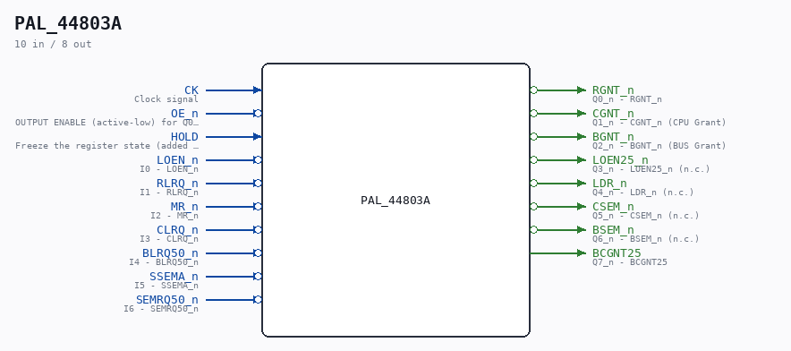

# PAL_44803A

Source: `Verilog/PAL/PAL_44803A.v`

<!-- Generated by Verilog/tests/module_doc.py from the //! comments in the source. Do not edit by hand - edit the RTL comments and regenerate. -->

<!-- HIERARCHY-NAV:BEGIN - written by Verilog/tests/gen_hierarchy.py, do not edit -->

**Where it sits** (Simulation): [ND120_TOP](../../doc/ND120_TOP.md) > [ND120_CORE](../../doc/ND120_CORE.md) > [ND3202D](../../CPU-BOARD-3202/circuit/doc/ND3202D.md) > [MEM_43](../../CPU-BOARD-3202/circuit/doc/MEM_43.md) > [MEM_RAMC_50](../../CPU-BOARD-3202/circuit/doc/MEM_RAMC_50.md) > **PAL_44803A**
- instance path: `CORE.CPU_BOARD.MEM.RAMC.PAL_44803_URAMA`

**Used in:** [MEM_RAMC_50](../../CPU-BOARD-3202/circuit/doc/MEM_RAMC_50.md) (all tops)

**Contains:** no other modules.

[Module hierarchy](../../HIERARCHY.md) - [All modules](../../MODULES.md)

<!-- HIERARCHY-NAV:END -->

## Description

ND120 PALASM CODE CONVERTED TO VERILOG
Component PAL 44803A
Last reviewed: 14-DEC-2024
Ronny Hansen

## Ports

| Direction | Width | Name | Description |
|---|---|---|---|
| input | `1` | `CK` | Clock signal |
| input | `1` | `OE_n` *(active low)* | OUTPUT ENABLE (active-low) for Q0-Q5 |
| input | `1` | `HOLD` | Freeze the register state (added 25-AUG-2026 for the |
| input | `1` | `LOEN_n` *(active low)* | I0 - LOEN_n |
| input | `1` | `RLRQ_n` *(active low)* | I1 - RLRQ_n |
| input | `1` | `MR_n` *(active low)* | I2 - MR_n |
| input | `1` | `CLRQ_n` *(active low)* | I3 - CLRQ_n |
| input | `1` | `BLRQ50_n` *(active low)* | I4 - BLRQ50_n |
| input | `1` | `SSEMA_n` *(active low)* | I5 - SSEMA_n |
| input | `1` | `SEMRQ50_n` *(active low)* | I6 - SEMRQ50_n |
| output | `1` | `RGNT_n` *(active low)* | Q0_n - RGNT_n |
| output | `1` | `CGNT_n` *(active low)* | Q1_n - CGNT_n (CPU Grant) |
| output | `1` | `BGNT_n` *(active low)* | Q2_n - BGNT_n (BUS Grant) |
| output | `1` | `LOEN25_n` *(active low)* | Q3_n - LOEN25_n (n.c.) |
| output | `1` | `LDR_n` *(active low)* | Q4_n - LDR_n (n.c.) |
| output | `1` | `CSEM_n` *(active low)* | Q5_n - CSEM_n (n.c.) |
| output | `1` | `BSEM_n` *(active low)* | Q6_n - BSEM_n (n.c.) |
| output | `1` | `BCGNT25` | Q7_n - BCGNT25 |
