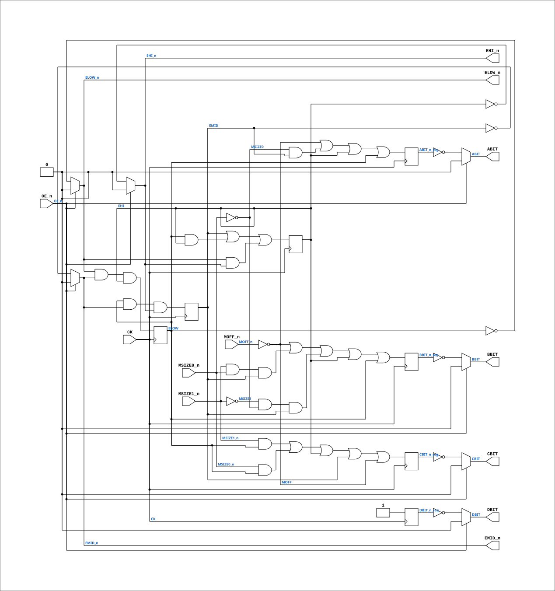

# PAL_44904B

Source: `Verilog/PAL/PAL_44904B.v`

<!-- Generated by Verilog/tests/module_doc.py from the //! comments in the source. Do not edit by hand - edit the RTL comments and regenerate. -->

<!-- HIERARCHY-NAV:BEGIN - written by Verilog/tests/gen_hierarchy.py, do not edit -->

**Where it sits** (Simulation): [ND120_TOP](../../doc/ND120_TOP.md) > [ND120_CORE](../../doc/ND120_CORE.md) > [ND3202D](../../CPU-BOARD-3202/circuit/doc/ND3202D.md) > [MEM_43](../../CPU-BOARD-3202/circuit/doc/MEM_43.md) > [MEM_ADEC_45](../../CPU-BOARD-3202/circuit/doc/MEM_ADEC_45.md) > **PAL_44904B**
- instance path: `CORE.CPU_BOARD.MEM.ADEC.PAL_44904_UMSIZE`

**Used in:** [MEM_ADEC_45](../../CPU-BOARD-3202/circuit/doc/MEM_ADEC_45.md) (all tops)

**Contains:** no other modules.

[Module hierarchy](../../HIERARCHY.md) - [All modules](../../MODULES.md)

<!-- HIERARCHY-NAV:END -->


<!-- SCHEMATIC:BEGIN - written by Verilog/tests/gen_schematics.py, do not edit -->

## Schematic

Drawn from the Verilog: the yosys netlist of the Simulation (Verilator) build, instance `CORE.CPU_BOARD.MEM.ADEC.PAL_44904_UMSIZE`. Sub-modules are boxes (click the picture to open it full size; there every sub-module box links to its page, and every wire shows its Verilog name).

[](PAL_44904B.svg)

<!-- SCHEMATIC:END -->

## Description

ND120 PALASM CODE CONVERTED TO VERILOG
Component PAL 44904B
Last reviewed: 2-FEB-2025
Ronny Hansen

## Ports

| Direction | Width | Name | Description |
|---|---|---|---|
| input | `1` | `CK` | Clock signal |
| input | `1` | `OE_n` *(active low)* | OUTPUT ENABLE (active-low) for Q0-Q5 |
| input | `1` | `MSIZE0_n` *(active low)* | I0 - MSIZE0_n |
| input | `1` | `MSIZE1_n` *(active low)* | I1 - MSIZE1_n |
| input | `1` | `MOFF_n` *(active low)* | I2 - MOFF_n |
| output | `1` | `ABIT` | Q0_n - ABIT // 7-Segmen A-bit |
| output | `1` | `BBIT` | Q1_n - BBIT // 7-Segmen B-bit |
| output | `1` | `CBIT` | Q2_n - CBIT // 7-Segmen C-bit |
| output | `1` | `DBIT` | Q3_n - DBIT // 7-Segmen D-bit |
| output | `1` | `ELOW_n` *(active low)* | Q5_n - ELOWSG_n (Enable LOW segment) |
| output | `1` | `EMID_n` *(active low)* | Q6_n - EMIDSEG_n (Enable MID-Segment) |
| output | `1` | `EHI_n` *(active low)* | Q7_n - EHISEG_n (Eneble HI-Segment) |

## Verilog source

[`Verilog/PAL/PAL_44904B.v`](https://github.com/RetroCoreLabs/nd-120/blob/main/Verilog/PAL/PAL_44904B.v) on GitHub.

<details markdown="1">
<summary>Show the Verilog of PAL_44904B (128 lines)</summary>

```verilog
/**********************************************************************************************************
** ND120 PALASM CODE CONVERTED TO VERILOG                                                                **
**                                                                                                       **
** Component PAL 44904B                                                                                  **
**                                                                                                       **
** Last reviewed: 2-FEB-2025                                                                             **
** Ronny Hansen                                                                                          **
***********************************************************************************************************/


// PAL16R8
// CJTC 180587
// 44904B,7G,SIZEIND

//  RAM SIZE INDICATOR
//  Sheet 45 of 3202D

// PAL16R8 FAMILY
// PAL16R8 has 8 flip-flips, 8 inputs and 8 outputs (negated from flip-flops with 3-state support)

// https://rocelec.widen.net/view/pdf/c6dwcslffz/VANTS00080-1.pdf


// PCB 3202D sheet 45:
//
// PAL input signal PD4 is connected to PAL OE_n pin
//     output signal Q from CHIP 2D is connected to PAL CK pin (RLRQ signal)


module PAL_44904B (
    input CK,   //! Clock signal
    input OE_n, //! OUTPUT ENABLE (active-low) for Q0-Q5

    input MSIZE0_n,  //! I0 - MSIZE0_n
    input MSIZE1_n,  //! I1 - MSIZE1_n
    input MOFF_n,    //! I2 - MOFF_n
    //input i3,      //! I3 - (n.c.)
    //input i4,      //! I4 - (n.c.)
    //input i5,      //! I5 - (n.c.)
    //input i6,      //! I6 - (n.c.)
    //input i7,      //! I7 - (n.c.)

    output ABIT,    //! Q0_n - ABIT // 7-Segmen A-bit
    output BBIT,    //! Q1_n - BBIT // 7-Segmen B-bit
    output CBIT,    //! Q2_n - CBIT // 7-Segmen C-bit
    output DBIT,    //! Q3_n - DBIT // 7-Segmen D-bit
    //output Q4_n,  //! Q4_n - (n.c.)
    output ELOW_n,  //! Q5_n - ELOWSG_n (Enable LOW segment)
    output EMID_n,  //! Q6_n - EMIDSEG_n (Enable MID-Segment)
    output EHI_n    //! Q7_n - EHISEG_n (Eneble HI-Segment)

    //,output wire [3:0]  Q  // Enable to Debug to watch the value of Q change
);

  // negated input signals (not used signals are commented out)
  wire MSIZE0 = ~MSIZE0_n;
  wire MSIZE1 = ~MSIZE1_n;
  wire MOFF = ~MOFF_n;


  // Internal registers (for state-holding variables)
  reg EHI_reg, EMID_reg, ELOW_reg;
  reg ABIT_n_reg, BBIT_n_reg, CBIT_n_reg, DBIT_n_reg;

  // Internal wires
  wire EHI = EHI_reg;
  wire EMID = EMID_reg;
  wire ELOW = ELOW_reg;


  //**** Sequential logic triggered on the rising edge of CLK ****
  always @(posedge CK) begin


    // MEMORY SIZE INDICATOR FOR 0, 2, 4 OR 6 MB MEMORY ARRAYS

    EHI_reg    <= EMID | (ELOW & EHI) | (ELOW_n & EHI_n);  // Enable digit 3


    EMID_reg   <= ELOW & EMID_n & EHI_n;  // Enable digit 2

    ELOW_reg   <= ELOW_n & EMID_n & EHI;  // Enable digit 1

    ABIT_n_reg <= MOFF | (MSIZE0 & EMID) | EHI | ELOW;

    BBIT_n_reg <= MOFF | (MSIZE1_n & MSIZE0_n & EMID) | (MSIZE1 & MSIZE0 & EMID) | EHI | ELOW;

    CBIT_n_reg <= (MSIZE1_n & ELOW) | (MSIZE0_n & ELOW) | EHI | EMID | MOFF;

    DBIT_n_reg <= 1'b1;  // VCC, always high


  end

  // Tri-state control for Q outputs
  // Assigning outputs with three-state logic controlled by OE_n

  assign ABIT   = OE_n ? 1'b0 : ~ABIT_n_reg;  // Q0_n
  assign BBIT   = OE_n ? 1'b0 : ~BBIT_n_reg;  // Q1_n
  assign CBIT   = OE_n ? 1'b0 : ~CBIT_n_reg;  // Q2_n
  assign DBIT   = OE_n ? 1'b0 : ~DBIT_n_reg;  // Q3_n
                                              // Q4_n
  assign EHI_n  = OE_n ? 1'b0 : ~EHI_reg;  // Q5_n
  assign EMID_n = OE_n ? 1'b0 : ~EMID_reg;  // Q6_n
  assign ELOW_n = OE_n ? 1'b0 : ~ELOW_reg;  // Q7_n


endmodule

/*

DESCRIPTION

                MEMORY SIZE     S1  S0
                -----------     --  --
                    2MB          F   F
                    4MB          F   T
                    6MB          T   F
                    1MB          T   T


DIGIT ENABLE BITS : ELOW --> EMID --> EHI

; 170687 CJTC/JLB: ADDED 1MB INDICATION.
*/
```

</details>
