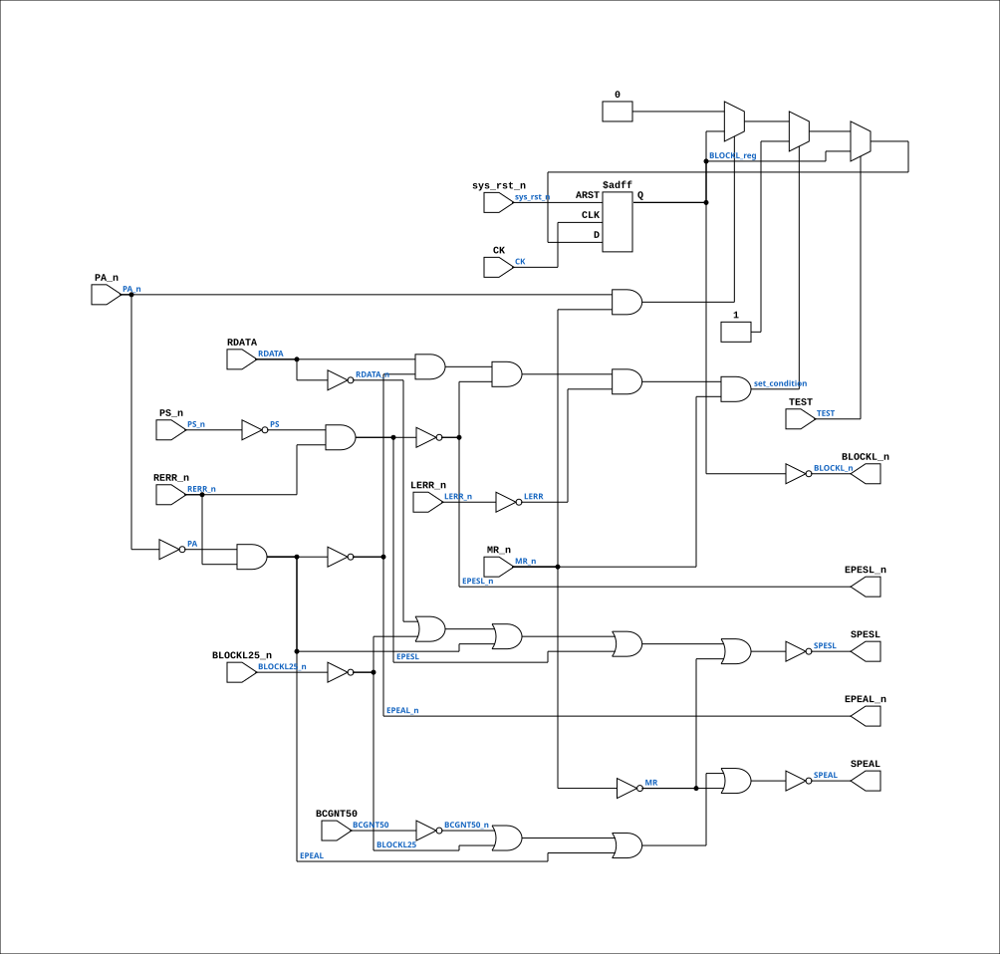

# PAL_45009B

Source: `Verilog/PAL/PAL_45009B.v`

<!-- Generated by Verilog/tests/module_doc.py from the //! comments in the source. Do not edit by hand - edit the RTL comments and regenerate. -->

<!-- HIERARCHY-NAV:BEGIN - written by Verilog/tests/gen_hierarchy.py, do not edit -->

**Where it sits** (Simulation): [ND120_TOP](../../doc/ND120_TOP.md) > [ND120_CORE](../../doc/ND120_CORE.md) > [ND3202D](../../CPU-BOARD-3202/circuit/doc/ND3202D.md) > [MEM_43](../../CPU-BOARD-3202/circuit/doc/MEM_43.md) > [MEM_ERROR_47](../../CPU-BOARD-3202/circuit/doc/MEM_ERROR_47.md) > **PAL_45009B**
- instance path: `CORE.CPU_BOARD.MEM.ERROR.PAL_45009_UERROR`

**Used in:** [MEM_ERROR_47](../../CPU-BOARD-3202/circuit/doc/MEM_ERROR_47.md) (all tops)

**Contains:** no other modules.

[Module hierarchy](../../HIERARCHY.md) - [All modules](../../MODULES.md)

<!-- HIERARCHY-NAV:END -->


<!-- SCHEMATIC:BEGIN - written by Verilog/tests/gen_schematics.py, do not edit -->

## Schematic

Drawn from the Verilog: the yosys netlist of the Simulation (Verilator) build, instance `CORE.CPU_BOARD.MEM.ERROR.PAL_45009_UERROR`. Sub-modules are boxes (click the picture to open it full size; there every sub-module box links to its page, and every wire shows its Verilog name).

[](PAL_45009B.svg)

<!-- SCHEMATIC:END -->

## Description

ND120 PALASM CODE CONVERTED TO VERILOG
Component PAL 45009B
Last reviewed: 2-FEB-2025
Ronny Hansen

## Ports

| Direction | Width | Name | Description |
|---|---|---|---|
| input | `1` | `CK` | Clock input (added for FPGA synthesis) |
| input | `1` | `sys_rst_n` *(active low)* | System reset (active low, for FPGA synthesis) |
| input | `1` | `RDATA` | I0 - RDATA25 signal (doesnt match name) |
| input | `1` | `BLOCKL25_n` *(active low)* | I1 - BLOCKL25_n |
| input | `1` | `BCGNT50` | I2 - BCGNT50 |
| input | `1` | `PS_n` *(active low)* | I3 - PS_n |
| input | `1` | `RERR_n` *(active low)* | I4 - RERR_n |
| input | `1` | `PA_n` *(active low)* | I5 - PA_n |
| input | `1` | `TEST` | I6 - PD4 |
| input | `1` | `LERR_n` *(active low)* | I7 - LERR_n |
| input | `1` | `MR_n` *(active low)* | I9 - MR_n |
| output | `1` | `SPESL` | Y0_n (OUT Only) |
| output | `1` | `SPEAL` | Y1_n (OUT ONLY) |
| output | `1` | `EPESL_n` *(active low)* | B0_n - EPESL_n (clock to PEAL register) |
| output | `1` | `EPEAL_n` *(active low)* | B1_n - EPEAL_n (/output enable to PEAL register) |
| output | `1` | `BLOCKL_n` *(active low)* | B2_n - BLOCKL_n |

## Verilog source

[`Verilog/PAL/PAL_45009B.v`](https://github.com/RetroCoreLabs/nd-120/blob/main/Verilog/PAL/PAL_45009B.v) on GitHub.

<details markdown="1">
<summary>Show the Verilog of PAL_45009B (126 lines)</summary>

```verilog
/**********************************************************************************************************
** ND120 PALASM CODE CONVERTED TO VERILOG                                                                **
**                                                                                                       **
** Component PAL 45009B                                                                                  **
**                                                                                                       **
** Last reviewed: 2-FEB-2025                                                                             **
** Ronny Hansen                                                                                          **
***********************************************************************************************************/


// PAL16L8
// ADGD 12AUG86
// 45009B,4F ,ERROR


// PCB 3202D sheet 47:
//

// PAL 16L8
// 10 INPUT only pins (I0-I9)
// 2 OUT only pins (Y0-Y1) and 6 IN or OUT pins (B0-B5)
//
// PAL16RL8 (https://rocelec.widen.net/view/pdf/c6dwcslffz/VANTS00080-1.pdf)

// NOTE: PAL16L8 is purely combinational in the original hardware.
// Clock input added for FPGA synthesis to eliminate latch inference.

module PAL_45009B (
    input CK,          //! Clock input (added for FPGA synthesis)
    input sys_rst_n,   //! System reset (active low, for FPGA synthesis)

    input RDATA,       //! I0 - RDATA25 signal (doesnt match name)
    input BLOCKL25_n,  //! I1 - BLOCKL25_n
    input BCGNT50,     //! I2 - BCGNT50
    input PS_n,        //! I3 - PS_n
    input RERR_n,      //! I4 - RERR_n
    input PA_n,        //! I5 - PA_n
    input TEST,        //! I6 - PD4
    input LERR_n,      //! I7 - LERR_n
    // input not_connected,   //! I8 -
    input MR_n,        //! I9 - MR_n


    output SPESL,  //! Y0_n (OUT Only)
    output SPEAL,  //! Y1_n (OUT ONLY)

    output EPESL_n,  //! B0_n - EPESL_n (clock to PEAL register)
    output EPEAL_n,  //! B1_n - EPEAL_n (/output enable to PEAL register)
    output BLOCKL_n  //! B2_n - BLOCKL_n
    // inout B3_n,   //! B3_n - (n.c)
    // inout B4_n,   //! B4_n - (n.c)
    // inout B5_n    //! B5_n - (n.c)
);


  // Verilog code equivalent to the provided PALASM code
  wire RDATA_n = ~RDATA;
  wire BCGNT50_n = ~BCGNT50;
  wire PS = ~PS_n;
  wire PA = ~PA_n;
  wire LERR = ~LERR_n;
  wire MR = ~MR_n;
  wire BLOCKL25 = ~BLOCKL25_n;
  wire EPESL = ~EPESL_n;
  wire EPEAL = ~EPEAL_n;

  reg  BLOCKL_reg;

  //** IGNORING TEST MODE FOR NOW **//

  // RDATA USED AS WRITE PULSE WHEN NOT BLOCKED
  assign SPESL   = ~(RDATA_n | BLOCKL25 | EPEAL | EPESL | MR);

  // BCGNT USED AS WRITE PULSE
  assign SPEAL   = ~(BCGNT50_n | BLOCKL25 | EPEAL | MR);

  // ENABLE IF ERROR IN LOCAL MEMORY
  assign EPESL_n = ~(PS & RERR_n);
  assign EPEAL_n = ~(PA & RERR_n);

  // BLOCKL condition
  wire set_condition = (RDATA & EPEAL_n & EPESL_n & LERR & MR_n);
  wire reset_condition = !(PA_n & MR_n);

`ifdef USE_TRANSPARENT_LATCHES
  // Transparent latch (original behavior for simulation)
  /* verilator lint_off LATCH */
  always @(*) begin
    if (!TEST) begin
      if (set_condition) BLOCKL_reg = 1'b1;  // SET ON LOCAL ERROR
      else if (reset_condition)
        BLOCKL_reg = 1'b0;  // HOLD TILL PEA READ
    end
  end
  /* verilator lint_on LATCH */
`else
  // Edge-triggered flip-flop (FPGA synthesis)
  always @(posedge CK or negedge sys_rst_n) begin
    if (!sys_rst_n) begin
      BLOCKL_reg <= 1'b0;
    end else if (!TEST) begin
      if (set_condition) BLOCKL_reg <= 1'b1;
      else if (reset_condition)
        BLOCKL_reg <= 1'b0;
    end
  end
`endif

  assign BLOCKL_n = ~BLOCKL_reg;

endmodule

/*


DESCRIPTION

; 2/4-87JLB: RDATA PIN 1.
; 070487 JLB: MUST NOT LOCK ON MOR, THAT IS DONE IN THE BUS INTERFACE ANYWAY
; UNBLOCK ON PA (I.E. ALSO IF THE BUS PEA WAS READ)
; 150487 CJTC: NO!!! SPIKES ON SPEAL - USE BLOCKL25 INSTEAD OF BLOCKL
;
; 180587 : M3202B
; 090887 B JLB: TEST MODE FOR C-PRINT.

*/
```

</details>
