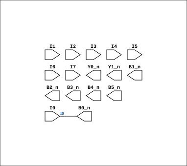

# PAL_16L8

Source: `Verilog/PAL/template/PAL18L8.v`

<!-- Generated by Verilog/tests/module_doc.py from the //! comments in the source. Do not edit by hand - edit the RTL comments and regenerate. -->

<!-- HIERARCHY-NAV:BEGIN - written by Verilog/tests/gen_hierarchy.py, do not edit -->

**Hierarchy:** not instantiated by any of the 9 build tops (elaborated by yosys).

[Module hierarchy](../../../HIERARCHY.md) - [All modules](../../../MODULES.md)

<!-- HIERARCHY-NAV:END -->


<!-- SCHEMATIC:BEGIN - written by Verilog/tests/gen_schematics.py, do not edit -->

## Schematic

Drawn from the Verilog: no build top uses this module, so it was elaborated from its own file with no defines and default parameters. Sub-modules are boxes (click the picture to open it full size; there every sub-module box links to its page, and every wire shows its Verilog name).

[](PAL_16L8.svg)

<!-- SCHEMATIC:END -->

## Ports

| Direction | Width | Name | Description |
|---|---|---|---|
| input | `1` | `I0` | I0 |
| input | `1` | `I1` | I1 |
| input | `1` | `I2` | I2 |
| input | `1` | `I3` | I3 |
| input | `1` | `I4` | I4 |
| input | `1` | `I5` | I5 |
| input | `1` | `I6` | I6 |
| input | `1` | `I7` | I7 |
| output | `1` | `Y0_n` *(active low)* | Y0_n (Can be IN or OUT) |
| output | `1` | `Y1_n` *(active low)* | Y1_n (Can be IN or OUT) |
| output | `1` | `B0_n` *(active low)* | B0_n |
| output | `1` | `B1_n` *(active low)* | B1_n |
| output | `1` | `B2_n` *(active low)* | B2_n |
| output | `1` | `B3_n` *(active low)* | B3_n |
| output | `1` | `B4_n` *(active low)* | B4_n |
| output | `1` | `B5_n` *(active low)* | B5_n |

## Verilog source

[`Verilog/PAL/template/PAL18L8.v`](https://github.com/RetroCoreLabs/nd-120/blob/main/Verilog/PAL/template/PAL18L8.v) on GitHub.

<details markdown="1">
<summary>Show the Verilog of PAL_16L8 (45 lines)</summary>

```verilog
// PAL 16L8
// 10 INPUT only pins (I0-I9)
// 2 OUT only pins (Y0-Y1) and 6 IN or OUT pins (B0-B5)
//
// PAL16RL8 (https://rocelec.widen.net/view/pdf/c6dwcslffz/VANTS00080-1.pdf)


/* 
PALASM PINS

I0 I1 I2 I3 I4 I5 I6 I7 I8 GND
I9 O8/Y1 IO7/B5 IO6/B4 IO5/B3 IO4/B2 IO3/B1 IO2/B0 IO1/B6 O1/Y0 VCC

*/


module PAL_16L8(

    input I0,           // I0
    input I1,           // I1
    input I2,           // I2
    input I3,           // I3
    input I4,           // I4
    input I5,           // I5
    input I6,           // I6   
    input I7,           // I7    


    output Y0_n,        // Y0_n (Can be IN or OUT)
    output Y1_n,        // Y1_n (Can be IN or OUT)
    
    output B0_n,        // B0_n
    output B1_n,        // B1_n
    output B2_n,        // B2_n
    output B3_n,        // B3_n
    output B4_n,        // B4_n             
    output B5_n         // B5_n             
);


// * TEMPLATE *

assign B0_n = I0;

endmodule
```

</details>
