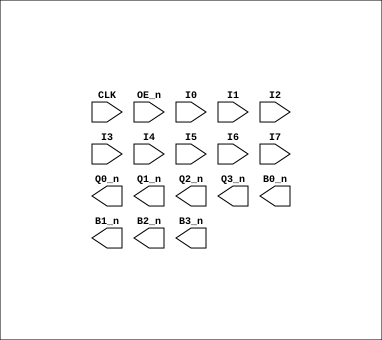

# PAL_16R4

Source: `Verilog/PAL/template/PAL16R4.v`

<!-- Generated by Verilog/tests/module_doc.py from the //! comments in the source. Do not edit by hand - edit the RTL comments and regenerate. -->

<!-- HIERARCHY-NAV:BEGIN - written by Verilog/tests/gen_hierarchy.py, do not edit -->

**Hierarchy:** not instantiated by any of the 9 build tops (elaborated by yosys).

[Module hierarchy](../../../HIERARCHY.md) - [All modules](../../../MODULES.md)

<!-- HIERARCHY-NAV:END -->


<!-- SCHEMATIC:BEGIN - written by Verilog/tests/gen_schematics.py, do not edit -->

## Schematic

Drawn from the Verilog: no build top uses this module, so it was elaborated from its own file with no defines and default parameters. Sub-modules are boxes (click the picture to open it full size; there every sub-module box links to its page, and every wire shows its Verilog name).

[](PAL_16R4.svg)

<!-- SCHEMATIC:END -->

## Ports

| Direction | Width | Name | Description |
|---|---|---|---|
| input | `1` | `CLK` | Clock signal |
| input | `1` | `OE_n` *(active low)* | OUTPUT ENABLE (active-low) for Q0-Q3 |
| input | `1` | `I0` | I0 |
| input | `1` | `I1` | I1 |
| input | `1` | `I2` | I2 |
| input | `1` | `I3` | I3 |
| input | `1` | `I4` | I4 |
| input | `1` | `I5` | I5 |
| input | `1` | `I6` | I6 |
| input | `1` | `I7` | I7 |
| output | `1` | `Q0_n` *(active low)* | Q0_n (Three-state and clocked) |
| output | `1` | `Q1_n` *(active low)* | Q1_n (Three-state and clocked) |
| output | `1` | `Q2_n` *(active low)* | Q2_n (Three-state and clocked) |
| output | `1` | `Q3_n` *(active low)* | Q3_n (Three-state and clocked) |
| output | `1` | `B0_n` *(active low)* | B0_n Can be IN or OUT) |
| output | `1` | `B1_n` *(active low)* | B1_n Can be IN or OUT) |
| output | `1` | `B2_n` *(active low)* | B2_n Can be IN or OUT) |
| output | `1` | `B3_n` *(active low)* | B3_n Can be IN or OUT) |

## Verilog source

[`Verilog/PAL/template/PAL16R4.v`](https://github.com/RetroCoreLabs/nd-120/blob/main/Verilog/PAL/template/PAL16R4.v) on GitHub.

<details markdown="1">
<summary>Show the Verilog of PAL_16R4 (45 lines)</summary>

```verilog
// PAL 16L8
// 8 INPUT only pins (I0-I9)
// 4 OUT only pins (Y0-Y1) and 4 IN or OUT pins (B0-B5)


// PAL16R4 (https://rocelec.widen.net/view/pdf/c6dwcslffz/VANTS00080-1.pdf)
// I/O 1,2, 7 and 8 (Pins B0 to B3) is not controlled by OE_n, only O3,O4,O5 and O6 (Pin's Q0-Q3)


/* 
PALASM PINS

CLK I0 I1 I2 I3 I4 I5 I6 I7 GND
/OE IO8/B3 IO7/B2 O6/Q3 O5/Q2 O4/Q1 O3/Q0 IO2/B1 IO1/B0 VCC

*/


module PAL_16R4(
    input CLK,          // Clock signal
    input OE_n,         // OUTPUT ENABLE (active-low) for Q0-Q3

    input I0,           // I0
    input I1,           // I1
    input I2,           // I2
    input I3,           // I3
    input I4,           // I4
    input I5,           // I5
    input I6,           // I6   
    input I7,           // I7    


    output Q0_n,        // Q0_n (Three-state and clocked)
    output Q1_n,        // Q1_n (Three-state and clocked)
    output Q2_n,        // Q2_n (Three-state and clocked)
    output Q3_n,        // Q3_n (Three-state and clocked)
    
    output B0_n,        // B0_n Can be IN or OUT)
    output B1_n,        // B1_n Can be IN or OUT)
    output B2_n,        // B2_n Can be IN or OUT)
    output B3_n         // B3_n Can be IN or OUT)
);

endmodule
```

</details>
