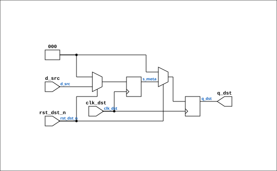

# nds_sync_level

Source: `Verilog/SD-FAT/circuit/nds_sync.v`

<!-- Generated by Verilog/tests/module_doc.py from the //! comments in the source. Do not edit by hand - edit the RTL comments and regenerate. -->

<!-- HIERARCHY-NAV:BEGIN - written by Verilog/tests/gen_hierarchy.py, do not edit -->

**Where it sits** (Simulation): [ND120_TOP](../../../doc/ND120_TOP.md) > [nd_storage_devices](nd_storage_devices.md) > [nd_storage](nd_storage.md) > [nd_storage_engine](nd_storage_engine.md) > **nds_sync_level**
- instance path: `TAPE_SDFAT_SOURCE.u_nd_storage.u_engine.u_sync_err`

**Used in:** [nd_storage_engine](nd_storage_engine.md) (Simulation, Tang, Nexys, QMTECH)

**Contains:** no other modules.

[Module hierarchy](../../../HIERARCHY.md) - [All modules](../../../MODULES.md)

<!-- HIERARCHY-NAV:END -->


<!-- SCHEMATIC:BEGIN - written by Verilog/tests/gen_schematics.py, do not edit -->

## Schematic

Drawn from the Verilog: the yosys netlist of the Simulation (Verilator) build, instance `TAPE_SDFAT_SOURCE.u_nd_storage.u_engine.u_sync_grant`. Sub-modules are boxes (click the picture to open it full size; there every sub-module box links to its page, and every wire shows its Verilog name).

[](nds_sync_level.svg)

<!-- SCHEMATIC:END -->

## Description

nd_storage CDC synchronizer primitives
The two small modules used by every clock-domain crossing in the
nd_storage stack (docs/nd-storage-design.md section 4.4: all
crossings are 2-flop and toggle-based).
nds_sync_pulse - toggle in, pulse out: the SOURCE domain flips a
toggle register; this module 2-flop-synchronizes the toggle into
the destination clock and emits a registered one-cycle pulse per
flip. Payload riding with the toggle must be held stable by the
source from the flip until the handshake answer returns: the
receiver samples it at the pulse, which is at least two
destination clocks after the flip landed.
nds_sync_level - plain 2-flop level synchronizer, WIDTH bits, for
quasi-static levels (open_ok, grant id, err flag). Multi-bit
values may only change while no consumer acts on them (the grant
id changes only while the word bridge is idle).
Source toggles must reset to 0 in their own domain: a toggle that is
already 1 when the destination leaves reset yields one spurious
pulse.
Last reviewed: 11-JUL-2026
Ronny Hansen

## Parameters

| Parameter | Default |
|---|---|
| `WIDTH` | `1` |

## Ports

| Direction | Width | Name | Description |
|---|---|---|---|
| input | `1` | `clk_dst` | destination clock |
| input | `1` | `rst_dst_n` *(active low)* | destination-domain reset |
| input | `[WIDTH-1:0]` | `d_src` | level in the source domain |
| output | `[WIDTH-1:0]` | `q_dst` | synchronized level |

## Verilog source

[`Verilog/SD-FAT/circuit/nds_sync.v`](https://github.com/RetroCoreLabs/nd-120/blob/main/Verilog/SD-FAT/circuit/nds_sync.v) on GitHub.

<details markdown="1">
<summary>Show the Verilog of nds_sync_level (25 lines)</summary>

```verilog
module nds_sync_level #(
    parameter WIDTH = 1
) (
    input  wire             clk_dst,    // destination clock
    input  wire             rst_dst_n,  // destination-domain reset
    input  wire [WIDTH-1:0] d_src,      // level in the source domain
    output wire [WIDTH-1:0] q_dst       // synchronized level
);

  reg [WIDTH-1:0] s_meta;
  reg [WIDTH-1:0] s_sync;

  always @(posedge clk_dst) begin
    if (!rst_dst_n) begin
      s_meta <= {WIDTH{1'b0}};
      s_sync <= {WIDTH{1'b0}};
    end else begin
      s_meta <= d_src;
      s_sync <= s_meta;
    end
  end

  assign q_dst = s_sync;

endmodule
```

</details>
