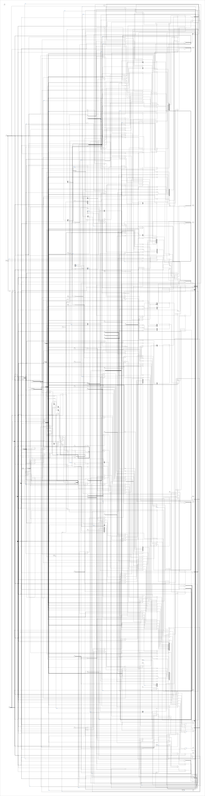

# sd_card_ctrl

Source: `Verilog/SD-FAT/circuit/sd_file_reader.v`

<!-- Generated by Verilog/tests/module_doc.py from the //! comments in the source. Do not edit by hand - edit the RTL comments and regenerate. -->

<!-- HIERARCHY-NAV:BEGIN - written by Verilog/tests/gen_hierarchy.py, do not edit -->

**Where it sits** (Simulation): [ND120_TOP](../../../doc/ND120_TOP.md) > [nd_storage_devices](nd_storage_devices.md) > [nd_storage](nd_storage.md) > [sd_file_reader](sd_file_reader.md) > **sd_card_ctrl**
- instance path: `TAPE_SDFAT_SOURCE.u_nd_storage.u_reader.u_ctrl`

**Used in:** [sd_file_reader](sd_file_reader.md) (Simulation, Tang, Nexys, QMTECH)

**Contains:** no other modules.

[Module hierarchy](../../../HIERARCHY.md) - [All modules](../../../MODULES.md)

<!-- HIERARCHY-NAV:END -->


<!-- SCHEMATIC:BEGIN - written by Verilog/tests/gen_schematics.py, do not edit -->

## Schematic

Drawn from the Verilog: the yosys netlist of the Simulation (Verilator) build, instance `TAPE_SDFAT_SOURCE.u_nd_storage.u_reader.u_ctrl`. Sub-modules are boxes (click the picture to open it full size; there every sub-module box links to its page, and every wire shows its Verilog name).

[](sd_card_ctrl.svg)

<!-- SCHEMATIC:END -->

## Description

SD card init + FAT16/FAT32 mount + root-directory scan + file stream
ORIGINAL ND-120 project code (MIT, like the repository). CLEAN-ROOM
implementation from public specifications only: the SD Physical Layer
Simplified Specification (command framing, init sequence, response
formats, data-block framing) and the Microsoft FAT specification
(MBR/BPB layout, FAT12/16/32 thresholds, directory entries, VFAT long
file names). The command/data bit engine reuses the proven idiom of
this project's own sd_writer.v (tick-based bit clock, CRC functions,
48-bit command shifter).
One run per release of rstn (the consumers hold the module in reset
and release it per command - the rewind / card-swap recovery pattern):
1. card init at the identification clock (~137 kHz at 27 MHz):
74+ dummy clocks, CMD0, CMD8 (SDv2 detect), CMD55+ACMD41 loop
(HCS; CCS in the OCR selects SDHC block addressing), CMD2 (CID),
CMD3 (RCA), CMD9 (CSD - card_capacity_mb is decoded from it, both
CSD v1 and v2; a CMD9 timeout is tolerated and leaves it 0),
CMD7 (select) - then the DATA clock (clk/(2*CLK_DIV),
13.5 MHz at 27 MHz / CLK_DIV=1) - CMD16 (512-byte blocks).
card_stat counts the init steps; >= 8 means the card is ready.
2. mount: sector 0 is a DBR (superfloppy) or an MBR (the four
partition entries are walked for the first plausible volume);
the BPB gives the geometry. Cluster count < 4085 (FAT12) or a
malformed BPB = unmountable: scan_done without filesystem_type.
3. root directory scan (FAT16 linear region / FAT32 root cluster
chain, CMD17 per sector): every plain file and subdirectory is
reported on dir_entry_* (VFAT long name when a valid LFN chain
with a matching SFN checksum precedes the entry, else the 8.3
name, no trailing dot on extension-less names); deleted entries,
volume labels and hidden/system/read-only entries are skipped;
a 0x00 name byte ends the directory. target_name/target_len is
matched case-insensitively (target_len = 0 never matches: LIST
mode).
4. file streaming: the FAT chain is walked run by run (consecutive
clusters merge into one CMD18 multi-block read - the speed path;
a single-sector tail uses CMD17); every block's CRC16 is
verified; found_file_size bytes are emitted in order on
outen/outbyte.
5. scan_done (sticky level): file streamed, file not found after
the full scan, or unmountable filesystem.
No tristates (repo rule): CMD is exposed as sdcmd_i/_o/_oe; DAT0 is
never driven by this module (read-only core - writes live in
sd_writer.v).
CLK_DIV: data-phase half-period in clk cycles. 1 = clk/2 (13.5 MHz at
27 MHz, inside the mandatory 25 MHz default-speed limit); legacy
values >1 divide further (2 = clk/4 for 25-50 MHz clocks). The
identification clock is fixed near 137 kHz at 27 MHz (100-400 kHz
band). SIMULATE=1 shortens only the identification clock and the
power-up dummy-clock run (simulation card models answer immediately).
Last reviewed: 11-JUL-2026
Ronny Hansen

## Parameters

| Parameter | Default |
|---|---|
| `DATA_DIV` | `8'd1` |
| `INIT_DIV` | `8'd99` |

## Ports

| Direction | Width | Name | Description |
|---|---|---|---|
| input | `1` | `clk` |  |
| input | `1` | `rstn` |  |
| input | `1` | `slow` |  |
| input | `1` | `op_start` |  |
| input | `[1:0]` | `op_kind` |  |
| input | `[5:0]` | `op_cmd` |  |
| input | `[31:0]` | `op_arg` |  |
| input | `1` | `op_r2` |  |
| input | `[7:0]` | `op_ndum` |  |
| input | `[12:0]` | `op_nblk` |  |
| output | `1` | `busy` |  |
| output | `1` | `done` |  |
| output | `1` | `err` |  |
| output | `[31:0]` | `resp_arg` |  |
| output | `[127:0]` | `resp_r2` | R2 payload: bit k = CID/CSD bit k (k >= 1) |
| output | `1` | `rx_we` |  |
| output | `[7:0]` | `rx_byte` |  |
| output | `[8:0]` | `rx_idx` |  |
| output | `1` | `sdclk` |  |
| input | `1` | `sdcmd_i` |  |
| output | `1` | `sdcmd_o` |  |
| output | `1` | `sdcmd_oe` |  |
| input | `1` | `sddat0` |  |

## Verilog source

[`Verilog/SD-FAT/circuit/sd_file_reader.v`](https://github.com/RetroCoreLabs/nd-120/blob/main/Verilog/SD-FAT/circuit/sd_file_reader.v) on GitHub.

<details markdown="1">
<summary>Show the Verilog of sd_card_ctrl (322 lines)</summary>

```verilog
/****************************************************************************
** sd_card_ctrl - SD command / read-data bit engine (1-bit SD native)      **
**                                                                         **
** Helper of sd_file_reader (same file, same clean-room provenance). One   **
** operation at a time:                                                    **
**   K_DUMMY  op_ndum sdclk cycles with CMD driven high (power-up ramp,    **
**            ACMD41 retry spacing)                                        **
**   K_CMD    48-bit command (start 0, host 1, index, arg, CRC7, end 1),   **
**            then a 48-bit (or 136-bit, op_r2) response; resp_arg         **
**            captures the 32-bit argument field                           **
**   K_CMDN   command without a response (CMD0)                            **
**   K_READ   command + R1, then op_nblk data blocks on DAT0 (start 0 +    **
**            4096 data bits + CRC16 + end); every byte is strobed out on  **
**            rx_we/rx_byte/rx_idx and every block's CRC16 is verified     **
**            (the CCITT accumulator over data+CRC ends at zero).          **
**            op_nblk > 1 sends CMD18 traffic and terminates with CMD12;   **
**            a CRC error or data timeout mid-stream aborts via CMD12      **
**            and reports err.                                             **
**                                                                         **
** Outputs change on the falling sdclk edge, inputs are sampled on the     **
** rising edge (the sd_writer.v timing idiom, proven at CLKDIV=1 =         **
** 13.5 MHz on hardware). The bit clock halves are DATA_DIV clk cycles     **
** (INIT_DIV while slow=1). No tristates: sdcmd_o/_oe only, DAT0 is        **
** never driven.                                                           **
**                                                                         **
** Last reviewed: 11-JUL-2026                                              **
** Ronny Hansen                                                            **
*****************************************************************************/

module sd_card_ctrl #(
    parameter [7:0] DATA_DIV = 8'd1,
    parameter [7:0] INIT_DIV = 8'd99
) (
    input wire clk,
    input wire rstn,
    input wire slow,

    input  wire        op_start,
    input  wire [1:0]  op_kind,
    input  wire [5:0]  op_cmd,
    input  wire [31:0] op_arg,
    input  wire        op_r2,
    input  wire [7:0]  op_ndum,
    input  wire [12:0] op_nblk,
    output wire        busy,
    output reg         done,
    output reg         err,
    output reg  [31:0] resp_arg,
    output reg [127:0] resp_r2,  // R2 payload: bit k = CID/CSD bit k (k >= 1)

    output reg        rx_we,
    output reg  [7:0] rx_byte,
    output reg  [8:0] rx_idx,

    output reg  sdclk,
    input  wire sdcmd_i,
    output reg  sdcmd_o,
    output reg  sdcmd_oe,
    input  wire sddat0
);

  function [6:0] crc7_step(input [6:0] c, input b);
    crc7_step = {c[5:0], 1'b0} ^ (7'h09 & {7{c[6] ^ b}});
  endfunction

  function [15:0] crc16_step(input [15:0] c, input b);
    crc16_step = {c[14:0], 1'b0} ^ (16'h1021 & {16{c[15] ^ b}});
  endfunction

  // ------------------------------------------------------------- bit clock
  reg [7:0] divcnt;
  wire [7:0] half = slow ? INIT_DIV : DATA_DIV;
  wire tick = (divcnt >= half - 8'd1);
  wire fall_tick = tick && sdclk;   // next edge falls: change outputs
  wire rise_tick = tick && !sdclk;  // next edge rises: sample inputs

  // ------------------------------------------------------------- FSM
  localparam [3:0] E_IDLE  = 4'd0;
  localparam [3:0] E_DUM   = 4'd1;
  localparam [3:0] E_GAP   = 4'd2;   // 8 released clocks before a command
  localparam [3:0] E_CMD   = 4'd3;   // shift the 48-bit command
  localparam [3:0] E_NRC   = 4'd4;   // no-response tail (CMD0)
  localparam [3:0] E_RWAIT = 4'd5;   // response start bit
  localparam [3:0] E_RESP  = 4'd6;   // remaining response bits
  localparam [3:0] E_DWAIT = 4'd7;   // data start bit
  localparam [3:0] E_DATA  = 4'd8;   // 4096 data + 16 CRC bits
  localparam [3:0] E_DEND  = 4'd9;   // block end bit + verdict
  localparam [3:0] E_DONE  = 4'd10;
  localparam [3:0] E_ERR   = 4'd11;

  localparam [21:0] TO_RESP = 22'd1000;       // response timeout (sdclk)
  localparam [21:0] TO_DATA = 22'd2_000_000;  // data-start timeout (sdclk)

  reg [3:0]  state;
  reg [1:0]  kind_r;
  reg        r2_r;
  reg        stopph;   // the running command is the injected CMD12
  reg        err_p;    // err (not done) once the CMD12 completes
  reg [12:0] blkleft;
  reg        multi;    // op_nblk > 1: CMD18 stream, CMD12 to terminate
  reg [47:0] cmdreg;
  reg [6:0]  crc7;
  reg [15:0] crc16;
  reg [12:0] bitcnt;
  reg [45:0] rsh;
  reg [7:0]  rbits;
  reg [7:0]  shreg;
  reg [7:0]  dumcnt;
  reg [21:0] toctr;

  assign busy = (state != E_IDLE);

  wire [45:0] rsh_n = {rsh[44:0], sdcmd_i};

  always @(posedge clk) begin
    if (!rstn) begin
      state    <= E_IDLE;
      divcnt   <= 8'd0;
      sdclk    <= 1'b0;
      sdcmd_o  <= 1'b1;
      sdcmd_oe <= 1'b0;
      done     <= 1'b0;
      err      <= 1'b0;
      resp_arg <= 32'd0;
      resp_r2  <= 128'd0;
      rx_we    <= 1'b0;
      rx_byte  <= 8'd0;
      rx_idx   <= 9'd0;
      kind_r   <= 2'd0;
      r2_r     <= 1'b0;
      stopph   <= 1'b0;
      err_p    <= 1'b0;
      blkleft  <= 13'd0;
      multi    <= 1'b0;
      cmdreg   <= 48'd0;
      crc7     <= 7'd0;
      crc16    <= 16'd0;
      bitcnt   <= 13'd0;
      rsh      <= 46'd0;
      rbits    <= 8'd0;
      shreg    <= 8'd0;
      dumcnt   <= 8'd0;
      toctr    <= 22'd0;
    end else begin
      done  <= 1'b0;
      err   <= 1'b0;
      rx_we <= 1'b0;

      if (state == E_IDLE) begin
        divcnt   <= 8'd0;
        sdclk    <= 1'b0;
        sdcmd_oe <= 1'b0;
        if (op_start) begin
          kind_r  <= op_kind;
          r2_r    <= op_r2;
          stopph  <= 1'b0;
          err_p   <= 1'b0;
          multi   <= (op_nblk > 13'd1);
          blkleft <= (op_nblk == 13'd0) ? 13'd1 : op_nblk;
          cmdreg  <= {2'b01, op_cmd, op_arg, 7'd0, 1'b1};
          crc7    <= 7'd0;
          bitcnt  <= 13'd0;
          dumcnt  <= op_ndum;
          state   <= (op_kind == 2'd0) ? E_DUM : E_GAP;
        end
      end else begin
        divcnt <= tick ? 8'd0 : divcnt + 8'd1;
        if (tick) sdclk <= ~sdclk;

        case (state)
          E_DUM:  // op_ndum clocks with CMD driven high
          if (fall_tick) begin
            sdcmd_oe <= 1'b1;
            sdcmd_o  <= 1'b1;
            if (dumcnt <= 8'd1) begin
              sdcmd_oe <= 1'b0;
              state    <= E_DONE;
            end else dumcnt <= dumcnt - 8'd1;
          end

          E_GAP:  // NCC spacing, CMD released
          if (fall_tick) begin
            sdcmd_oe <= 1'b0;
            if (bitcnt == 13'd7) begin
              bitcnt <= 13'd0;
              state  <= E_CMD;
            end else bitcnt <= bitcnt + 13'd1;
          end

          E_CMD:  // 48-bit command, CRC7 accumulated over the first 40 bits
          if (fall_tick) begin
            if (bitcnt < 13'd40) begin
              sdcmd_oe <= 1'b1;
              sdcmd_o  <= cmdreg[47];
              crc7     <= crc7_step(crc7, cmdreg[47]);
              cmdreg   <= {cmdreg[46:0], 1'b1};
            end else if (bitcnt < 13'd47) begin
              sdcmd_o <= crc7[6];
              crc7    <= {crc7[5:0], 1'b0};
            end else begin
              sdcmd_o <= 1'b1;  // end bit
            end
            if (bitcnt == 13'd47) begin
              bitcnt <= 13'd0;
              toctr  <= 22'd0;
              state  <= (kind_r == 2'd2 && !stopph) ? E_NRC : E_RWAIT;
            end else bitcnt <= bitcnt + 13'd1;
          end

          E_NRC:  // CMD0 has no response: 8 clocks, then done
          if (fall_tick) begin
            sdcmd_oe <= 1'b0;
            if (bitcnt == 13'd7) begin
              bitcnt <= 13'd0;
              state  <= E_DONE;
            end else bitcnt <= bitcnt + 13'd1;
          end

          E_RWAIT: begin
            if (fall_tick) sdcmd_oe <= 1'b0;  // release after the end bit
            if (rise_tick && !sdcmd_oe) begin
              if (sdcmd_i == 1'b0) begin
                bitcnt <= 13'd0;
                rbits  <= (r2_r && !stopph) ? 8'd135 : 8'd47;
                state  <= E_RESP;
              end else if (toctr >= TO_RESP) state <= E_ERR;
              else toctr <= toctr + 22'd1;
            end
          end

          E_RESP:
          if (rise_tick) begin
            rsh <= rsh_n;
            // the 46-bit rsh window loses the head of a 136-bit R2; a full
            // shadow keeps every CID/CSD bit (the last 128 sampled bits are
            // exactly CSD[127:1] followed by the end bit)
            if (r2_r && !stopph) resp_r2 <= {resp_r2[126:0], sdcmd_i};
            if (bitcnt[7:0] == rbits - 8'd1) begin
              if (!r2_r || stopph) resp_arg <= rsh_n[39:8];
              bitcnt <= 13'd0;
              toctr  <= 22'd0;
              if (stopph) state <= err_p ? E_ERR : E_DONE;
              else if (kind_r == 2'd3) state <= E_DWAIT;
              else state <= E_DONE;
            end else bitcnt <= bitcnt + 13'd1;
          end

          E_DWAIT:
          if (rise_tick) begin
            if (sddat0 == 1'b0) begin  // data start bit
              bitcnt <= 13'd0;
              crc16  <= 16'd0;
              shreg  <= 8'd0;
              state  <= E_DATA;
            end else if (toctr >= TO_DATA) begin
              if (multi) begin  // close the CMD18 stream, then err
                err_p  <= 1'b1;
                cmdreg <= {2'b01, 6'd12, 32'd0, 7'd0, 1'b1};
                crc7   <= 7'd0;
                bitcnt <= 13'd0;
                stopph <= 1'b1;
                state  <= E_GAP;
              end else state <= E_ERR;
            end else toctr <= toctr + 22'd1;
          end

          E_DATA:  // 4096 data bits + 16 CRC bits (accumulator ends at 0)
          if (rise_tick) begin
            crc16 <= crc16_step(crc16, sddat0);
            if (bitcnt < 13'd4096) begin
              shreg <= {shreg[6:0], sddat0};
              if (bitcnt[2:0] == 3'd7) begin
                rx_we   <= 1'b1;
                rx_idx  <= bitcnt[11:3];
                rx_byte <= {shreg[6:0], sddat0};
              end
            end
            if (bitcnt == 13'd4111) state <= E_DEND;
            else bitcnt <= bitcnt + 13'd1;
          end

          E_DEND:  // end bit; CRC verdict; next block / CMD12 / done
          if (rise_tick) begin
            if (crc16 != 16'd0) begin
              if (multi) begin
                err_p  <= 1'b1;
                cmdreg <= {2'b01, 6'd12, 32'd0, 7'd0, 1'b1};
                crc7   <= 7'd0;
                bitcnt <= 13'd0;
                stopph <= 1'b1;
                state  <= E_GAP;
              end else state <= E_ERR;
            end else if (blkleft > 13'd1) begin
              blkleft <= blkleft - 13'd1;
              toctr   <= 22'd0;
              state   <= E_DWAIT;
            end else if (multi) begin
              cmdreg <= {2'b01, 6'd12, 32'd0, 7'd0, 1'b1};
              crc7   <= 7'd0;
              bitcnt <= 13'd0;
              stopph <= 1'b1;
              state  <= E_GAP;
            end else state <= E_DONE;
          end

          E_DONE: begin
            done  <= 1'b1;
            state <= E_IDLE;
          end

          E_ERR: begin
            err   <= 1'b1;
            state <= E_IDLE;
          end

          default: state <= E_IDLE;
        endcase
      end
    end
  end

endmodule
```

</details>
