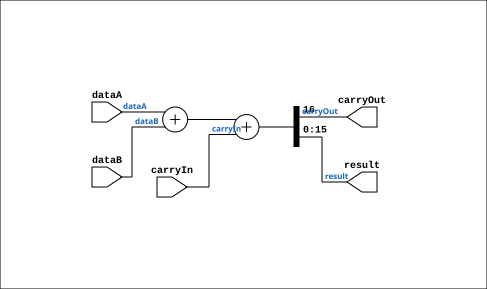

# Adder

Source: `Verilog/Shared/logisim/Adder.v`

<!-- Generated by Verilog/tests/module_doc.py from the //! comments in the source. Do not edit by hand - edit the RTL comments and regenerate. -->

<!-- HIERARCHY-NAV:BEGIN - written by Verilog/tests/gen_hierarchy.py, do not edit -->

**Where it sits** (Simulation): [ND120_TOP](../../../doc/ND120_TOP.md) > [ND120_CORE](../../../doc/ND120_CORE.md) > [ND3202D](../../../CPU-BOARD-3202/circuit/doc/ND3202D.md) > [CPU_15](../../../CPU-BOARD-3202/circuit/doc/CPU_15.md) > [CPU_PROC_32](../../../CPU-BOARD-3202/circuit/doc/CPU_PROC_32.md) > [CPU_PROC_CGA_33](../../../CPU-BOARD-3202/circuit/doc/CPU_PROC_CGA_33.md) > [CGA](../../../DELILAH-CPU/CGA/circuit/doc/CGA.md) > [CGA_MAC](../../../DELILAH-CPU/CGA_MAC/circuit/doc/CGA_MAC.md) > [CGA_MAC_ADD](../../../DELILAH-CPU/CGA_MAC/circuit/doc/CGA_MAC_ADD.md) > [CGA_MAC_FASTADD](../../../DELILAH-CPU/CGA_MAC/circuit/doc/CGA_MAC_FASTADD.md) > **Adder**
- instance path: `CORE.CPU_BOARD.CPU.PROC.CGA.DELILAH.MAC.MAC_ADD.FASTADD.ARITH_1`

**Used in:** [CGA_CPU_ALU_RALU](../../../DELILAH-CPU/CGA_ALU/circuit/doc/CGA_CPU_ALU_RALU.md) (all tops), [CGA_MAC_FASTADD](../../../DELILAH-CPU/CGA_MAC/circuit/doc/CGA_MAC_FASTADD.md) (all tops)

**Contains:** no other modules.

[Module hierarchy](../../../HIERARCHY.md) - [All modules](../../../MODULES.md)

<!-- HIERARCHY-NAV:END -->


<!-- SCHEMATIC:BEGIN - written by Verilog/tests/gen_schematics.py, do not edit -->

## Schematic

Drawn from the Verilog: the yosys netlist of the Simulation (Verilator) build, instance `CORE.CPU_BOARD.CPU.PROC.CGA.DELILAH.ALU.ALU_RALU.ARITH_12`. Sub-modules are boxes (click the picture to open it full size; there every sub-module box links to its page, and every wire shows its Verilog name).

[](Adder.svg)

<!-- SCHEMATIC:END -->

## Description

Component : Adder

## Ports

| Direction | Width | Name | Description |
|---|---|---|---|
| input | `1` | `carryIn` |  |
| output | `1` | `carryOut` |  |
| input | `[nrOfBits-1:0]` | `dataA` |  |
| input | `[nrOfBits-1:0]` | `dataB` |  |
| output | `[nrOfBits-1:0]` | `result` |  |

## Verilog source

[`Verilog/Shared/logisim/Adder.v`](https://github.com/RetroCoreLabs/nd-120/blob/main/Verilog/Shared/logisim/Adder.v) on GitHub.

<details markdown="1">
<summary>Show the Verilog of Adder (39 lines)</summary>

```verilog
/******************************************************************************
 **                                                                          **
 ** Component : Adder                                                        **
 **                                                                          **
 *****************************************************************************/

module Adder( carryIn, carryOut, dataA, dataB, result );

   // Parameters are declared here
   parameter extendedBits = 1;
   parameter nrOfBits = 1;

   // Validate parameters
   initial begin
      if (nrOfBits <= 0) begin
         $display("Error: nrOfBits must be greater than 0.");
         $finish;
      end
      if (extendedBits <= 0) begin
         $display("Error: extendedBits must be greater than 0.");
         $finish;
      end
   end

   // Inputs using the parameters in their declarations
   input carryIn;
   input [nrOfBits-1:0] dataA;
   input [nrOfBits-1:0] dataB;

   // Outputs using the parameters in their declarations
   output reg carryOut;
   output reg [nrOfBits-1:0] result;

   // Combinational logic for addition
   always @* begin
      {carryOut, result} = dataA + dataB + carryIn;
   end

endmodule
```

</details>
