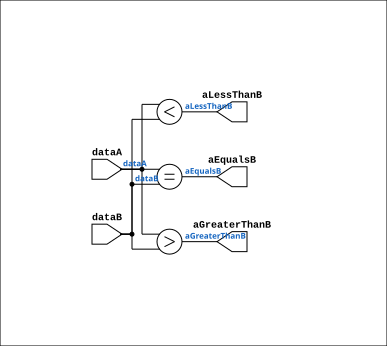

# Comparator

Source: `Verilog/Shared/logisim/Comparator.v`

<!-- Generated by Verilog/tests/module_doc.py from the //! comments in the source. Do not edit by hand - edit the RTL comments and regenerate. -->

<!-- HIERARCHY-NAV:BEGIN - written by Verilog/tests/gen_hierarchy.py, do not edit -->

**Where it sits** (Simulation): [ND120_TOP](../../../doc/ND120_TOP.md) > [ND120_CORE](../../../doc/ND120_CORE.md) > [ND3202D](../../../CPU-BOARD-3202/circuit/doc/ND3202D.md) > [CPU_15](../../../CPU-BOARD-3202/circuit/doc/CPU_15.md) > [CPU_PROC_32](../../../CPU-BOARD-3202/circuit/doc/CPU_PROC_32.md) > [CPU_PROC_CGA_33](../../../CPU-BOARD-3202/circuit/doc/CPU_PROC_CGA_33.md) > [CGA](../../../DELILAH-CPU/CGA/circuit/doc/CGA.md) > [CGA_MIC](../../../DELILAH-CPU/CGA_MIC/circuit/doc/CGA_MIC.md) > [CMP4](../../ndlib/doc/CMP4.md) > **Comparator**
- instance path: `CORE.CPU_BOARD.CPU.PROC.CGA.DELILAH.MIC.LC_CMP.ARITH_1`

**Used in:** [CMP4](../../ndlib/doc/CMP4.md) (all tops)

**Contains:** no other modules.

[Module hierarchy](../../../HIERARCHY.md) - [All modules](../../../MODULES.md)

<!-- HIERARCHY-NAV:END -->


<!-- SCHEMATIC:BEGIN - written by Verilog/tests/gen_schematics.py, do not edit -->

## Schematic

Drawn from the Verilog: the yosys netlist of the Simulation (Verilator) build, instance `CORE.CPU_BOARD.CPU.PROC.CGA.DELILAH.MIC.LC_CMP.ARITH_1`. Sub-modules are boxes (click the picture to open it full size; there every sub-module box links to its page, and every wire shows its Verilog name).

[](Comparator.svg)

<!-- SCHEMATIC:END -->

## Description

ND120 Shared
Component: Comparator
Last reviewed: 2-FEB-2025
Ronny Hansen

## Ports

| Direction | Width | Name | Description |
|---|---|---|---|
| output | `1` | `aEqualsB` |  |
| output | `1` | `aGreaterThanB` |  |
| output | `1` | `aLessThanB` |  |
| input | `[nrOfBits-1:0]` | `dataA` |  |
| input | `[nrOfBits-1:0]` | `dataB` |  |

## Verilog source

[`Verilog/Shared/logisim/Comparator.v`](https://github.com/RetroCoreLabs/nd-120/blob/main/Verilog/Shared/logisim/Comparator.v) on GitHub.

<details markdown="1">
<summary>Show the Verilog of Comparator (70 lines)</summary>

```verilog
/**************************************************************************
** ND120 Shared                                                          **
**                                                                       **
** Component: Comparator                                                 **
**                                                                       **
** Last reviewed: 2-FEB-2025                                             **
** Ronny Hansen                                                          **
***************************************************************************/

module Comparator( aEqualsB,
                   aGreaterThanB,
                   aLessThanB,
                   dataA,
                   dataB );

   /*******************************************************************************
   ** Here all module parameters are defined with a dummy value                  **
   *******************************************************************************/
   parameter nrOfBits = 1;
   parameter twosComplement = 1;

   /*******************************************************************************
   ** The inputs are defined here                                                **
   *******************************************************************************/
   input [nrOfBits-1:0] dataA;
   input [nrOfBits-1:0] dataB;

   /*******************************************************************************
   ** The outputs are defined here                                               **
   *******************************************************************************/
   output aEqualsB;
   output aGreaterThanB;
   output aLessThanB;

   /*******************************************************************************
   ** The wires are defined here                                                 **
   *******************************************************************************/
   wire s_signedGreater;
   wire s_signedLess;
   wire s_unsignedGreater;
   wire s_unsignedLess;

   /*******************************************************************************
   ** The module functionality is described here                                 **
   *******************************************************************************/
   assign s_signedLess      = ($signed(dataA) < $signed(dataB));
   assign s_unsignedLess    = (dataA < dataB);
   assign s_signedGreater   = ($signed(dataA) > $signed(dataB));
   assign s_unsignedGreater = (dataA > dataB);

   assign aEqualsB      = (dataA == dataB);
   assign aGreaterThanB = (twosComplement==1) ? s_signedGreater : s_unsignedGreater;
   assign aLessThanB    = (twosComplement==1) ? s_signedLess : s_unsignedLess;


    /*******************************************************************************
    ** Prevent linter warnings for unused signals
    *******************************************************************************/
   generate
    if (twosComplement == 1)
      begin : gen_unused_unsigned
         (* keep = "true", DONT_TOUCH = "true" *) wire _unused = &{1'b0, s_unsignedGreater, s_unsignedLess};
      end
   else
      begin : gen_unused_signed
         (* keep = "true", DONT_TOUCH = "true" *) wire _unused = &{1'b0, s_signedGreater, s_signedLess};
      end
   endgenerate

endmodule
```

</details>
