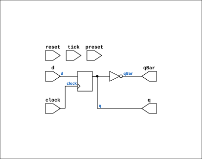

# D_FLIPFLOP

Source: `Verilog/Shared/logisim/D_FLIPFLOP.v`

<!-- Generated by Verilog/tests/module_doc.py from the //! comments in the source. Do not edit by hand - edit the RTL comments and regenerate. -->

<!-- HIERARCHY-NAV:BEGIN - written by Verilog/tests/gen_hierarchy.py, do not edit -->

**Hierarchy:** not instantiated by any of the 9 build tops (elaborated by yosys).

[Module hierarchy](../../../HIERARCHY.md) - [All modules](../../../MODULES.md)

<!-- HIERARCHY-NAV:END -->


<!-- SCHEMATIC:BEGIN - written by Verilog/tests/gen_schematics.py, do not edit -->

## Schematic

Drawn from the Verilog: no build top uses this module, so it was elaborated from its own file with no defines and default parameters. Sub-modules are boxes (click the picture to open it full size; there every sub-module box links to its page, and every wire shows its Verilog name).

[](D_FLIPFLOP.svg)

<!-- SCHEMATIC:END -->

## Description

ND120 SHARED CODE
D FLIP-FLOP
ACTIVE_ASYNC=0 (default): Clean synchronous FF for FPGA.
ACTIVE_ASYNC=1: Async preset/reset for instances that need it.
Last reviewed: 30-MAR-2026
Ronny Hansen

## Parameters

| Parameter | Default |
|---|---|
| `InvertClockEnable` | `1` |
| `ACTIVE_ASYNC` | `0      // 0=clean FF (no async` |

## Ports

| Direction | Width | Name | Description |
|---|---|---|---|
| input | `1` | `clock` | Clock |
| input | `1` | `d` | D input (DATA) |
| input | `1` | `preset` | PRESET - Active-high, sets Q to 1 when asserted |
| input | `1` | `reset` | RESET - Active-high, sets Q to 0 when asserted |
| input | `1` | `tick` | Tick (not used) |
| output | `1` | `q` | Q out |
| output | `1` | `qBar` | QBar out |

## Verilog source

[`Verilog/Shared/logisim/D_FLIPFLOP.v`](https://github.com/RetroCoreLabs/nd-120/blob/main/Verilog/Shared/logisim/D_FLIPFLOP.v) on GitHub.

<details markdown="1">
<summary>Show the Verilog of D_FLIPFLOP (59 lines)</summary>

```verilog

/**************************************************************************
** ND120 SHARED CODE                                                     **
** D FLIP-FLOP                                                           **
**                                                                       **
** ACTIVE_ASYNC=0 (default): Clean synchronous FF for FPGA.             **
** ACTIVE_ASYNC=1: Async preset/reset for instances that need it.       **
**                                                                       **
** Last reviewed: 30-MAR-2026                                            **
** Ronny Hansen                                                          **
***************************************************************************/


module D_FLIPFLOP #(
    parameter integer InvertClockEnable = 1,
    parameter integer ACTIVE_ASYNC = 0      // 0=clean FF (no async), 1=async preset/reset
)(
    input clock,     //! Clock
    input d,         //! D input (DATA)
    input preset,    //! PRESET - Active-high, sets Q to 1 when asserted
    input reset,     //! RESET - Active-high, sets Q to 0 when asserted
    input tick,      //! Tick (not used)

    output q,        //! Q out
    output qBar      //! QBar out
);

   wire s_clock;
   reg s_currentState;

   assign q       = s_currentState;
   assign qBar    = ~s_currentState;
   assign s_clock = (InvertClockEnable == 0) ? clock : ~clock;

   initial begin
      s_currentState = 0;
   end

   generate
      if (ACTIVE_ASYNC == 1) begin : gen_async
         // Async preset/reset -- for instances that use active preset or reset signals.
         // Creates combinational loop warning in Vivado (expected, resolves in one LUT delay).
         always @(posedge s_clock or posedge preset or posedge reset)
         begin
            s_currentState <= preset ? 1'b1 :
                              reset  ? 1'b0 :
                              d;
         end
      end else begin : gen_sync
         // Clean synchronous FF -- no combinational loop, maps to native FPGA FF.
         // Safe when preset and reset are tied to constant 0.
         always @(posedge s_clock)
         begin
            s_currentState <= d;
         end
      end
   endgenerate

endmodule
```

</details>
