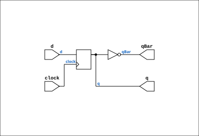

# D_FLIPFLOP_SIMPLE

Source: `Verilog/Shared/logisim/D_FLIPFLOP_SIMPLE.v`

<!-- Generated by Verilog/tests/module_doc.py from the //! comments in the source. Do not edit by hand - edit the RTL comments and regenerate. -->

<!-- HIERARCHY-NAV:BEGIN - written by Verilog/tests/gen_hierarchy.py, do not edit -->

**Hierarchy:** not instantiated by any of the 9 build tops (elaborated by yosys).

[Module hierarchy](../../../HIERARCHY.md) - [All modules](../../../MODULES.md)

<!-- HIERARCHY-NAV:END -->


<!-- SCHEMATIC:BEGIN - written by Verilog/tests/gen_schematics.py, do not edit -->

## Schematic

Drawn from the Verilog: no build top uses this module, so it was elaborated from its own file with no defines and default parameters. Sub-modules are boxes (click the picture to open it full size; there every sub-module box links to its page, and every wire shows its Verilog name).

[](D_FLIPFLOP_SIMPLE.svg)

<!-- SCHEMATIC:END -->

## Description

ND120 SHARED CODE
D FLIP-FLOP (Wihtout SET or RESET)
Last reviewed: 9-FEB-2025
Ronny Hansen

## Ports

| Direction | Width | Name | Description |
|---|---|---|---|
| input | `1` | `clock` | Clock |
| input | `1` | `d` | D input (DATA) |
| output | `1` | `q` | Q out |
| output | `1` | `qBar` | QBar out |

## Verilog source

[`Verilog/Shared/logisim/D_FLIPFLOP_SIMPLE.v`](https://github.com/RetroCoreLabs/nd-120/blob/main/Verilog/Shared/logisim/D_FLIPFLOP_SIMPLE.v) on GitHub.

<details markdown="1">
<summary>Show the Verilog of D_FLIPFLOP_SIMPLE (49 lines)</summary>

```verilog

/**************************************************************************
** ND120 SHARED CODE                                                     **
** D FLIP-FLOP (Wihtout SET or RESET)                                    **
**                                                                       **
**                                                                       **
** Last reviewed: 9-FEB-2025                                             **
** Ronny Hansen                                                          **
***************************************************************************/


module D_FLIPFLOP_SIMPLE (
    input clock,     //! Clock
    input d,         //! D input (DATA)

    output q,        //! Q out
    output qBar      //! QBar out
);

   /*******************************************************************************
   ** The wires are defined here                                                 **
   *******************************************************************************/
   wire s_clock;

   /*******************************************************************************
   ** The registers are defined here                                             **
   *******************************************************************************/
   reg s_currentState;

   /*******************************************************************************
   ** Here the output signals are defined                                        **
   *******************************************************************************/
   assign q        = s_currentState;
   assign qBar     = ~(s_currentState);

   /*******************************************************************************
   ** Here the initial register value is defined; for simulation only            **
   *******************************************************************************/
   initial
   begin
      s_currentState = 0;
   end

   always @(posedge clock)
   begin
      s_currentState <= d;
   end

endmodule
```

</details>
