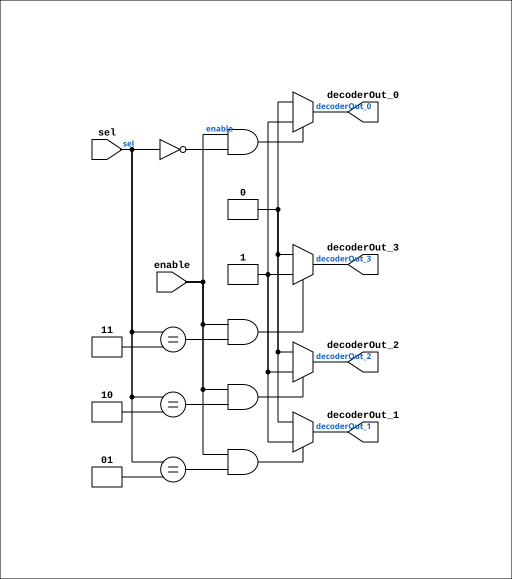

# Decoder_4

Source: `Verilog/Shared/logisim/Decoder_4.v`

<!-- Generated by Verilog/tests/module_doc.py from the //! comments in the source. Do not edit by hand - edit the RTL comments and regenerate. -->

<!-- HIERARCHY-NAV:BEGIN - written by Verilog/tests/gen_hierarchy.py, do not edit -->

**Hierarchy:** not instantiated by any of the 9 build tops (elaborated by yosys).

[Module hierarchy](../../../HIERARCHY.md) - [All modules](../../../MODULES.md)

<!-- HIERARCHY-NAV:END -->


<!-- SCHEMATIC:BEGIN - written by Verilog/tests/gen_schematics.py, do not edit -->

## Schematic

Drawn from the Verilog: no build top uses this module, so it was elaborated from its own file with no defines and default parameters. Sub-modules are boxes (click the picture to open it full size; there every sub-module box links to its page, and every wire shows its Verilog name).

[](Decoder_4.svg)

<!-- SCHEMATIC:END -->

## Description

Logisim-evolution goes FPGA automatic generated Verilog code
https://github.com/logisim-evolution/
Component : Decoder_4

## Ports

| Direction | Width | Name | Description |
|---|---|---|---|
| output | `1` | `decoderOut_0` |  |
| output | `1` | `decoderOut_1` |  |
| output | `1` | `decoderOut_2` |  |
| output | `1` | `decoderOut_3` |  |
| input | `1` | `enable` |  |
| input | `[1:0]` | `sel` |  |

## Verilog source

[`Verilog/Shared/logisim/Decoder_4.v`](https://github.com/RetroCoreLabs/nd-120/blob/main/Verilog/Shared/logisim/Decoder_4.v) on GitHub.

<details markdown="1">
<summary>Show the Verilog of Decoder_4 (37 lines)</summary>

```verilog
/******************************************************************************
 ** Logisim-evolution goes FPGA automatic generated Verilog code             **
 ** https://github.com/logisim-evolution/                                    **
 **                                                                          **
 ** Component : Decoder_4                                                    **
 **                                                                          **
 *****************************************************************************/

module Decoder_4( decoderOut_0,
                  decoderOut_1,
                  decoderOut_2,
                  decoderOut_3,
                  enable,
                  sel );

   /*******************************************************************************
   ** The inputs are defined here                                                **
   *******************************************************************************/
   input       enable;
   input [1:0] sel;

   /*******************************************************************************
   ** The outputs are defined here                                               **
   *******************************************************************************/
   output decoderOut_0;
   output decoderOut_1;
   output decoderOut_2;
   output decoderOut_3;

   /*******************************************************************************
   ** The module functionality is described here                                 **
   *******************************************************************************/
   assign decoderOut_0  = (enable&(sel == 2'b00)) ? 1'b1 : 1'b0;
   assign decoderOut_1  = (enable&(sel == 2'b01)) ? 1'b1 : 1'b0;
   assign decoderOut_2  = (enable&(sel == 2'b10)) ? 1'b1 : 1'b0;
   assign decoderOut_3  = (enable&(sel == 2'b11)) ? 1'b1 : 1'b0;
endmodule
```

</details>
