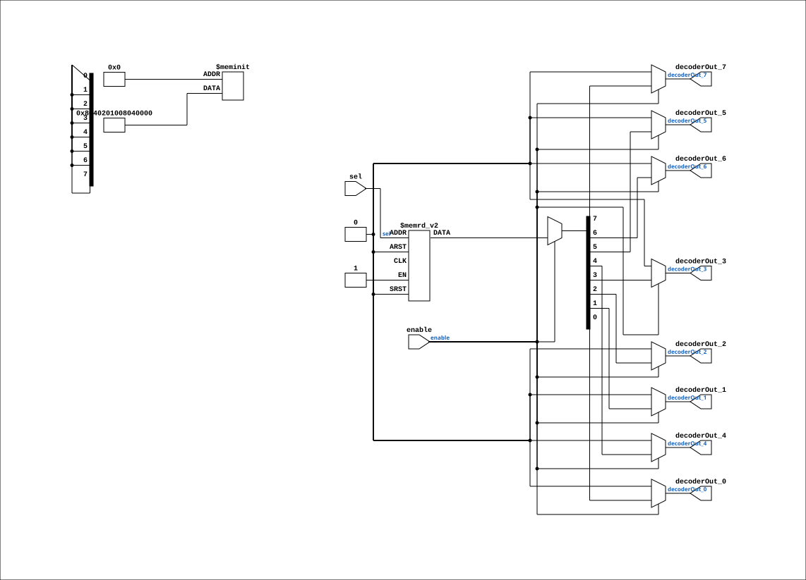

# Decoder_8

Source: `Verilog/Shared/logisim/Decoder_8.v`

<!-- Generated by Verilog/tests/module_doc.py from the //! comments in the source. Do not edit by hand - edit the RTL comments and regenerate. -->

<!-- HIERARCHY-NAV:BEGIN - written by Verilog/tests/gen_hierarchy.py, do not edit -->

**Where it sits** (Simulation): [ND120_TOP](../../../doc/ND120_TOP.md) > [ND120_CORE](../../../doc/ND120_CORE.md) > [ND3202D](../../../CPU-BOARD-3202/circuit/doc/ND3202D.md) > [CPU_15](../../../CPU-BOARD-3202/circuit/doc/CPU_15.md) > [CPU_PROC_32](../../../CPU-BOARD-3202/circuit/doc/CPU_PROC_32.md) > [CPU_PROC_CGA_33](../../../CPU-BOARD-3202/circuit/doc/CPU_PROC_CGA_33.md) > [CGA](../../../DELILAH-CPU/CGA/circuit/doc/CGA.md) > [CGA_WRF](../../../DELILAH-CPU/CGA_WRF/circuit/doc/CGA_WRF.md) > [ND38GLP](../../ndlib/doc/ND38GLP.md) > **Decoder_8**
- instance path: `CORE.CPU_BOARD.CPU.PROC.CGA.DELILAH.WRF.LAA_LO.PLEXERS_1`

**Used in:** [ND38GHP](../../ndlib/doc/ND38GHP.md) (all tops), [ND38GLP](../../ndlib/doc/ND38GLP.md) (all tops)

**Contains:** no other modules.

[Module hierarchy](../../../HIERARCHY.md) - [All modules](../../../MODULES.md)

<!-- HIERARCHY-NAV:END -->


<!-- SCHEMATIC:BEGIN - written by Verilog/tests/gen_schematics.py, do not edit -->

## Schematic

Drawn from the Verilog: the yosys netlist of the Simulation (Verilator) build, instance `CORE.CPU_BOARD.CPU.PROC.CGA.DELILAH.WRF.LAA_LO.PLEXERS_1`. Sub-modules are boxes (click the picture to open it full size; there every sub-module box links to its page, and every wire shows its Verilog name).

[](Decoder_8.svg)

<!-- SCHEMATIC:END -->

## Description

Component : Decoder_8

## Ports

| Direction | Width | Name | Description |
|---|---|---|---|
| input | `1` | `enable` |  |
| input | `[2:0]` | `sel` |  |
| output | `1` | `decoderOut_0` |  |
| output | `1` | `decoderOut_1` |  |
| output | `1` | `decoderOut_2` |  |
| output | `1` | `decoderOut_3` |  |
| output | `1` | `decoderOut_4` |  |
| output | `1` | `decoderOut_5` |  |
| output | `1` | `decoderOut_6` |  |
| output | `1` | `decoderOut_7` |  |

## Verilog source

[`Verilog/Shared/logisim/Decoder_8.v`](https://github.com/RetroCoreLabs/nd-120/blob/main/Verilog/Shared/logisim/Decoder_8.v) on GitHub.

<details markdown="1">
<summary>Show the Verilog of Decoder_8 (39 lines)</summary>

```verilog
/******************************************************************************
 **                                                                          **
 ** Component : Decoder_8                                                    **
 **                                                                          **
 *****************************************************************************/

module Decoder_8 (
    input enable,
    input [2:0] sel,
    output reg decoderOut_0,
    output reg decoderOut_1,
    output reg decoderOut_2,
    output reg decoderOut_3,
    output reg decoderOut_4,
    output reg decoderOut_5,
    output reg decoderOut_6,
    output reg decoderOut_7
);

    // Combinational logic for the 8-output decoder
    always @(*) begin
        if (enable) begin
            case (sel)
                3'b000: {decoderOut_7, decoderOut_6, decoderOut_5, decoderOut_4, decoderOut_3, decoderOut_2, decoderOut_1, decoderOut_0} = 8'b00000001;
                3'b001: {decoderOut_7, decoderOut_6, decoderOut_5, decoderOut_4, decoderOut_3, decoderOut_2, decoderOut_1, decoderOut_0} = 8'b00000010;
                3'b010: {decoderOut_7, decoderOut_6, decoderOut_5, decoderOut_4, decoderOut_3, decoderOut_2, decoderOut_1, decoderOut_0} = 8'b00000100;
                3'b011: {decoderOut_7, decoderOut_6, decoderOut_5, decoderOut_4, decoderOut_3, decoderOut_2, decoderOut_1, decoderOut_0} = 8'b00001000;
                3'b100: {decoderOut_7, decoderOut_6, decoderOut_5, decoderOut_4, decoderOut_3, decoderOut_2, decoderOut_1, decoderOut_0} = 8'b00010000;
                3'b101: {decoderOut_7, decoderOut_6, decoderOut_5, decoderOut_4, decoderOut_3, decoderOut_2, decoderOut_1, decoderOut_0} = 8'b00100000;
                3'b110: {decoderOut_7, decoderOut_6, decoderOut_5, decoderOut_4, decoderOut_3, decoderOut_2, decoderOut_1, decoderOut_0} = 8'b01000000;
                3'b111: {decoderOut_7, decoderOut_6, decoderOut_5, decoderOut_4, decoderOut_3, decoderOut_2, decoderOut_1, decoderOut_0} = 8'b10000000;
                default: {decoderOut_7, decoderOut_6, decoderOut_5, decoderOut_4, decoderOut_3, decoderOut_2, decoderOut_1, decoderOut_0} = 8'b00000000;
            endcase
        end else begin
            {decoderOut_7, decoderOut_6, decoderOut_5, decoderOut_4, decoderOut_3, decoderOut_2, decoderOut_1, decoderOut_0} = 8'b00000000;
        end
    end

endmodule
```

</details>
