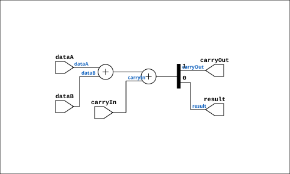

# FullAdder

Source: `Verilog/Shared/logisim/FullAdder.v`

<!-- Generated by Verilog/tests/module_doc.py from the //! comments in the source. Do not edit by hand - edit the RTL comments and regenerate. -->

<!-- HIERARCHY-NAV:BEGIN - written by Verilog/tests/gen_hierarchy.py, do not edit -->

**Hierarchy:** not instantiated by any of the 9 build tops (elaborated by yosys).

[Module hierarchy](../../../HIERARCHY.md) - [All modules](../../../MODULES.md)

<!-- HIERARCHY-NAV:END -->


<!-- SCHEMATIC:BEGIN - written by Verilog/tests/gen_schematics.py, do not edit -->

## Schematic

Drawn from the Verilog: no build top uses this module, so it was elaborated from its own file with no defines and default parameters. Sub-modules are boxes (click the picture to open it full size; there every sub-module box links to its page, and every wire shows its Verilog name).

[](FullAdder.svg)

<!-- SCHEMATIC:END -->

## Description

Logisim-evolution goes FPGA automatic generated Verilog code
https://github.com/logisim-evolution/
Component : FullAdder

## Ports

| Direction | Width | Name | Description |
|---|---|---|---|
| input | `1` | `carryIn` |  |
| output | `1` | `carryOut` |  |
| input | `1` | `dataA` |  |
| input | `1` | `dataB` |  |
| output | `1` | `result` |  |

## Verilog source

[`Verilog/Shared/logisim/FullAdder.v`](https://github.com/RetroCoreLabs/nd-120/blob/main/Verilog/Shared/logisim/FullAdder.v) on GitHub.

<details markdown="1">
<summary>Show the Verilog of FullAdder (45 lines)</summary>

```verilog
/******************************************************************************
 ** Logisim-evolution goes FPGA automatic generated Verilog code             **
 ** https://github.com/logisim-evolution/                                    **
 **                                                                          **
 ** Component : FullAdder                                                    **
 **                                                                          **
 *****************************************************************************/

module FullAdder( carryIn,
                  carryOut,
                  dataA,
                  dataB,
                  result );

   /*******************************************************************************
   ** Here all module parameters are defined with a dummy value                  **
   *******************************************************************************/
   parameter extendedBits = 1;

   /*******************************************************************************
   ** The inputs are defined here                                                **
   *******************************************************************************/
   input carryIn;
   input dataA;
   input dataB;

   /*******************************************************************************
   ** The outputs are defined here                                               **
   *******************************************************************************/
   output carryOut;
   output result;

   /*******************************************************************************
   ** The wires are defined here                                                 **
   *******************************************************************************/
   wire [extendedBits-1:0] s_extendedDataA;
   wire [extendedBits-1:0] s_extendedDataB;
   wire [extendedBits-1:0] s_sumResult;

   /*******************************************************************************
   ** The module functionality is described here                                 **
   *******************************************************************************/
   assign   {carryOut, result} = dataA + dataB + carryIn;

endmodule
```

</details>
