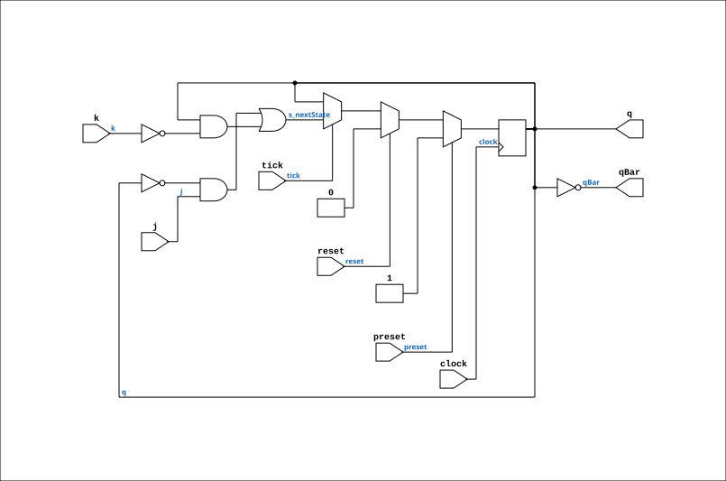

# J_K_FLIPFLOP

Source: `Verilog/Shared/logisim/J_K_FLIPFLOP.v`

<!-- Generated by Verilog/tests/module_doc.py from the //! comments in the source. Do not edit by hand - edit the RTL comments and regenerate. -->

<!-- HIERARCHY-NAV:BEGIN - written by Verilog/tests/gen_hierarchy.py, do not edit -->

**Where it sits** (Simulation): [ND120_TOP](../../../doc/ND120_TOP.md) > [ND120_CORE](../../../doc/ND120_CORE.md) > [ND3202D](../../../CPU-BOARD-3202/circuit/doc/ND3202D.md) > [IO_37](../../../CPU-BOARD-3202/circuit/doc/IO_37.md) > [IO_DCD_38](../../../CPU-BOARD-3202/circuit/doc/IO_DCD_38.md) > [DECODE_DGA](../../../DECODE-GateArray/DGA/circuit/doc/DECODE_DGA.md) > [DECODE_DGA_POW](../../../DECODE-GateArray/DGA/circuit/doc/DECODE_DGA_POW.md) > **J_K_FLIPFLOP**
- instance path: `CORE.CPU_BOARD.IO.DCD.DGA.POW.A616`

**Used in:** [DECODE_DGA_POW](../../../DECODE-GateArray/DGA/circuit/doc/DECODE_DGA_POW.md) (all tops)

**Contains:** no other modules.

[Module hierarchy](../../../HIERARCHY.md) - [All modules](../../../MODULES.md)

<!-- HIERARCHY-NAV:END -->


<!-- SCHEMATIC:BEGIN - written by Verilog/tests/gen_schematics.py, do not edit -->

## Schematic

Drawn from the Verilog: the yosys netlist of the Simulation (Verilator) build, instance `CORE.CPU_BOARD.IO.DCD.DGA.POW.A616`. Sub-modules are boxes (click the picture to open it full size; there every sub-module box links to its page, and every wire shows its Verilog name).

[](J_K_FLIPFLOP.svg)

<!-- SCHEMATIC:END -->

## Description

ND120 SHARED CODE
J-K FLIP-FLOP
Last reviewed: 11-NOV-2024
Ronny Hansen

## Parameters

| Parameter | Default |
|---|---|
| `InvertClockEnable` | `1` |

## Ports

| Direction | Width | Name | Description |
|---|---|---|---|
| input | `1` | `clock` |  |
| input | `1` | `j` |  |
| input | `1` | `k` |  |
| input | `1` | `preset` |  |
| input | `1` | `reset` |  |
| input | `1` | `tick` |  |
| output | `1` | `q` |  |
| output | `1` | `qBar` |  |

## Verilog source

[`Verilog/Shared/logisim/J_K_FLIPFLOP.v`](https://github.com/RetroCoreLabs/nd-120/blob/main/Verilog/Shared/logisim/J_K_FLIPFLOP.v) on GitHub.

<details markdown="1">
<summary>Show the Verilog of J_K_FLIPFLOP (47 lines)</summary>

```verilog
/**************************************************************************
** ND120 SHARED CODE                                                     **
** J-K FLIP-FLOP                                                         **
**                                                                       **
**                                                                       **
** Last reviewed: 11-NOV-2024                                            **
** Ronny Hansen                                                          **
***************************************************************************/

module J_K_FLIPFLOP #(
    parameter integer InvertClockEnable = 1
) (
    input  clock,
    input  j,
    input  k,
    input  preset,
    input  reset,
    input  tick,
    output q,
    output qBar
);

  reg s_currentState;

  // Output logic
  assign q = s_currentState;
  assign qBar = ~s_currentState;

  // Clock inversion based on parameter
  wire s_clock = (InvertClockEnable == 0) ? clock : ~clock;

  // State transition logic
  wire s_nextState = (~s_currentState & j) | (s_currentState & ~k);

  // State update logic
  //always @(posedge reset or posedge preset or posedge s_clock) begin (Vivado doesnt like ASYNC RESET )
  always @(posedge s_clock) begin
    if (preset)  // priority to pre-set
      s_currentState <= 1'b1;
    else if (reset) s_currentState <= 1'b0;
    else if (tick) s_currentState <= s_nextState;
  end

  // Initial state for simulation
  initial s_currentState = 0;

endmodule
```

</details>
