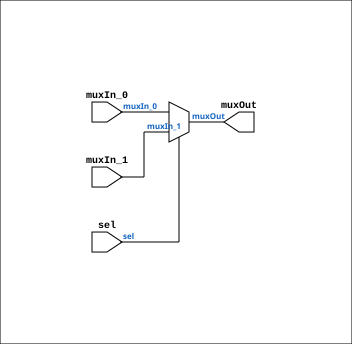

# Multiplexer_2

Source: `Verilog/Shared/logisim/Multiplexer_2.v`

<!-- Generated by Verilog/tests/module_doc.py from the //! comments in the source. Do not edit by hand - edit the RTL comments and regenerate. -->

<!-- HIERARCHY-NAV:BEGIN - written by Verilog/tests/gen_hierarchy.py, do not edit -->

**Where it sits** (Simulation): [ND120_TOP](../../../doc/ND120_TOP.md) > [ND120_CORE](../../../doc/ND120_CORE.md) > [ND3202D](../../../CPU-BOARD-3202/circuit/doc/ND3202D.md) > [CPU_15](../../../CPU-BOARD-3202/circuit/doc/CPU_15.md) > [CPU_PROC_32](../../../CPU-BOARD-3202/circuit/doc/CPU_PROC_32.md) > [CPU_PROC_CGA_33](../../../CPU-BOARD-3202/circuit/doc/CPU_PROC_CGA_33.md) > [CGA](../../../DELILAH-CPU/CGA/circuit/doc/CGA.md) > [CGA_ALU](../../../DELILAH-CPU/CGA_ALU/circuit/doc/CGA_ALU.md) > [MUX21LP](../../ndlib/doc/MUX21LP.md) > **Multiplexer_2**
- instance path: `CORE.CPU_BOARD.CPU.PROC.CGA.DELILAH.ALU.AARG0_MUX.PLEXERS_1`

**Used in:** [CGA_MIC_CSEL](../../../DELILAH-CPU/CGA_MIC/circuit/doc/CGA_MIC_CSEL.md) (all tops), [CGA_MIC_INCOUNT](../../../DELILAH-CPU/CGA_MIC/circuit/doc/CGA_MIC_INCOUNT.md) (all tops), [MUX21L](../../ndlib/doc/MUX21L.md) (all tops), [MUX21LP](../../ndlib/doc/MUX21LP.md) (all tops), [MUX24P](../../ndlib/doc/MUX24P.md) (all tops)

**Contains:** no other modules.

[Module hierarchy](../../../HIERARCHY.md) - [All modules](../../../MODULES.md)

<!-- HIERARCHY-NAV:END -->


<!-- SCHEMATIC:BEGIN - written by Verilog/tests/gen_schematics.py, do not edit -->

## Schematic

Drawn from the Verilog: the yosys netlist of the Simulation (Verilator) build, instance `CORE.CPU_BOARD.CPU.PROC.CGA.DELILAH.ALU.AARG0_MUX.PLEXERS_1`. Sub-modules are boxes (click the picture to open it full size; there every sub-module box links to its page, and every wire shows its Verilog name).

[](Multiplexer_2.svg)

<!-- SCHEMATIC:END -->

## Description

Component : Multiplexer_2
Refactored 03.12.2023 Ronny Hansen

## Ports

| Direction | Width | Name | Description |
|---|---|---|---|
| input | `1` | `muxIn_1` |  |
| input | `1` | `sel` |  |
| output | `1` | `muxOut` |  |

## Verilog source

[`Verilog/Shared/logisim/Multiplexer_2.v`](https://github.com/RetroCoreLabs/nd-120/blob/main/Verilog/Shared/logisim/Multiplexer_2.v) on GitHub.

<details markdown="1">
<summary>Show the Verilog of Multiplexer_2 (18 lines)</summary>

```verilog
/******************************************************************************
 **                                                                          **
 ** Component : Multiplexer_2                                                **
 **                                                                          **
 ** Refactored 03.12.2023 Ronny Hansen                                       **
 *****************************************************************************/
/* */

module Multiplexer_2( input muxIn_0,
                      input muxIn_1,                      
                      input sel,
                      output wire muxOut
                      );   

      // Logic for 2-to-1 Multiplexer
    assign muxOut = sel ? muxIn_1 : muxIn_0;

endmodule
```

</details>
