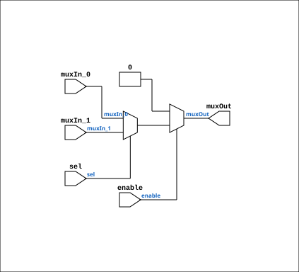

# Multiplexer_2_w_enable

Source: `Verilog/Shared/logisim/Multiplexer_2_w_enable.v`

<!-- Generated by Verilog/tests/module_doc.py from the //! comments in the source. Do not edit by hand - edit the RTL comments and regenerate. -->

<!-- HIERARCHY-NAV:BEGIN - written by Verilog/tests/gen_hierarchy.py, do not edit -->

**Where it sits** (Simulation): [ND120_TOP](../../../doc/ND120_TOP.md) > [ND120_CORE](../../../doc/ND120_CORE.md) > [ND3202D](../../../CPU-BOARD-3202/circuit/doc/ND3202D.md) > [IO_37](../../../CPU-BOARD-3202/circuit/doc/IO_37.md) > [IO_DCD_38](../../../CPU-BOARD-3202/circuit/doc/IO_DCD_38.md) > [DECODE_DGA](../../../DECODE-GateArray/DGA/circuit/doc/DECODE_DGA.md) > [DECODE_DGA_POW](../../../DECODE-GateArray/DGA/circuit/doc/DECODE_DGA_POW.md) > [F571](../../../DECODE-GateArray/DGA/circuit/doc/F571.md) > **Multiplexer_2_w_enable**
- instance path: `CORE.CPU_BOARD.IO.DCD.DGA.POW.A620.PLEXERS_1`

**Used in:** [F571](../../../DECODE-GateArray/DGA/circuit/doc/F571.md) (all tops)

**Contains:** no other modules.

[Module hierarchy](../../../HIERARCHY.md) - [All modules](../../../MODULES.md)

<!-- HIERARCHY-NAV:END -->


<!-- SCHEMATIC:BEGIN - written by Verilog/tests/gen_schematics.py, do not edit -->

## Schematic

Drawn from the Verilog: the yosys netlist of the Simulation (Verilator) build, instance `CORE.CPU_BOARD.IO.DCD.DGA.POW.A620.PLEXERS_1`. Sub-modules are boxes (click the picture to open it full size; there every sub-module box links to its page, and every wire shows its Verilog name).

[](Multiplexer_2_w_enable.svg)

<!-- SCHEMATIC:END -->

## Description

Component : Multiplexer_2_w_enable
Refactored 03.12.2023 Ronny Hansen

## Ports

| Direction | Width | Name | Description |
|---|---|---|---|
| input | `1` | `muxIn_0` |  |
| input | `1` | `muxIn_1` |  |
| input | `1` | `sel` |  |
| output | `1` | `muxOut` |  |

## Verilog source

[`Verilog/Shared/logisim/Multiplexer_2_w_enable.v`](https://github.com/RetroCoreLabs/nd-120/blob/main/Verilog/Shared/logisim/Multiplexer_2_w_enable.v) on GitHub.

<details markdown="1">
<summary>Show the Verilog of Multiplexer_2_w_enable (16 lines)</summary>

```verilog
/******************************************************************************
 **                                                                          **
 ** Component : Multiplexer_2_w_enable                                       **
 **                                                                          **
 ** Refactored 03.12.2023 Ronny Hansen                                       **
 *****************************************************************************/
/* */

module Multiplexer_2_w_enable( input wire enable,
                      input wire muxIn_0,
                      input wire muxIn_1,                      
                      input wire sel,
                      output wire muxOut
                      );   
      assign muxOut = (enable == 1'b0) ? 1'b0 : (sel ? muxIn_1 : muxIn_0);
endmodule
```

</details>
