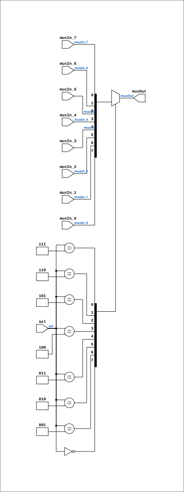

# Multiplexer_8

Source: `Verilog/Shared/logisim/Multiplexer_8.v`

<!-- Generated by Verilog/tests/module_doc.py from the //! comments in the source. Do not edit by hand - edit the RTL comments and regenerate. -->

<!-- HIERARCHY-NAV:BEGIN - written by Verilog/tests/gen_hierarchy.py, do not edit -->

**Where it sits** (Simulation): [ND120_TOP](../../../doc/ND120_TOP.md) > [ND120_CORE](../../../doc/ND120_CORE.md) > [ND3202D](../../../CPU-BOARD-3202/circuit/doc/ND3202D.md) > [CPU_15](../../../CPU-BOARD-3202/circuit/doc/CPU_15.md) > [CPU_PROC_32](../../../CPU-BOARD-3202/circuit/doc/CPU_PROC_32.md) > [CPU_PROC_CGA_33](../../../CPU-BOARD-3202/circuit/doc/CPU_PROC_CGA_33.md) > [CGA](../../../DELILAH-CPU/CGA/circuit/doc/CGA.md) > [CGA_MIC](../../../DELILAH-CPU/CGA_MIC/circuit/doc/CGA_MIC.md) > [CGA_MIC_CSEL](../../../DELILAH-CPU/CGA_MIC/circuit/doc/CGA_MIC_CSEL.md) > **Multiplexer_8**
- instance path: `CORE.CPU_BOARD.CPU.PROC.CGA.DELILAH.MIC.CSEL.PLEXERS_1`

**Used in:** [CGA_MIC_CSEL](../../../DELILAH-CPU/CGA_MIC/circuit/doc/CGA_MIC_CSEL.md) (all tops), [MUX81](../../ndlib/doc/MUX81.md) (all tops)

**Contains:** no other modules.

[Module hierarchy](../../../HIERARCHY.md) - [All modules](../../../MODULES.md)

<!-- HIERARCHY-NAV:END -->


<!-- SCHEMATIC:BEGIN - written by Verilog/tests/gen_schematics.py, do not edit -->

## Schematic

Drawn from the Verilog: the yosys netlist of the Simulation (Verilator) build, instance `CORE.CPU_BOARD.CPU.PROC.CGA.DELILAH.MIC.CSEL.PLEXERS_1`. Sub-modules are boxes (click the picture to open it full size; there every sub-module box links to its page, and every wire shows its Verilog name).

[](Multiplexer_8.svg)

<!-- SCHEMATIC:END -->

## Description

Component : Multiplexer_8

## Ports

| Direction | Width | Name | Description |
|---|---|---|---|
| input | `1` | `muxIn_0` |  |
| input | `1` | `muxIn_1` |  |
| input | `1` | `muxIn_2` |  |
| input | `1` | `muxIn_3` |  |
| input | `1` | `muxIn_4` |  |
| input | `1` | `muxIn_5` |  |
| input | `1` | `muxIn_6` |  |
| input | `1` | `muxIn_7` |  |
| input | `[2:0]` | `sel` |  |
| output | `1` | `muxOut` |  |

## Verilog source

[`Verilog/Shared/logisim/Multiplexer_8.v`](https://github.com/RetroCoreLabs/nd-120/blob/main/Verilog/Shared/logisim/Multiplexer_8.v) on GitHub.

<details markdown="1">
<summary>Show the Verilog of Multiplexer_8 (35 lines)</summary>

```verilog
/******************************************************************************
 **                                                                          **
 ** Component : Multiplexer_8                                                **
 **                                                                          **
 *****************************************************************************/

module Multiplexer_8(
    input  muxIn_0,
    input  muxIn_1,
    input  muxIn_2,
    input  muxIn_3,
    input  muxIn_4,
    input  muxIn_5,
    input  muxIn_6,
    input  muxIn_7,
    input  [2:0] sel,
    output reg muxOut
);

    // Logic for the 8-to-1 multiplexer
    always @(*) begin
        case (sel)
            3'b000: muxOut = muxIn_0; // Select input 0
            3'b001: muxOut = muxIn_1; // Select input 1
            3'b010: muxOut = muxIn_2; // Select input 2
            3'b011: muxOut = muxIn_3; // Select input 3
            3'b100: muxOut = muxIn_4; // Select input 4
            3'b101: muxOut = muxIn_5; // Select input 5
            3'b110: muxOut = muxIn_6; // Select input 6
            3'b111: muxOut = muxIn_7; // Select input 7
            default: muxOut = 1'bx;   // Undefined state
        endcase
    end

endmodule
```

</details>
