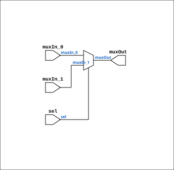

# Multiplexer_bus_2

Source: `Verilog/Shared/logisim/Multiplexer_bus_2.v`

<!-- Generated by Verilog/tests/module_doc.py from the //! comments in the source. Do not edit by hand - edit the RTL comments and regenerate. -->

<!-- HIERARCHY-NAV:BEGIN - written by Verilog/tests/gen_hierarchy.py, do not edit -->

**Where it sits** (Simulation): [ND120_TOP](../../../doc/ND120_TOP.md) > [ND120_CORE](../../../doc/ND120_CORE.md) > [ND3202D](../../../CPU-BOARD-3202/circuit/doc/ND3202D.md) > [CPU_15](../../../CPU-BOARD-3202/circuit/doc/CPU_15.md) > [CPU_PROC_32](../../../CPU-BOARD-3202/circuit/doc/CPU_PROC_32.md) > [CPU_PROC_CGA_33](../../../CPU-BOARD-3202/circuit/doc/CPU_PROC_CGA_33.md) > [CGA](../../../DELILAH-CPU/CGA/circuit/doc/CGA.md) > [CGA_INTR](../../../DELILAH-CPU/CGA_INTR/circuit/doc/CGA_INTR.md) > [CGA_INTR_CNTLR](../../../DELILAH-CPU/CGA_INTR/circuit/doc/CGA_INTR_CNTLR.md) > **Multiplexer_bus_2**
- instance path: `CORE.CPU_BOARD.CPU.PROC.CGA.DELILAH.INTR.CNTLR.PLEXERS_1`

**Used in:** [CGA_INTR_CNTLR](../../../DELILAH-CPU/CGA_INTR/circuit/doc/CGA_INTR_CNTLR.md) (all tops)

**Contains:** no other modules.

[Module hierarchy](../../../HIERARCHY.md) - [All modules](../../../MODULES.md)

<!-- HIERARCHY-NAV:END -->


<!-- SCHEMATIC:BEGIN - written by Verilog/tests/gen_schematics.py, do not edit -->

## Schematic

Drawn from the Verilog: the yosys netlist of the Simulation (Verilator) build, instance `CORE.CPU_BOARD.CPU.PROC.CGA.DELILAH.INTR.CNTLR.PLEXERS_1`. Sub-modules are boxes (click the picture to open it full size; there every sub-module box links to its page, and every wire shows its Verilog name).

[](Multiplexer_bus_2.svg)

<!-- SCHEMATIC:END -->

## Description

Component : Multiplexer_bus_2

## Ports

| Direction | Width | Name | Description |
|---|---|---|---|
| input | `[nrOfBits-1:0]` | `muxIn_0` |  |
| input | `[nrOfBits-1:0]` | `muxIn_1` |  |
| input | `1` | `sel` |  |
| output | `[nrOfBits-1:0]` | `muxOut` |  |

## Verilog source

[`Verilog/Shared/logisim/Multiplexer_bus_2.v`](https://github.com/RetroCoreLabs/nd-120/blob/main/Verilog/Shared/logisim/Multiplexer_bus_2.v) on GitHub.

<details markdown="1">
<summary>Show the Verilog of Multiplexer_bus_2 (23 lines)</summary>

```verilog
/******************************************************************************
 **                                                                          **
 ** Component : Multiplexer_bus_2                                            **
 **                                                                          **
 *****************************************************************************/

module Multiplexer_bus_2( muxIn_0, muxIn_1, sel, muxOut );

    // Parameters are declared here
    parameter nrOfBits = 1;

    // Inputs using the parameters in their declarations
    input [nrOfBits-1:0] muxIn_0;
    input [nrOfBits-1:0] muxIn_1;
    input sel;

    // Output using the parameters in its declaration
    output [nrOfBits-1:0] muxOut;

    // Logic for the 2-to-1 multiplexer bus
    assign muxOut = (sel == 1'b0) ? muxIn_0 : muxIn_1;

endmodule
```

</details>
