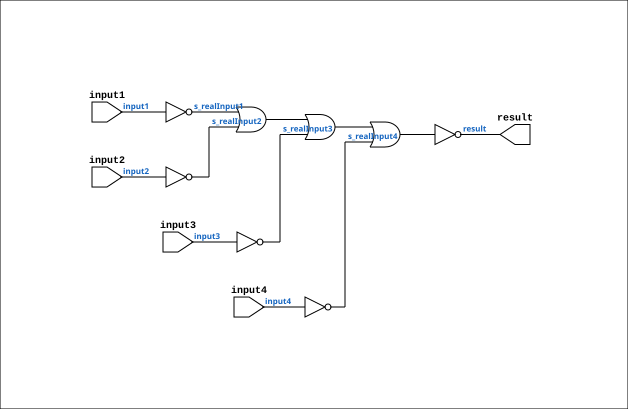

# NOR_GATE_4_INPUTS

Source: `Verilog/Shared/logisim/NOR_GATE_4_INPUTS.v`

<!-- Generated by Verilog/tests/module_doc.py from the //! comments in the source. Do not edit by hand - edit the RTL comments and regenerate. -->

<!-- HIERARCHY-NAV:BEGIN - written by Verilog/tests/gen_hierarchy.py, do not edit -->

**Where it sits** (Simulation): [ND120_TOP](../../../doc/ND120_TOP.md) > [ND120_CORE](../../../doc/ND120_CORE.md) > [ND3202D](../../../CPU-BOARD-3202/circuit/doc/ND3202D.md) > [CPU_15](../../../CPU-BOARD-3202/circuit/doc/CPU_15.md) > [CPU_PROC_32](../../../CPU-BOARD-3202/circuit/doc/CPU_PROC_32.md) > [CPU_PROC_CGA_33](../../../CPU-BOARD-3202/circuit/doc/CPU_PROC_CGA_33.md) > [CGA](../../../DELILAH-CPU/CGA/circuit/doc/CGA.md) > [CGA_INTR](../../../DELILAH-CPU/CGA_INTR/circuit/doc/CGA_INTR.md) > [CGA_INTR_CNTLR](../../../DELILAH-CPU/CGA_INTR/circuit/doc/CGA_INTR_CNTLR.md) > [CGA_INTR_CNTLR_VECGEN](../../../DELILAH-CPU/CGA_INTR/circuit/doc/CGA_INTR_CNTLR_VECGEN.md) > [CGA_INTR_CNTLR_VECGEN_PTY](../../../DELILAH-CPU/CGA_INTR/circuit/doc/CGA_INTR_CNTLR_VECGEN_PTY.md) > [CGA_INTR_CNTLR_VECGEN_PTY_PTYENC](../../../DELILAH-CPU/CGA_INTR/circuit/doc/CGA_INTR_CNTLR_VECGEN_PTY_PTYENC.md) > **NOR_GATE_4_INPUTS**
- instance path: `CORE.CPU_BOARD.CPU.PROC.CGA.DELILAH.INTR.CNTLR.VECGEN.PTY.PTYENC_HI.NR4`

**Used in:** [CGA_DCD](../../../DELILAH-CPU/CGA_DCD/circuit/doc/CGA_DCD.md) (all tops), [CGA_INTR_CNTLR_VECGEN_PTY_PTYENC](../../../DELILAH-CPU/CGA_INTR/circuit/doc/CGA_INTR_CNTLR_VECGEN_PTY_PTYENC.md) (all tops), [CGA_MAC_DECODE](../../../DELILAH-CPU/CGA_MAC/circuit/doc/CGA_MAC_DECODE.md) (all tops)

**Contains:** no other modules.

[Module hierarchy](../../../HIERARCHY.md) - [All modules](../../../MODULES.md)

<!-- HIERARCHY-NAV:END -->


<!-- SCHEMATIC:BEGIN - written by Verilog/tests/gen_schematics.py, do not edit -->

## Schematic

Drawn from the Verilog: the yosys netlist of the Simulation (Verilator) build, instance `CORE.CPU_BOARD.CPU.PROC.CGA.DELILAH.DCD.GATES_6`. Sub-modules are boxes (click the picture to open it full size; there every sub-module box links to its page, and every wire shows its Verilog name).

[](NOR_GATE_4_INPUTS.svg)

<!-- SCHEMATIC:END -->

## Description

Logisim-evolution goes FPGA automatic generated Verilog code
https://github.com/logisim-evolution/
Component : NOR_GATE_4_INPUTS

## Ports

| Direction | Width | Name | Description |
|---|---|---|---|
| input | `1` | `input1` |  |
| input | `1` | `input2` |  |
| input | `1` | `input3` |  |
| input | `1` | `input4` |  |
| output | `1` | `result` |  |

## Verilog source

[`Verilog/Shared/logisim/NOR_GATE_4_INPUTS.v`](https://github.com/RetroCoreLabs/nd-120/blob/main/Verilog/Shared/logisim/NOR_GATE_4_INPUTS.v) on GitHub.

<details markdown="1">
<summary>Show the Verilog of NOR_GATE_4_INPUTS (61 lines)</summary>

```verilog
/******************************************************************************
 ** Logisim-evolution goes FPGA automatic generated Verilog code             **
 ** https://github.com/logisim-evolution/                                    **
 **                                                                          **
 ** Component : NOR_GATE_4_INPUTS                                            **
 **                                                                          **
 *****************************************************************************/

module NOR_GATE_4_INPUTS( input1,
                          input2,
                          input3,
                          input4,
                          result );

   /*******************************************************************************
   ** Here all module parameters are defined with a dummy value                  **
   *******************************************************************************/
   parameter [64:0] BubblesMask = 1;

   /*******************************************************************************
   ** The inputs are defined here                                                **
   *******************************************************************************/
   input input1;
   input input2;
   input input3;
   input input4;

   /*******************************************************************************
   ** The outputs are defined here                                               **
   *******************************************************************************/
   output result;

   /*******************************************************************************
   ** The wires are defined here                                                 **
   *******************************************************************************/
   wire s_realInput1;
   wire s_realInput2;
   wire s_realInput3;
   wire s_realInput4;

   /*******************************************************************************
   ** The module functionality is described here                                 **
   *******************************************************************************/

   /*******************************************************************************
   ** Here the bubbles are processed                                             **
   *******************************************************************************/
   assign  s_realInput1 = (BubblesMask[0] == 1'b0) ? input1 : ~input1;
   assign  s_realInput2 = (BubblesMask[1] == 1'b0) ? input2 : ~input2;
   assign  s_realInput3 = (BubblesMask[2] == 1'b0) ? input3 : ~input3;
   assign  s_realInput4 = (BubblesMask[3] == 1'b0) ? input4 : ~input4;

   /*******************************************************************************
   ** Here the functionality is defined                                          **
   *******************************************************************************/
   assign result = ~(s_realInput1|
                     s_realInput2|
                     s_realInput3|
                     s_realInput4);

endmodule
```

</details>
