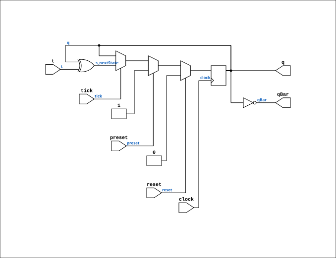

# T_FLIPFLOP

Source: `Verilog/Shared/logisim/T_FLIPFLOP.v`

<!-- Generated by Verilog/tests/module_doc.py from the //! comments in the source. Do not edit by hand - edit the RTL comments and regenerate. -->

<!-- HIERARCHY-NAV:BEGIN - written by Verilog/tests/gen_hierarchy.py, do not edit -->

**Hierarchy:** not instantiated by any of the 9 build tops (elaborated by yosys).

[Module hierarchy](../../../HIERARCHY.md) - [All modules](../../../MODULES.md)

<!-- HIERARCHY-NAV:END -->


<!-- SCHEMATIC:BEGIN - written by Verilog/tests/gen_schematics.py, do not edit -->

## Schematic

Drawn from the Verilog: no build top uses this module, so it was elaborated from its own file with no defines and default parameters. Sub-modules are boxes (click the picture to open it full size; there every sub-module box links to its page, and every wire shows its Verilog name).

[](T_FLIPFLOP.svg)

<!-- SCHEMATIC:END -->

## Description

Logisim-evolution goes FPGA automatic generated Verilog code
https://github.com/logisim-evolution/
Component : T_FLIPFLOP

## Ports

| Direction | Width | Name | Description |
|---|---|---|---|
| input | `1` | `clock` |  |
| input | `1` | `preset` |  |
| output | `1` | `q` |  |
| output | `1` | `qBar` |  |
| input | `1` | `reset` |  |
| input | `1` | `t` |  |
| input | `1` | `tick` |  |

## Verilog source

[`Verilog/Shared/logisim/T_FLIPFLOP.v`](https://github.com/RetroCoreLabs/nd-120/blob/main/Verilog/Shared/logisim/T_FLIPFLOP.v) on GitHub.

<details markdown="1">
<summary>Show the Verilog of T_FLIPFLOP (83 lines)</summary>

```verilog
/******************************************************************************
 ** Logisim-evolution goes FPGA automatic generated Verilog code             **
 ** https://github.com/logisim-evolution/                                    **
 **                                                                          **
 ** Component : T_FLIPFLOP                                                   **
 **                                                                          **
 *****************************************************************************/

module T_FLIPFLOP( clock,
                   preset,
                   q,
                   qBar,
                   reset,
                   t,
                   tick );

   /*******************************************************************************
   ** Here all module parameters are defined with a dummy value                  **
   *******************************************************************************/
   parameter invertClockEnable = 1;

   /*******************************************************************************
   ** The inputs are defined here                                                **
   *******************************************************************************/
   input clock;
   input preset;
   input reset;
   input t;
   input tick;

   /*******************************************************************************
   ** The outputs are defined here                                               **
   *******************************************************************************/
   output q;
   output qBar;

   /*******************************************************************************
   ** The wires are defined here                                                 **
   *******************************************************************************/
   wire s_clock;
   wire s_nextState;

   /*******************************************************************************
   ** The registers are defined here                                             **
   *******************************************************************************/
   reg s_currentState;

   /*******************************************************************************
   ** The module functionality is described here                                 **
   *******************************************************************************/

   /*******************************************************************************
   ** Here the output signals are defined                                        **
   *******************************************************************************/
   assign q        = s_currentState;
   assign qBar     = ~(s_currentState);
   assign s_clock  = (invertClockEnable == 0) ? clock : ~clock;

   /*******************************************************************************
   ** Here the initial register value is defined; for simulation only            **
   *******************************************************************************/
   initial
   begin
      s_currentState = 0;
   end

   /*******************************************************************************
   ** Here the update logic is defined                                           **
   *******************************************************************************/
   assign s_nextState = s_currentState^t;

   /*******************************************************************************
   ** Here the actual state register is defined                                  **
   *******************************************************************************/
   //always @(posedge reset or posedge preset or posedge s_clock) //Vivado doesnt like ASYNC RESET )
   always @(posedge s_clock) //Vivado doesnt like ASYNC RESET )
   begin      
      if (reset) s_currentState <= 1'b0;       // priority to re-set
      else if (preset) s_currentState <= 1'b1;  
      else if (tick) s_currentState <= s_nextState;
   end

endmodule
```

</details>
