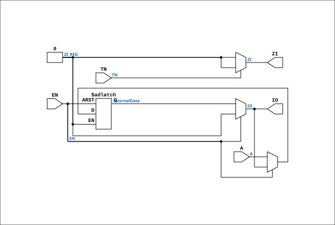

# BD4TU

Source: `Verilog/Shared/ndlib/BD4TU.v`

<!-- Generated by Verilog/tests/module_doc.py from the //! comments in the source. Do not edit by hand - edit the RTL comments and regenerate. -->

<!-- HIERARCHY-NAV:BEGIN - written by Verilog/tests/gen_hierarchy.py, do not edit -->

**Hierarchy:** not instantiated by any of the 9 build tops (elaborated by yosys).

[Module hierarchy](../../../HIERARCHY.md) - [All modules](../../../MODULES.md)

<!-- HIERARCHY-NAV:END -->


<!-- SCHEMATIC:BEGIN - written by Verilog/tests/gen_schematics.py, do not edit -->

## Schematic

Drawn from the Verilog: no build top uses this module, so it was elaborated from its own file with no defines and default parameters. Sub-modules are boxes (click the picture to open it full size; there every sub-module box links to its page, and every wire shows its Verilog name).

[](BD4TU.svg)

<!-- SCHEMATIC:END -->

## Description

Component : BD4TU
Databufffer with 3-state
Used in CGA (Sheet 5/10) page 6
In the drawings the read bufffer is connected to "PTREE1" for read-enable
Which is connected to 1/HIGH. Not really sure what thus migth mean.
Ronny Hansen 14.01.2023

## Ports

| Direction | Width | Name | Description |
|---|---|---|---|
| inout | `1` | `IO` | Buffer input/output |
| input | `1` | `EN` | Enable. H= READ from BUF to ZI, L= WRITE from A to BUF |
| input | `1` | `TN` | Test ? Connected to PTSTN, which is always 1/HIGH |
| output | `1` | `ZI` | Z-INPUT |

## Verilog source

[`Verilog/Shared/ndlib/BD4TU.v`](https://github.com/RetroCoreLabs/nd-120/blob/main/Verilog/Shared/ndlib/BD4TU.v) on GitHub.

<details markdown="1">
<summary>Show the Verilog of BD4TU (45 lines)</summary>

```verilog
/*******************************************************************************
 ** Component : BD4TU                                                         **
 **                                                                           **
 ** Databufffer with 3-state                                                  **
 ** Used in CGA (Sheet 5/10) page 6                                           **
 **                                                                           **
 ** In the drawings the read bufffer is connected to "PTREE1" for read-enable **
 ** Which is connected to 1/HIGH. Not really sure what thus migth mean.       **
 **                                                                           **
 ** Ronny Hansen 14.01.2023                                                   **
 ******************************************************************************/

module BD4TU( input wire A,
              inout wire IO, // Buffer input/output            
              input wire EN,  // Enable. H= READ from BUF to ZI, L= WRITE from A to BUF
              input wire TN,  // Test ? Connected to PTSTN, which is always 1/HIGH
              output wire ZI  //Z-INPUT
);


    reg internalData; // Internal data register
    reg ZI_REG; // ZI register

    // Bidirectional data operation
    assign IO = (EN == 1'b0) ? internalData : 1'b0;

    //assign ZI = BUF   
    assign ZI = TN ?  ZI_REG : 1'b0; // Probably the correct implementation ?
   
    always @* begin
        if (EN == 1'b0) begin
            // Write A to BUF
            internalData <= A;
        end
        else begin
            // Read BUF to ZI (Verilog will read from the BUF wire even i we have set it to three-state (ie not driving it, but we can still read)
            internalData <= IO;
        end
    end


  


endmodule
```

</details>
