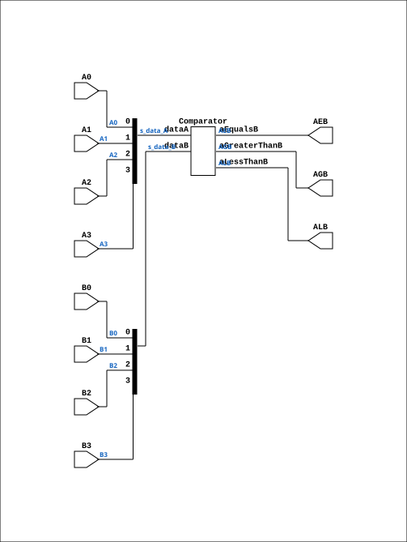

# CMP4

Source: `Verilog/Shared/ndlib/CMP4.v`

<!-- Generated by Verilog/tests/module_doc.py from the //! comments in the source. Do not edit by hand - edit the RTL comments and regenerate. -->

<!-- HIERARCHY-NAV:BEGIN - written by Verilog/tests/gen_hierarchy.py, do not edit -->

**Where it sits** (Simulation): [ND120_TOP](../../../doc/ND120_TOP.md) > [ND120_CORE](../../../doc/ND120_CORE.md) > [ND3202D](../../../CPU-BOARD-3202/circuit/doc/ND3202D.md) > [CPU_15](../../../CPU-BOARD-3202/circuit/doc/CPU_15.md) > [CPU_PROC_32](../../../CPU-BOARD-3202/circuit/doc/CPU_PROC_32.md) > [CPU_PROC_CGA_33](../../../CPU-BOARD-3202/circuit/doc/CPU_PROC_CGA_33.md) > [CGA](../../../DELILAH-CPU/CGA/circuit/doc/CGA.md) > [CGA_MIC](../../../DELILAH-CPU/CGA_MIC/circuit/doc/CGA_MIC.md) > **CMP4**
- instance path: `CORE.CPU_BOARD.CPU.PROC.CGA.DELILAH.MIC.LC_CMP`

**Used in:** [CGA_MIC](../../../DELILAH-CPU/CGA_MIC/circuit/doc/CGA_MIC.md) (all tops)

**Contains:** [Comparator](../../logisim/doc/Comparator.md)

[Module hierarchy](../../../HIERARCHY.md) - [All modules](../../../MODULES.md)

<!-- HIERARCHY-NAV:END -->


<!-- SCHEMATIC:BEGIN - written by Verilog/tests/gen_schematics.py, do not edit -->

## Schematic

Drawn from the Verilog: the yosys netlist of the Simulation (Verilator) build, instance `CORE.CPU_BOARD.CPU.PROC.CGA.DELILAH.MIC.LC_CMP`. Sub-modules are boxes (click the picture to open it full size; there every sub-module box links to its page, and every wire shows its Verilog name).

[](CMP4.svg)

<!-- SCHEMATIC:END -->

## Description

ND120 Shared
Component: CMP4 (4 bit comparator)
Last reviewed: 9-NOV-2024
Ronny Hansen

## Ports

| Direction | Width | Name | Description |
|---|---|---|---|
| input | `1` | `A0` | A bit 0 |
| input | `1` | `A1` | A bit 1 |
| input | `1` | `A2` | A bit 2 |
| input | `1` | `A3` | A bit 3 |
| input | `1` | `B0` | B bit 0 |
| input | `1` | `B1` | B bit 1 |
| input | `1` | `B2` | B bit 2 |
| input | `1` | `B3` | B bit 3 |
| output | `1` | `AEB` | A EQUAL B |
| output | `1` | `AGB` | A GREATER THEN B |
| output | `1` | `ALB` | A LESS THAN B |

## Verilog source

[`Verilog/Shared/ndlib/CMP4.v`](https://github.com/RetroCoreLabs/nd-120/blob/main/Verilog/Shared/ndlib/CMP4.v) on GitHub.

<details markdown="1">
<summary>Show the Verilog of CMP4 (70 lines)</summary>

```verilog
/**************************************************************************
** ND120 Shared                                                          **
**                                                                       **
** Component: CMP4 (4 bit comparator)                                    **
**                                                                       **
** Last reviewed: 9-NOV-2024                                             **
** Ronny Hansen                                                          **
***************************************************************************/

module CMP4 (
    input A0,  //! A bit 0
    input A1,  //! A bit 1
    input A2,  //! A bit 2
    input A3,  //! A bit 3

    input B0,  //! B bit 0
    input B1,  //! B bit 1
    input B2,  //! B bit 2
    input B3,  //! B bit 3

    output AEB,  //! A EQUAL B
    output AGB,  //! A GREATER THEN B
    output ALB   //! A LESS THAN B
);

  /*******************************************************************************
   ** The wires are defined here                                                 **
   *******************************************************************************/
  wire [3:0] s_data_A;
  wire [3:0] s_data_B;
  wire       s_aeb_out;
  wire       s_agb_out;
  wire       s_alb_out;

  /*******************************************************************************
   ** Here all input connections are defined                                     **
   *******************************************************************************/
  assign s_data_A[0] = A0;
  assign s_data_A[1] = A1;
  assign s_data_A[2] = A2;
  assign s_data_A[3] = A3;

  assign s_data_B[0] = B0;
  assign s_data_B[1] = B1;
  assign s_data_B[2] = B2;
  assign s_data_B[3] = B3;

  /*******************************************************************************
   ** Here all output connections are defined                                    **
   *******************************************************************************/
  assign AEB = s_aeb_out;
  assign AGB = s_agb_out;
  assign ALB = s_alb_out;

  /*******************************************************************************
   ** Here all normal components are defined                                     **
   *******************************************************************************/
  Comparator #(
      .nrOfBits(4),
      .twosComplement(1)
  ) ARITH_1 (
      .aEqualsB(s_aeb_out),
      .aGreaterThanB(s_agb_out),
      .aLessThanB(s_alb_out),
      .dataA(s_data_A[3:0]),
      .dataB(s_data_B[3:0])
  );


endmodule
```

</details>
