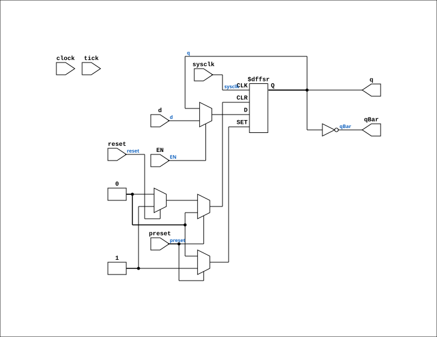

# D_FLIPFLOP_EN

Source: `Verilog/Shared/ndlib/D_FLIPFLOP_EN.v`

<!-- Generated by Verilog/tests/module_doc.py from the //! comments in the source. Do not edit by hand - edit the RTL comments and regenerate. -->

<!-- HIERARCHY-NAV:BEGIN - written by Verilog/tests/gen_hierarchy.py, do not edit -->

**Where it sits** (Simulation): [ND120_TOP](../../../doc/ND120_TOP.md) > [ND120_CORE](../../../doc/ND120_CORE.md) > [ND3202D](../../../CPU-BOARD-3202/circuit/doc/ND3202D.md) > [IO_37](../../../CPU-BOARD-3202/circuit/doc/IO_37.md) > [IO_DCD_38](../../../CPU-BOARD-3202/circuit/doc/IO_DCD_38.md) > [DECODE_DGA](../../../DECODE-GateArray/DGA/circuit/doc/DECODE_DGA.md) > [DECODE_DGA_COMM](../../../DECODE-GateArray/DGA/circuit/doc/DECODE_DGA_COMM.md) > **D_FLIPFLOP_EN**
- instance path: `CORE.CPU_BOARD.IO.DCD.DGA.COMM.MEMORY_63`

**Used in:** [CGA_ALU](../../../DELILAH-CPU/CGA_ALU/circuit/doc/CGA_ALU.md) (all tops), [CGA_ALU_GPR](../../../DELILAH-CPU/CGA_ALU/circuit/doc/CGA_ALU_GPR.md) (all tops), [CGA_CPU_ALU_CONTR](../../../DELILAH-CPU/CGA_ALU/circuit/doc/CGA_CPU_ALU_CONTR.md) (all tops), [CGA_DCD](../../../DELILAH-CPU/CGA_DCD/circuit/doc/CGA_DCD.md) (all tops), [CGA_INTR](../../../DELILAH-CPU/CGA_INTR/circuit/doc/CGA_INTR.md) (all tops), [CGA_INTR_CNTLR_IRGEL_HIGEL](../../../DELILAH-CPU/CGA_INTR/circuit/doc/CGA_INTR_CNTLR_IRGEL_HIGEL.md) (all tops), [CGA_INTR_CNTLR_IRGEL_LOGEL](../../../DELILAH-CPU/CGA_INTR/circuit/doc/CGA_INTR_CNTLR_IRGEL_LOGEL.md) (all tops), [CGA_INTR_CNTLR_IRQ_MASK_MASKBIT](../../../DELILAH-CPU/CGA_INTR/circuit/doc/CGA_INTR_CNTLR_IRQ_MASK_MASKBIT.md) (all tops), [CGA_INTR_CNTLR_IRQ_REG_RQBIT_V2](../../../DELILAH-CPU/CGA_INTR/circuit/doc/CGA_INTR_CNTLR_IRQ_REG_RQBIT_V2.md) (all tops), [CGA_INTR_CNTLR_MDCD](../../../DELILAH-CPU/CGA_INTR/circuit/doc/CGA_INTR_CNTLR_MDCD.md) (all tops), [CGA_INTR_CNTLR_VECGEN_STAT_SBIT](../../../DELILAH-CPU/CGA_INTR/circuit/doc/CGA_INTR_CNTLR_VECGEN_STAT_SBIT.md) (all tops), [CGA_MAC_LASEL](../../../DELILAH-CPU/CGA_MAC/circuit/doc/CGA_MAC_LASEL.md) (all tops), [CGA_MIC](../../../DELILAH-CPU/CGA_MIC/circuit/doc/CGA_MIC.md) (all tops), [CGA_MIC_INCOUNT](../../../DELILAH-CPU/CGA_MIC/circuit/doc/CGA_MIC_INCOUNT.md) (all tops), [CGA_MIC_STACK_BIT](../../../DELILAH-CPU/CGA_MIC/circuit/doc/CGA_MIC_STACK_BIT.md) (all tops), [CGA_MIC_STACK_BIT12](../../../DELILAH-CPU/CGA_MIC/circuit/doc/CGA_MIC_STACK_BIT12.md) (all tops), [CGA_TRAP_TVGEN_P2](../../../DELILAH-CPU/CGA_TRAP/circuit/doc/CGA_TRAP_TVGEN_P2.md) (all tops), [DECODE_DGA_COMM](../../../DECODE-GateArray/DGA/circuit/doc/DECODE_DGA_COMM.md) (all tops), [F924_EN](F924_EN.md) (all tops), [M169C_EN](M169C_EN.md) (all tops)

**Contains:** no other modules.

[Module hierarchy](../../../HIERARCHY.md) - [All modules](../../../MODULES.md)

<!-- HIERARCHY-NAV:END -->


<!-- SCHEMATIC:BEGIN - written by Verilog/tests/gen_schematics.py, do not edit -->

## Schematic

Drawn from the Verilog: the yosys netlist of the Simulation (Verilator) build, instance `CORE.CPU_BOARD.IO.DCD.DGA.COMM.MEMORY_63`. Sub-modules are boxes (click the picture to open it full size; there every sub-module box links to its page, and every wire shows its Verilog name).

[](D_FLIPFLOP_EN.svg)

<!-- SCHEMATIC:END -->

## Description

ND120 Shared
D_FLIPFLOP_EN - D_FLIPFLOP with an optional clock-enable mode.
USE_ENABLE=0 (default): wraps the original D_FLIPFLOP - posedge
clock, original behaviour.
USE_ENABLE=1: posedge sysclk, captures when EN is high (P2 clock-
domain conversion mode - see SCAN_FF_EN.v / the plan doc).
USE_ENABLE=2: strobe edge-capture - `clock` carries a control strobe,
not a clock; capture d on a sysclk-detected rise of `clock` (P3
mode, AM29C821 USE_SYSCLK=2 pattern). EN is unused (tie 0).
ASYNC_RESET=0 (default): preset/reset must be tied 0 (clean sync
flop, InvertClockEnable=0).
ASYNC_RESET=1: preset/reset are async active-high set/clear with
preset priority, like the original D_FLIPFLOP with ACTIVE_ASYNC(1).
tick is unused (tie 1).
Last reviewed: 10-JUL-2026
Ronny Hansen

## Parameters

| Parameter | Default |
|---|---|
| `USE_ENABLE` | `0` |
| `ASYNC_RESET` | `0` |

## Ports

| Direction | Width | Name | Description |
|---|---|---|---|
| input | `1` | `sysclk` | FPGA system clock (used only when USE_ENABLE=1) |
| input | `1` | `EN` | Clock enable    (used only when USE_ENABLE=1) |
| input | `1` | `clock` | Clock (used only when USE_ENABLE=0) |
| input | `1` | `d` | D input |
| input | `1` | `preset` | Must be tied 0 |
| input | `1` | `reset` | Async active-high clear when ASYNC_RESET=1, else tie 0 |
| input | `1` | `tick` | Not used (tie 1) |
| output | `1` | `q` |  |
| output | `1` | `qBar` |  |

## Verilog source

[`Verilog/Shared/ndlib/D_FLIPFLOP_EN.v`](https://github.com/RetroCoreLabs/nd-120/blob/main/Verilog/Shared/ndlib/D_FLIPFLOP_EN.v) on GitHub.

<details markdown="1">
<summary>Show the Verilog of D_FLIPFLOP_EN (112 lines)</summary>

```verilog
/**************************************************************************
** ND120 Shared                                                          **
**                                                                       **
** D_FLIPFLOP_EN - D_FLIPFLOP with an optional clock-enable mode.        **
**                                                                       **
** USE_ENABLE=0 (default): wraps the original D_FLIPFLOP - posedge       **
**   clock, original behaviour.                                          **
** USE_ENABLE=1: posedge sysclk, captures when EN is high (P2 clock-     **
**   domain conversion mode - see SCAN_FF_EN.v / the plan doc).          **
** USE_ENABLE=2: strobe edge-capture - `clock` carries a control strobe, **
**   not a clock; capture d on a sysclk-detected rise of `clock` (P3     **
**   mode, AM29C821 USE_SYSCLK=2 pattern). EN is unused (tie 0).         **
**                                                                       **
** ASYNC_RESET=0 (default): preset/reset must be tied 0 (clean sync      **
**   flop, InvertClockEnable=0).                                         **
** ASYNC_RESET=1: preset/reset are async active-high set/clear with      **
**   preset priority, like the original D_FLIPFLOP with ACTIVE_ASYNC(1). **
**                                                                       **
** tick is unused (tie 1).                                               **
**                                                                       **
** Last reviewed: 10-JUL-2026                                            **
** Ronny Hansen                                                          **
***************************************************************************/

module D_FLIPFLOP_EN #(
    parameter integer USE_ENABLE  = 0,
    parameter integer ASYNC_RESET = 0
) (
    input sysclk,  //! FPGA system clock (used only when USE_ENABLE=1)
    input EN,      //! Clock enable    (used only when USE_ENABLE=1)

    input clock,   //! Clock (used only when USE_ENABLE=0)
    input d,       //! D input
    input preset,  //! Must be tied 0
    input reset,   //! Async active-high clear when ASYNC_RESET=1, else tie 0
                   //! (preset likewise an async set, priority over reset)
    input tick,    //! Not used (tie 1)

    output q,
    output qBar
);

  generate
    if (USE_ENABLE == 1 && ASYNC_RESET == 1) begin : gen_enable_arst
      /* verilator lint_off UNUSEDSIGNAL */
      wire unused = clock & tick;
      /* verilator lint_on UNUSEDSIGNAL */
      reg q_r = 1'b0;
      always @(posedge sysclk or posedge preset or posedge reset) begin
        if (preset) q_r <= 1'b1;
        else if (reset) q_r <= 1'b0;
        else if (EN) q_r <= d;
      end
      assign q    = q_r;
      assign qBar = ~q_r;
    end else if (USE_ENABLE == 2) begin : gen_strobe_edge
      /* verilator lint_off UNUSEDSIGNAL */
      wire unused = EN & preset & reset & tick;
      /* verilator lint_on UNUSEDSIGNAL */
      reg q_r = 1'b0;
      reg clock_d = 1'b0;
      always @(posedge sysclk) begin
        clock_d <= clock;
        if (clock && !clock_d) q_r <= d;
      end
      assign q    = q_r;
      assign qBar = ~q_r;
    end else if (USE_ENABLE == 1) begin : gen_enable
      /* verilator lint_off UNUSEDSIGNAL */
      wire unused = clock & preset & reset & tick;
      /* verilator lint_on UNUSEDSIGNAL */
      reg q_r = 1'b0;
      always @(posedge sysclk) begin
        if (EN) q_r <= d;
      end
      assign q    = q_r;
      assign qBar = ~q_r;
    end else if (ASYNC_RESET == 1) begin : gen_orig_arst
      /* verilator lint_off UNUSEDSIGNAL */
      wire unused_sys = sysclk & EN;
      /* verilator lint_on UNUSEDSIGNAL */
      D_FLIPFLOP #(
          .ACTIVE_ASYNC(1),
          .InvertClockEnable(0)
      ) FF (
          .clock (clock),
          .d     (d),
          .preset(preset),
          .reset (reset),
          .tick  (tick),
          .q     (q),
          .qBar  (qBar)
      );
    end else begin : gen_orig
      /* verilator lint_off UNUSEDSIGNAL */
      wire unused_sys = sysclk & EN;
      /* verilator lint_on UNUSEDSIGNAL */
      D_FLIPFLOP #(
          .InvertClockEnable(0)
      ) FF (
          .clock (clock),
          .d     (d),
          .preset(preset),
          .reset (reset),
          .tick  (tick),
          .q     (q),
          .qBar  (qBar)
      );
    end
  endgenerate

endmodule
```

</details>
