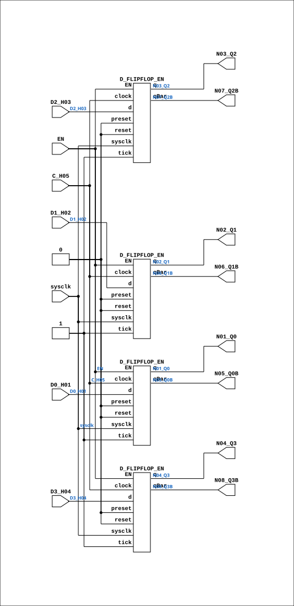

# F924_EN

Source: `Verilog/Shared/ndlib/F924_EN.v`

<!-- Generated by Verilog/tests/module_doc.py from the //! comments in the source. Do not edit by hand - edit the RTL comments and regenerate. -->

<!-- HIERARCHY-NAV:BEGIN - written by Verilog/tests/gen_hierarchy.py, do not edit -->

**Where it sits** (Simulation): [ND120_TOP](../../../doc/ND120_TOP.md) > [ND120_CORE](../../../doc/ND120_CORE.md) > [ND3202D](../../../CPU-BOARD-3202/circuit/doc/ND3202D.md) > [IO_37](../../../CPU-BOARD-3202/circuit/doc/IO_37.md) > [IO_DCD_38](../../../CPU-BOARD-3202/circuit/doc/IO_DCD_38.md) > [DECODE_DGA](../../../DECODE-GateArray/DGA/circuit/doc/DECODE_DGA.md) > [DECODE_DGA_IDBS](../../../DECODE-GateArray/DGA/circuit/doc/DECODE_DGA_IDBS.md) > **F924_EN**
- instance path: `CORE.CPU_BOARD.IO.DCD.DGA.IDBS.A282`

**Used in:** [DECODE_DGA_COMM](../../../DECODE-GateArray/DGA/circuit/doc/DECODE_DGA_COMM.md) (all tops), [DECODE_DGA_IDBS](../../../DECODE-GateArray/DGA/circuit/doc/DECODE_DGA_IDBS.md) (all tops)

**Contains:** [D_FLIPFLOP_EN](D_FLIPFLOP_EN.md) x4

[Module hierarchy](../../../HIERARCHY.md) - [All modules](../../../MODULES.md)

<!-- HIERARCHY-NAV:END -->


<!-- SCHEMATIC:BEGIN - written by Verilog/tests/gen_schematics.py, do not edit -->

## Schematic

Drawn from the Verilog: the yosys netlist of the Simulation (Verilator) build, instance `CORE.CPU_BOARD.IO.DCD.DGA.IDBS.A282`. Sub-modules are boxes (click the picture to open it full size; there every sub-module box links to its page, and every wire shows its Verilog name).

[](F924_EN.svg)

<!-- SCHEMATIC:END -->

## Description

ND120 Shared
F924_EN - F924 (NEC 4-bit D-type flip-flop) with an optional
clock-enable mode.
USE_ENABLE=0 (default): wraps the original F924 - posedge C_H05,
original behaviour.
USE_ENABLE=1: posedge sysclk, captures when EN is high (P2 clock-
domain conversion mode - see SCAN_FF_EN.v / the plan doc). This
branch is a STRUCTURAL COPY of the original F924 body - every
wire and assign identical - with only the four internal flops
swapped from D_FLIPFLOP #(.InvertClockEnable(0)) to
D_FLIPFLOP_EN #(.USE_ENABLE(1)) (default ASYNC_RESET=0; the
originals tie preset/reset to 0 and tick to 1, preserved here).
The C_H05 pin is routed to the flops' (unused-in-mode-1) clock
pins.
Last reviewed: 10-JUL-2026
Ronny Hansen

## Parameters

| Parameter | Default |
|---|---|
| `USE_ENABLE` | `0` |

## Ports

| Direction | Width | Name | Description |
|---|---|---|---|
| input | `1` | `sysclk` | FPGA system clock (used only when USE_ENABLE=1) |
| input | `1` | `EN` | Clock enable    (used only when USE_ENABLE=1) |
| input | `1` | `C_H05` |  |
| input | `1` | `D0_H01` |  |
| input | `1` | `D1_H02` |  |
| input | `1` | `D2_H03` |  |
| input | `1` | `D3_H04` |  |
| output | `1` | `N01_Q0` |  |
| output | `1` | `N02_Q1` |  |
| output | `1` | `N03_Q2` |  |
| output | `1` | `N04_Q3` |  |
| output | `1` | `N05_Q0B` |  |
| output | `1` | `N06_Q1B` |  |
| output | `1` | `N07_Q2B` |  |
| output | `1` | `N08_Q3B` |  |

## Verilog source

[`Verilog/Shared/ndlib/F924_EN.v`](https://github.com/RetroCoreLabs/nd-120/blob/main/Verilog/Shared/ndlib/F924_EN.v) on GitHub.

<details markdown="1">
<summary>Show the Verilog of F924_EN (173 lines)</summary>

```verilog
/**************************************************************************
** ND120 Shared                                                          **
**                                                                       **
** F924_EN - F924 (NEC 4-bit D-type flip-flop) with an optional          **
** clock-enable mode.                                                    **
**                                                                       **
** USE_ENABLE=0 (default): wraps the original F924 - posedge C_H05,      **
**   original behaviour.                                                 **
** USE_ENABLE=1: posedge sysclk, captures when EN is high (P2 clock-     **
**   domain conversion mode - see SCAN_FF_EN.v / the plan doc). This     **
**   branch is a STRUCTURAL COPY of the original F924 body - every       **
**   wire and assign identical - with only the four internal flops       **
**   swapped from D_FLIPFLOP #(.InvertClockEnable(0)) to                 **
**   D_FLIPFLOP_EN #(.USE_ENABLE(1)) (default ASYNC_RESET=0; the         **
**   originals tie preset/reset to 0 and tick to 1, preserved here).     **
**   The C_H05 pin is routed to the flops' (unused-in-mode-1) clock      **
**   pins.                                                               **
**                                                                       **
** Last reviewed: 10-JUL-2026                                            **
** Ronny Hansen                                                          **
***************************************************************************/

module F924_EN #(
    parameter integer USE_ENABLE = 0
) (
    input sysclk,  //! FPGA system clock (used only when USE_ENABLE=1)
    input EN,      //! Clock enable    (used only when USE_ENABLE=1)

    // Clock (used only when USE_ENABLE=0)
    input C_H05,

    // Data inputs
    input D0_H01,
    input D1_H02,
    input D2_H03,
    input D3_H04,

    // Normal outputs
    output N01_Q0,
    output N02_Q1,
    output N03_Q2,
    output N04_Q3,

    // Negated outputs
    output N05_Q0B,
    output N06_Q1B,
    output N07_Q2B,
    output N08_Q3B
);

  generate
    if (USE_ENABLE == 1) begin : gen_enable

      /*******************************************************************************
       ** The wires are defined here (structural copy of F924)                       **
       *******************************************************************************/
      wire s_clock;
      wire s_d0;
      wire s_d1;
      wire s_d2;
      wire s_d3;
      wire s_q0_n;
      wire s_q0;
      wire s_q1_n;
      wire s_q1;
      wire s_q2_n;
      wire s_q2;
      wire s_q3_n;
      wire s_q3;

      // Assign inputs
      assign s_clock = C_H05;

      assign s_d0 = D0_H01;
      assign s_d1 = D1_H02;
      assign s_d2 = D2_H03;
      assign s_d3 = D3_H04;

      // Assign outputs
      assign N01_Q0 = s_q0;
      assign N02_Q1 = s_q1;
      assign N03_Q2 = s_q2;
      assign N04_Q3 = s_q3;
      assign N05_Q0B = s_q0_n;
      assign N06_Q1B = s_q1_n;
      assign N07_Q2B = s_q2_n;
      assign N08_Q3B = s_q3_n;

      // The four internal flops, swapped to D_FLIPFLOP_EN in mode 1.
      // Originals were D_FLIPFLOP #(.InvertClockEnable(0)) with
      // preset/reset tied 0 and tick tied 1 (D_FLIPFLOP_EN defaults:
      // ASYNC_RESET=0; its mode-0 branch also uses InvertClockEnable(0)).
      // The clock pin (s_clock) is unused inside D_FLIPFLOP_EN when
      // USE_ENABLE=1 and is lint-waived there.
      D_FLIPFLOP_EN #(
          .USE_ENABLE(1)
      ) MEMORY_1 (
          .sysclk(sysclk),
          .EN(EN),
          .clock(s_clock),
          .d(s_d0),
          .preset(1'b0),
          .q(s_q0),
          .qBar(s_q0_n),
          .reset(1'b0),
          .tick(1'b1)
      );

      D_FLIPFLOP_EN #(
          .USE_ENABLE(1)
      ) MEMORY_2 (
          .sysclk(sysclk),
          .EN(EN),
          .clock(s_clock),
          .d(s_d1),
          .preset(1'b0),
          .q(s_q1),
          .qBar(s_q1_n),
          .reset(1'b0),
          .tick(1'b1)
      );

      D_FLIPFLOP_EN #(
          .USE_ENABLE(1)
      ) MEMORY_3 (
          .sysclk(sysclk),
          .EN(EN),
          .clock(s_clock),
          .d(s_d2),
          .preset(1'b0),
          .q(s_q2),
          .qBar(s_q2_n),
          .reset(1'b0),
          .tick(1'b1)
      );

      D_FLIPFLOP_EN #(
          .USE_ENABLE(1)
      ) MEMORY_4 (
          .sysclk(sysclk),
          .EN(EN),
          .clock(s_clock),
          .d(s_d3),
          .preset(1'b0),
          .q(s_q3),
          .qBar(s_q3_n),
          .reset(1'b0),
          .tick(1'b1)
      );

    end else begin : gen_orig
      /* verilator lint_off UNUSEDSIGNAL */
      wire unused_sys = sysclk & EN;
      /* verilator lint_on UNUSEDSIGNAL */
      F924 FF4 (
          .C_H05  (C_H05),
          .D0_H01 (D0_H01),
          .D1_H02 (D1_H02),
          .D2_H03 (D2_H03),
          .D3_H04 (D3_H04),
          .N01_Q0 (N01_Q0),
          .N02_Q1 (N02_Q1),
          .N03_Q2 (N03_Q2),
          .N04_Q3 (N04_Q3),
          .N05_Q0B(N05_Q0B),
          .N06_Q1B(N06_Q1B),
          .N07_Q2B(N07_Q2B),
          .N08_Q3B(N08_Q3B)
      );
    end
  endgenerate

endmodule
```

</details>
