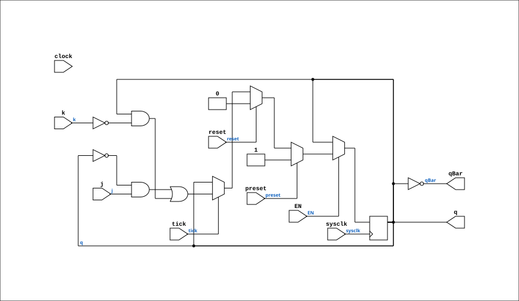

# J_K_FLIPFLOP_EN

Source: `Verilog/Shared/ndlib/J_K_FLIPFLOP_EN.v`

<!-- Generated by Verilog/tests/module_doc.py from the //! comments in the source. Do not edit by hand - edit the RTL comments and regenerate. -->

<!-- HIERARCHY-NAV:BEGIN - written by Verilog/tests/gen_hierarchy.py, do not edit -->

**Where it sits** (Simulation): [ND120_TOP](../../../doc/ND120_TOP.md) > [ND120_CORE](../../../doc/ND120_CORE.md) > [ND3202D](../../../CPU-BOARD-3202/circuit/doc/ND3202D.md) > [CPU_15](../../../CPU-BOARD-3202/circuit/doc/CPU_15.md) > [CPU_PROC_32](../../../CPU-BOARD-3202/circuit/doc/CPU_PROC_32.md) > [CPU_PROC_CGA_33](../../../CPU-BOARD-3202/circuit/doc/CPU_PROC_CGA_33.md) > [CGA](../../../DELILAH-CPU/CGA/circuit/doc/CGA.md) > [CGA_MAC](../../../DELILAH-CPU/CGA_MAC/circuit/doc/CGA_MAC.md) > [CGA_MAC_PTSEL](../../../DELILAH-CPU/CGA_MAC/circuit/doc/CGA_MAC_PTSEL.md) > **J_K_FLIPFLOP_EN**
- instance path: `CORE.CPU_BOARD.CPU.PROC.CGA.DELILAH.MAC.MAC_PTSEL.MEMORY_5`

**Used in:** [CGA_MAC_PTSEL](../../../DELILAH-CPU/CGA_MAC/circuit/doc/CGA_MAC_PTSEL.md) (all tops)

**Contains:** no other modules.

[Module hierarchy](../../../HIERARCHY.md) - [All modules](../../../MODULES.md)

<!-- HIERARCHY-NAV:END -->


<!-- SCHEMATIC:BEGIN - written by Verilog/tests/gen_schematics.py, do not edit -->

## Schematic

Drawn from the Verilog: the yosys netlist of the Simulation (Verilator) build, instance `CORE.CPU_BOARD.CPU.PROC.CGA.DELILAH.MAC.MAC_PTSEL.MEMORY_5`. Sub-modules are boxes (click the picture to open it full size; there every sub-module box links to its page, and every wire shows its Verilog name).

[](J_K_FLIPFLOP_EN.svg)

<!-- SCHEMATIC:END -->

## Description

ND120 Shared
J_K_FLIPFLOP_EN - J_K_FLIPFLOP with an optional clock-enable mode.
USE_ENABLE=0 (default): wraps the original J_K_FLIPFLOP - clocked on
the original clock pin (InvertClockEnable passed through),
bit-for-bit the original behaviour.
USE_ENABLE=1: clocked on posedge sysclk, updates when EN is high
(P2 clock-domain conversion mode - see SCAN_FF_EN.v / the plan
doc). The clock pin is unused in this mode. preset/reset stay
SYNCHRONOUS, exactly as in the original clocked block, with the
original priority: preset > reset > tick.
Last reviewed: 10-JUL-2026
Ronny Hansen

## Parameters

| Parameter | Default |
|---|---|
| `USE_ENABLE` | `0` |
| `InvertClockEnable` | `1` |

## Ports

| Direction | Width | Name | Description |
|---|---|---|---|
| input | `1` | `sysclk` | FPGA system clock (used only when USE_ENABLE=1) |
| input | `1` | `EN` | Clock enable    (used only when USE_ENABLE=1) |
| input | `1` | `clock` | Clock (used only when USE_ENABLE=0) |
| input | `1` | `j` | J input |
| input | `1` | `k` | K input |
| input | `1` | `preset` | Synchronous active-high set (priority over reset) |
| input | `1` | `reset` | Synchronous active-high clear |
| input | `1` | `tick` | Update enable inside the clocked block |
| output | `1` | `q` |  |
| output | `1` | `qBar` |  |

## Verilog source

[`Verilog/Shared/ndlib/J_K_FLIPFLOP_EN.v`](https://github.com/RetroCoreLabs/nd-120/blob/main/Verilog/Shared/ndlib/J_K_FLIPFLOP_EN.v) on GitHub.

<details markdown="1">
<summary>Show the Verilog of J_K_FLIPFLOP_EN (71 lines)</summary>

```verilog
/**************************************************************************
** ND120 Shared                                                          **
**                                                                       **
** J_K_FLIPFLOP_EN - J_K_FLIPFLOP with an optional clock-enable mode.    **
**                                                                       **
** USE_ENABLE=0 (default): wraps the original J_K_FLIPFLOP - clocked on  **
**   the original clock pin (InvertClockEnable passed through),          **
**   bit-for-bit the original behaviour.                                 **
** USE_ENABLE=1: clocked on posedge sysclk, updates when EN is high      **
**   (P2 clock-domain conversion mode - see SCAN_FF_EN.v / the plan      **
**   doc). The clock pin is unused in this mode. preset/reset stay       **
**   SYNCHRONOUS, exactly as in the original clocked block, with the     **
**   original priority: preset > reset > tick.                           **
**                                                                       **
** Last reviewed: 10-JUL-2026                                            **
** Ronny Hansen                                                          **
***************************************************************************/

module J_K_FLIPFLOP_EN #(
    parameter integer USE_ENABLE = 0,
    parameter integer InvertClockEnable = 1
) (
    input sysclk,  //! FPGA system clock (used only when USE_ENABLE=1)
    input EN,      //! Clock enable    (used only when USE_ENABLE=1)

    input clock,   //! Clock (used only when USE_ENABLE=0)
    input j,       //! J input
    input k,       //! K input
    input preset,  //! Synchronous active-high set (priority over reset)
    input reset,   //! Synchronous active-high clear
    input tick,    //! Update enable inside the clocked block

    output q,
    output qBar
);

  generate
    if (USE_ENABLE == 1) begin : gen_enable
      /* verilator lint_off UNUSEDSIGNAL */
      wire unused_clk = clock;
      /* verilator lint_on UNUSEDSIGNAL */
      reg q_r = 1'b0;
      always @(posedge sysclk) begin
        if (EN) begin
          if (preset) q_r <= 1'b1;
          else if (reset) q_r <= 1'b0;
          else if (tick) q_r <= (~q_r & j) | (q_r & ~k);
        end
      end
      assign q    = q_r;
      assign qBar = ~q_r;
    end else begin : gen_orig
      /* verilator lint_off UNUSEDSIGNAL */
      wire unused_sys = sysclk & EN;
      /* verilator lint_on UNUSEDSIGNAL */
      J_K_FLIPFLOP #(
          .InvertClockEnable(InvertClockEnable)
      ) FF (
          .clock (clock),
          .j     (j),
          .k     (k),
          .preset(preset),
          .reset (reset),
          .tick  (tick),
          .q     (q),
          .qBar  (qBar)
      );
    end
  endgenerate

endmodule
```

</details>
