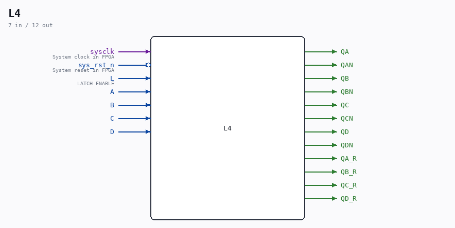
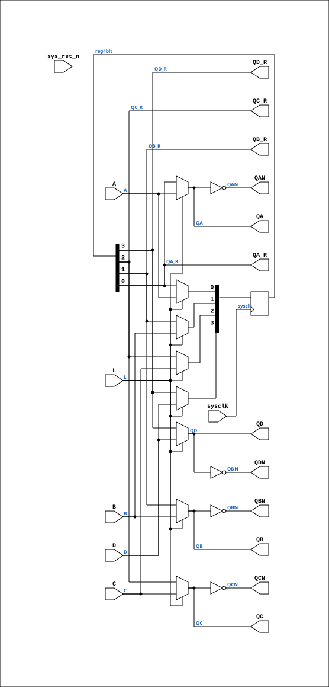

# L4

Source: `Verilog/Shared/ndlib/L4.v`

<!-- Generated by Verilog/tests/module_doc.py from the //! comments in the source. Do not edit by hand - edit the RTL comments and regenerate. -->

<!-- HIERARCHY-NAV:BEGIN - written by Verilog/tests/gen_hierarchy.py, do not edit -->

**Where it sits** (Simulation): [ND120_TOP](../../../doc/ND120_TOP.md) > [ND120_CORE](../../../doc/ND120_CORE.md) > [ND3202D](../../../CPU-BOARD-3202/circuit/doc/ND3202D.md) > [CPU_15](../../../CPU-BOARD-3202/circuit/doc/CPU_15.md) > [CPU_PROC_32](../../../CPU-BOARD-3202/circuit/doc/CPU_PROC_32.md) > [CPU_PROC_CGA_33](../../../CPU-BOARD-3202/circuit/doc/CPU_PROC_CGA_33.md) > [CGA](../../../DELILAH-CPU/CGA/circuit/doc/CGA.md) > [CGA_MAC](../../../DELILAH-CPU/CGA_MAC/circuit/doc/CGA_MAC.md) > [CGA_MAC_SEGPT](../../../DELILAH-CPU/CGA_MAC/circuit/doc/CGA_MAC_SEGPT.md) > [CGA_MAC_SEGPT_XPT](../../../DELILAH-CPU/CGA_MAC/circuit/doc/CGA_MAC_SEGPT_XPT.md) > **L4**
- instance path: `CORE.CPU_BOARD.CPU.PROC.CGA.DELILAH.MAC.MAC_SEGPT.XPT.XPT_L`

**Used in:** [CGA_MAC_SEGPT_PCR](../../../DELILAH-CPU/CGA_MAC/circuit/doc/CGA_MAC_SEGPT_PCR.md) (all tops), [CGA_MAC_SEGPT_XPT](../../../DELILAH-CPU/CGA_MAC/circuit/doc/CGA_MAC_SEGPT_XPT.md) (all tops)

**Contains:** no other modules.

[Module hierarchy](../../../HIERARCHY.md) - [All modules](../../../MODULES.md)

<!-- HIERARCHY-NAV:END -->



<!-- SCHEMATIC:BEGIN - written by Verilog/tests/gen_schematics.py, do not edit -->

## Schematic

Drawn from the Verilog: the yosys netlist of the Simulation (Verilator) build, instance `CORE.CPU_BOARD.CPU.PROC.CGA.DELILAH.MAC.MAC_SEGPT.XPT.XPT_L`. Sub-modules are boxes (click the picture to open it full size; there every sub-module box links to its page, and every wire shows its Verilog name).

[](L4.svg)

<!-- SCHEMATIC:END -->

## Description

ND120 Shared
Component L4 (4-bit latch)
Last reviewed: 9-FEB-2025
Ronny Hansen

## Ports

| Direction | Width | Name | Description |
|---|---|---|---|
| input | `1` | `sysclk` | System clock in FPGA |
| input | `1` | `sys_rst_n` *(active low)* | System reset in FPGA |
| input | `1` | `L` | LATCH ENABLE |
| input | `1` | `A` |  |
| input | `1` | `B` |  |
| input | `1` | `C` |  |
| input | `1` | `D` |  |
| output | `1` | `QA` |  |
| output | `1` | `QAN` |  |
| output | `1` | `QB` |  |
| output | `1` | `QBN` |  |
| output | `1` | `QC` |  |
| output | `1` | `QCN` |  |
| output | `1` | `QD` |  |
| output | `1` | `QDN` |  |
| output | `1` | `QA_R` |  |
| output | `1` | `QB_R` |  |
| output | `1` | `QC_R` |  |
| output | `1` | `QD_R` |  |

## Verilog source

[`Verilog/Shared/ndlib/L4.v`](https://github.com/RetroCoreLabs/nd-120/blob/main/Verilog/Shared/ndlib/L4.v) on GitHub.

<details markdown="1">
<summary>Show the Verilog of L4 (81 lines)</summary>

```verilog
/**************************************************************************
** ND120 Shared                                                          **
**                                                                       **
** Component L4 (4-bit latch)                                            **
**                                                                       **
** Last reviewed: 9-FEB-2025                                             **
** Ronny Hansen                                                          **
***************************************************************************/

module L4 (
    // System input signals
    input sysclk,    // System clock in FPGA
    input sys_rst_n, // System reset in FPGA

    input L, //! LATCH ENABLE

    input A,
    input B,
    input C,
    input D,

    output QA,
    output QAN,
    output QB,
    output QBN,
    output QC,
    output QCN,
    output QD,
    output QDN,

    // Registered-value taps (21-AUG-2026): the stored value WITHOUT the
    // FF-mode transparent bypass mux - same contract as L8's QA_R..QH_R,
    // see Shared/ndlib/L8.v. Leave unconnected where the transparent
    // output is the wanted one.
    output QA_R,
    output QB_R,
    output QC_R,
    output QD_R
);

reg [3:0] reg4bit;

assign {QA_R, QB_R, QC_R, QD_R} =
       {reg4bit[0], reg4bit[1], reg4bit[2], reg4bit[3]};

`ifdef USE_TRANSPARENT_LATCHES
assign QA=reg4bit[0]; assign QAN=~reg4bit[0];
assign QB=reg4bit[1]; assign QBN=~reg4bit[1];
assign QC=reg4bit[2]; assign QCN=~reg4bit[2];
assign QD=reg4bit[3]; assign QDN=~reg4bit[3];
`else
// FPGA: synthesizable transparent latch = mux + FF (Q follows input while L high)
wire q_a = L ? A : reg4bit[0]; assign QA=q_a; assign QAN=~q_a;
wire q_b = L ? B : reg4bit[1]; assign QB=q_b; assign QBN=~q_b;
wire q_c = L ? C : reg4bit[2]; assign QC=q_c; assign QCN=~q_c;
wire q_d = L ? D : reg4bit[3]; assign QD=q_d; assign QDN=~q_d;
`endif


`ifdef USE_TRANSPARENT_LATCHES
always @(*) begin
    if (L) begin
        reg4bit[0] = A;
        reg4bit[1] = B;
        reg4bit[2] = C;
        reg4bit[3] = D;
    end
end
`else
always @(posedge sysclk) begin
    if (L) begin
        reg4bit[0] <= A;
        reg4bit[1] <= B;
        reg4bit[2] <= C;
        reg4bit[3] <= D;
    end
end
`endif

endmodule
```

</details>
