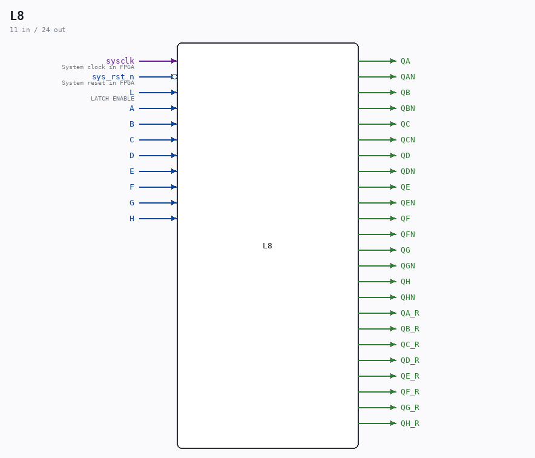
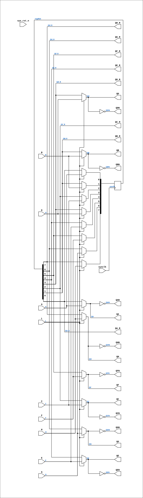

# L8

Source: `Verilog/Shared/ndlib/L8.v`

<!-- Generated by Verilog/tests/module_doc.py from the //! comments in the source. Do not edit by hand - edit the RTL comments and regenerate. -->

<!-- HIERARCHY-NAV:BEGIN - written by Verilog/tests/gen_hierarchy.py, do not edit -->

**Where it sits** (Simulation): [ND120_TOP](../../../doc/ND120_TOP.md) > [ND120_CORE](../../../doc/ND120_CORE.md) > [ND3202D](../../../CPU-BOARD-3202/circuit/doc/ND3202D.md) > [CPU_15](../../../CPU-BOARD-3202/circuit/doc/CPU_15.md) > [CPU_PROC_32](../../../CPU-BOARD-3202/circuit/doc/CPU_PROC_32.md) > [CPU_PROC_CGA_33](../../../CPU-BOARD-3202/circuit/doc/CPU_PROC_CGA_33.md) > [CGA](../../../DELILAH-CPU/CGA/circuit/doc/CGA.md) > [CGA_MIC](../../../DELILAH-CPU/CGA_MIC/circuit/doc/CGA_MIC.md) > **L8**
- instance path: `CORE.CPU_BOARD.CPU.PROC.CGA.DELILAH.MIC.IRLATCH`

**Used in:** [CGA_CPU_ALU_CONTR](../../../DELILAH-CPU/CGA_ALU/circuit/doc/CGA_CPU_ALU_CONTR.md) (all tops), [CGA_MAC_APOS_CALCA](../../../DELILAH-CPU/CGA_MAC/circuit/doc/CGA_MAC_APOS_CALCA.md) (all tops), [CGA_MAC_SEGPT_PCR](../../../DELILAH-CPU/CGA_MAC/circuit/doc/CGA_MAC_SEGPT_PCR.md) (all tops), [CGA_MAC_SEGPT_SEG](../../../DELILAH-CPU/CGA_MAC/circuit/doc/CGA_MAC_SEGPT_SEG.md) (all tops), [CGA_MIC](../../../DELILAH-CPU/CGA_MIC/circuit/doc/CGA_MIC.md) (all tops), [CGA_WRF_RBLOCK_LR16](../../../DELILAH-CPU/CGA_WRF/circuit/doc/CGA_WRF_RBLOCK_LR16.md) (all tops), [CGA_WRF_RBLOCK_PREG](../../../DELILAH-CPU/CGA_WRF/circuit/doc/CGA_WRF_RBLOCK_PREG.md) (all tops)

**Contains:** no other modules.

[Module hierarchy](../../../HIERARCHY.md) - [All modules](../../../MODULES.md)

<!-- HIERARCHY-NAV:END -->



<!-- SCHEMATIC:BEGIN - written by Verilog/tests/gen_schematics.py, do not edit -->

## Schematic

Drawn from the Verilog: the yosys netlist of the Simulation (Verilator) build, instance `CORE.CPU_BOARD.CPU.PROC.CGA.DELILAH.MIC.IRLATCH`. Sub-modules are boxes (click the picture to open it full size; there every sub-module box links to its page, and every wire shows its Verilog name).

[](L8.svg)

<!-- SCHEMATIC:END -->

## Description

ND120 Shared
Component L8 (8-bit latch)
Last reviewed: 9-FEB-2025
Ronny Hansen

## Ports

| Direction | Width | Name | Description |
|---|---|---|---|
| input | `1` | `sysclk` | System clock in FPGA |
| input | `1` | `sys_rst_n` *(active low)* | System reset in FPGA |
| input | `1` | `L` | LATCH ENABLE |
| input | `1` | `A` |  |
| input | `1` | `B` |  |
| input | `1` | `C` |  |
| input | `1` | `D` |  |
| input | `1` | `E` |  |
| input | `1` | `F` |  |
| input | `1` | `G` |  |
| input | `1` | `H` |  |
| output | `1` | `QA` |  |
| output | `1` | `QAN` |  |
| output | `1` | `QB` |  |
| output | `1` | `QBN` |  |
| output | `1` | `QC` |  |
| output | `1` | `QCN` |  |
| output | `1` | `QD` |  |
| output | `1` | `QDN` |  |
| output | `1` | `QE` |  |
| output | `1` | `QEN` |  |
| output | `1` | `QF` |  |
| output | `1` | `QFN` |  |
| output | `1` | `QG` |  |
| output | `1` | `QGN` |  |
| output | `1` | `QH` |  |
| output | `1` | `QHN` |  |
| output | `1` | `QA_R` |  |
| output | `1` | `QB_R` |  |
| output | `1` | `QC_R` |  |
| output | `1` | `QD_R` |  |
| output | `1` | `QE_R` |  |
| output | `1` | `QF_R` |  |
| output | `1` | `QG_R` |  |
| output | `1` | `QH_R` |  |

## Verilog source

[`Verilog/Shared/ndlib/L8.v`](https://github.com/RetroCoreLabs/nd-120/blob/main/Verilog/Shared/ndlib/L8.v) on GitHub.

<details markdown="1">
<summary>Show the Verilog of L8 (118 lines)</summary>

```verilog
/**************************************************************************
** ND120 Shared                                                          **
**                                                                       **
** Component L8 (8-bit latch)                                            **
**                                                                       **
** Last reviewed: 9-FEB-2025                                             **
** Ronny Hansen                                                          **
***************************************************************************/


module L8 (
    // System input signals
    input sysclk,    // System clock in FPGA
    input sys_rst_n, // System reset in FPGA


    input L, //! LATCH ENABLE

    input A,
    input B,
    input C,
    input D,
    input E,
    input F,
    input G,
    input H,

    output QA,
    output QAN,
    output QB,
    output QBN,
    output QC,
    output QCN,
    output QD,
    output QDN,
    output QE,
    output QEN,
    output QF,
    output QFN,
    output QG,
    output QGN,
    output QH,
    output QHN,

    // Registered-value taps (21-AUG-2026): the stored value WITHOUT the
    // FF-mode transparent bypass mux (L ? D : reg). Combinational-loop cut
    // for IDB readback paths - see CGA_MAC_SEGPT_PCR. In latch mode reg8bit
    // updates combinationally while L is high, so the tap equals the
    // transparent output there; only FF mode behaves differently (the tap
    // lags the bypass by one sysclk during the load window). Leave
    // unconnected everywhere the transparent output is the wanted one.
    output QA_R,
    output QB_R,
    output QC_R,
    output QD_R,
    output QE_R,
    output QF_R,
    output QG_R,
    output QH_R
);

reg [7:0] reg8bit;

assign {QA_R, QB_R, QC_R, QD_R, QE_R, QF_R, QG_R, QH_R} =
       {reg8bit[0], reg8bit[1], reg8bit[2], reg8bit[3],
        reg8bit[4], reg8bit[5], reg8bit[6], reg8bit[7]};

`ifdef USE_TRANSPARENT_LATCHES
assign QA=reg8bit[0]; assign QAN=~reg8bit[0];
assign QB=reg8bit[1]; assign QBN=~reg8bit[1];
assign QC=reg8bit[2]; assign QCN=~reg8bit[2];
assign QD=reg8bit[3]; assign QDN=~reg8bit[3];
assign QE=reg8bit[4]; assign QEN=~reg8bit[4];
assign QF=reg8bit[5]; assign QFN=~reg8bit[5];
assign QG=reg8bit[6]; assign QGN=~reg8bit[6];
assign QH=reg8bit[7]; assign QHN=~reg8bit[7];
`else
// FPGA: synthesizable transparent latch = mux + FF (Q follows input while L high)
wire q_a = L ? A : reg8bit[0]; assign QA=q_a; assign QAN=~q_a;
wire q_b = L ? B : reg8bit[1]; assign QB=q_b; assign QBN=~q_b;
wire q_c = L ? C : reg8bit[2]; assign QC=q_c; assign QCN=~q_c;
wire q_d = L ? D : reg8bit[3]; assign QD=q_d; assign QDN=~q_d;
wire q_e = L ? E : reg8bit[4]; assign QE=q_e; assign QEN=~q_e;
wire q_f = L ? F : reg8bit[5]; assign QF=q_f; assign QFN=~q_f;
wire q_g = L ? G : reg8bit[6]; assign QG=q_g; assign QGN=~q_g;
wire q_h = L ? H : reg8bit[7]; assign QH=q_h; assign QHN=~q_h;
`endif


`ifdef USE_TRANSPARENT_LATCHES
always @(*) begin
    if (L) begin
        reg8bit[0] = A;
        reg8bit[1] = B;
        reg8bit[2] = C;
        reg8bit[3] = D;
        reg8bit[4] = E;
        reg8bit[5] = F;
        reg8bit[6] = G;
        reg8bit[7] = H;
    end
end
`else
always @(posedge sysclk) begin
    if (L) begin
        reg8bit[0] <= A;
        reg8bit[1] <= B;
        reg8bit[2] <= C;
        reg8bit[3] <= D;
        reg8bit[4] <= E;
        reg8bit[5] <= F;
        reg8bit[6] <= G;
        reg8bit[7] <= H;
    end
end
`endif

endmodule
```

</details>
