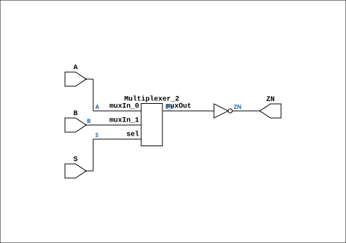

# MUX21L

Source: `Verilog/Shared/ndlib/MUX21L.v`

<!-- Generated by Verilog/tests/module_doc.py from the //! comments in the source. Do not edit by hand - edit the RTL comments and regenerate. -->

<!-- HIERARCHY-NAV:BEGIN - written by Verilog/tests/gen_hierarchy.py, do not edit -->

**Where it sits** (Simulation): [ND120_TOP](../../../doc/ND120_TOP.md) > [ND120_CORE](../../../doc/ND120_CORE.md) > [ND3202D](../../../CPU-BOARD-3202/circuit/doc/ND3202D.md) > [CPU_15](../../../CPU-BOARD-3202/circuit/doc/CPU_15.md) > [CPU_PROC_32](../../../CPU-BOARD-3202/circuit/doc/CPU_PROC_32.md) > [CPU_PROC_CGA_33](../../../CPU-BOARD-3202/circuit/doc/CPU_PROC_CGA_33.md) > [CGA](../../../DELILAH-CPU/CGA/circuit/doc/CGA.md) > [CGA_MIC](../../../DELILAH-CPU/CGA_MIC/circuit/doc/CGA_MIC.md) > **MUX21L**
- instance path: `CORE.CPU_BOARD.CPU.PROC.CGA.DELILAH.MIC.M_RF1`

**Used in:** [CGA_MIC](../../../DELILAH-CPU/CGA_MIC/circuit/doc/CGA_MIC.md) (all tops)

**Contains:** [Multiplexer_2](../../logisim/doc/Multiplexer_2.md)

[Module hierarchy](../../../HIERARCHY.md) - [All modules](../../../MODULES.md)

<!-- HIERARCHY-NAV:END -->


<!-- SCHEMATIC:BEGIN - written by Verilog/tests/gen_schematics.py, do not edit -->

## Schematic

Drawn from the Verilog: the yosys netlist of the Simulation (Verilator) build, instance `CORE.CPU_BOARD.CPU.PROC.CGA.DELILAH.MIC.M_RF1`. Sub-modules are boxes (click the picture to open it full size; there every sub-module box links to its page, and every wire shows its Verilog name).

[](MUX21L.svg)

<!-- SCHEMATIC:END -->

## Description

ND120 Shared
Component : MUX21L
Last reviewed: 11-NOV-2024
Ronny Hansen

## Ports

| Direction | Width | Name | Description |
|---|---|---|---|
| input | `1` | `A` |  |
| input | `1` | `B` |  |
| input | `1` | `S` |  |
| output | `1` | `ZN` |  |

## Verilog source

[`Verilog/Shared/ndlib/MUX21L.v`](https://github.com/RetroCoreLabs/nd-120/blob/main/Verilog/Shared/ndlib/MUX21L.v) on GitHub.

<details markdown="1">
<summary>Show the Verilog of MUX21L (61 lines)</summary>

```verilog
/**************************************************************************
** ND120 Shared                                                          **
**                                                                       **
** Component : MUX21L                                                    **
**                                                                       **
** Last reviewed: 11-NOV-2024                                            **
** Ronny Hansen                                                          **
***************************************************************************/

module MUX21L (
    input A,
    input B,
    input S,

    output ZN
);

  /*******************************************************************************
   ** The wires are defined here                                                 **
   *******************************************************************************/
  wire s_z;
  wire s_s;
  wire s_zn_out;
  wire s_a;
  wire s_b;

  /*******************************************************************************
   ** The module functionality is described here                                 **
   *******************************************************************************/

  /*******************************************************************************
   ** Here all input connections are defined                                     **
   *******************************************************************************/
  assign s_s = S;
  assign s_a = A;
  assign s_b = B;

  /*******************************************************************************
   ** Here all output connections are defined                                    **
   *******************************************************************************/
  assign ZN = s_zn_out;

  /*******************************************************************************
   ** Here all in-lined components are defined                                   **
   *******************************************************************************/

  // NOT Gate
  assign s_zn_out = ~s_z;

  /*******************************************************************************
   ** Here all normal components are defined                                     **
   *******************************************************************************/
  Multiplexer_2 PLEXERS_1 (
      .muxIn_0(s_a),
      .muxIn_1(s_b),
      .muxOut(s_z),
      .sel(s_s)
  );


endmodule
```

</details>
