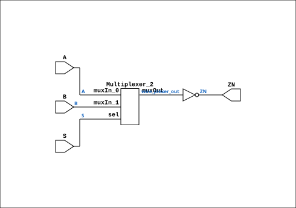

# MUX21LP

Source: `Verilog/Shared/ndlib/MUX21LP.v`

<!-- Generated by Verilog/tests/module_doc.py from the //! comments in the source. Do not edit by hand - edit the RTL comments and regenerate. -->

<!-- HIERARCHY-NAV:BEGIN - written by Verilog/tests/gen_hierarchy.py, do not edit -->

**Where it sits** (Simulation): [ND120_TOP](../../../doc/ND120_TOP.md) > [ND120_CORE](../../../doc/ND120_CORE.md) > [ND3202D](../../../CPU-BOARD-3202/circuit/doc/ND3202D.md) > [CPU_15](../../../CPU-BOARD-3202/circuit/doc/CPU_15.md) > [CPU_PROC_32](../../../CPU-BOARD-3202/circuit/doc/CPU_PROC_32.md) > [CPU_PROC_CGA_33](../../../CPU-BOARD-3202/circuit/doc/CPU_PROC_CGA_33.md) > [CGA](../../../DELILAH-CPU/CGA/circuit/doc/CGA.md) > [CGA_ALU](../../../DELILAH-CPU/CGA_ALU/circuit/doc/CGA_ALU.md) > **MUX21LP**
- instance path: `CORE.CPU_BOARD.CPU.PROC.CGA.DELILAH.ALU.AARG0_MUX`

**Used in:** [CGA_ALU](../../../DELILAH-CPU/CGA_ALU/circuit/doc/CGA_ALU.md) (all tops), [CGA_ALU_GPR](../../../DELILAH-CPU/CGA_ALU/circuit/doc/CGA_ALU_GPR.md) (all tops), [CGA_ALU_RALU_MUX216L](../../../DELILAH-CPU/CGA_ALU/circuit/doc/CGA_ALU_RALU_MUX216L.md) (all tops), [CGA_CPU_ALU_CONTR](../../../DELILAH-CPU/CGA_ALU/circuit/doc/CGA_CPU_ALU_CONTR.md) (all tops)

**Contains:** [Multiplexer_2](../../logisim/doc/Multiplexer_2.md)

[Module hierarchy](../../../HIERARCHY.md) - [All modules](../../../MODULES.md)

<!-- HIERARCHY-NAV:END -->


<!-- SCHEMATIC:BEGIN - written by Verilog/tests/gen_schematics.py, do not edit -->

## Schematic

Drawn from the Verilog: the yosys netlist of the Simulation (Verilator) build, instance `CORE.CPU_BOARD.CPU.PROC.CGA.DELILAH.ALU.AARG0_MUX`. Sub-modules are boxes (click the picture to open it full size; there every sub-module box links to its page, and every wire shows its Verilog name).

[](MUX21LP.svg)

<!-- SCHEMATIC:END -->

## Description

Component : MUX21LP  (2-to-1 Multiplexer NEGATED)

## Ports

| Direction | Width | Name | Description |
|---|---|---|---|
| input | `1` | `A` | Input A |
| input | `1` | `B` | Input B |
| input | `1` | `S` | Select input |
| output | `1` | `ZN` | Negated Output |

## Verilog source

[`Verilog/Shared/ndlib/MUX21LP.v`](https://github.com/RetroCoreLabs/nd-120/blob/main/Verilog/Shared/ndlib/MUX21LP.v) on GitHub.

<details markdown="1">
<summary>Show the Verilog of MUX21LP (25 lines)</summary>

```verilog
/******************************************************************************
 **                                                                          **
 ** Component : MUX21LP  (2-to-1 Multiplexer NEGATED)                                                     **
 **                                                                          **
 *****************************************************************************/

module MUX21LP( 
   input A,    // Input A
   input B,    // Input B
   input S,    // Select input
   output ZN   // Negated Output
   );

   wire wire_plexer_out;
   assign ZN = ~wire_plexer_out;

   Multiplexer_2   PLEXERS_1 (
                              .muxIn_0(A),
                              .muxIn_1(B),
                              .muxOut(wire_plexer_out),
                              .sel(S)
   );


endmodule
```

</details>
