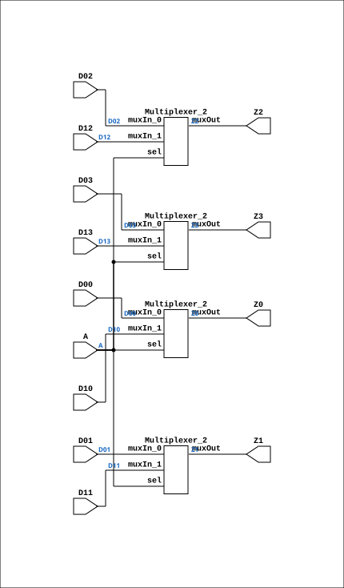

# MUX24P

Source: `Verilog/Shared/ndlib/MUX24P.v`

<!-- Generated by Verilog/tests/module_doc.py from the //! comments in the source. Do not edit by hand - edit the RTL comments and regenerate. -->

<!-- HIERARCHY-NAV:BEGIN - written by Verilog/tests/gen_hierarchy.py, do not edit -->

**Where it sits** (Simulation): [ND120_TOP](../../../doc/ND120_TOP.md) > [ND120_CORE](../../../doc/ND120_CORE.md) > [ND3202D](../../../CPU-BOARD-3202/circuit/doc/ND3202D.md) > [CPU_15](../../../CPU-BOARD-3202/circuit/doc/CPU_15.md) > [CPU_PROC_32](../../../CPU-BOARD-3202/circuit/doc/CPU_PROC_32.md) > [CPU_PROC_CGA_33](../../../CPU-BOARD-3202/circuit/doc/CPU_PROC_CGA_33.md) > [CGA](../../../DELILAH-CPU/CGA/circuit/doc/CGA.md) > [CGA_WRF](../../../DELILAH-CPU/CGA_WRF/circuit/doc/CGA_WRF.md) > [CGA_WRF_RBLOCK](../../../DELILAH-CPU/CGA_WRF/circuit/doc/CGA_WRF_RBLOCK.md) > [CGA_WRF_RBLOCK_LR16](../../../DELILAH-CPU/CGA_WRF/circuit/doc/CGA_WRF_RBLOCK_LR16.md) > **MUX24P**
- instance path: `CORE.CPU_BOARD.CPU.PROC.CGA.DELILAH.WRF.RBLOCK.B_REG_3.MUX_15_12`

**Used in:** [CGA_WRF_RBLOCK_LR16](../../../DELILAH-CPU/CGA_WRF/circuit/doc/CGA_WRF_RBLOCK_LR16.md) (all tops)

**Contains:** [Multiplexer_2](../../logisim/doc/Multiplexer_2.md) x4

[Module hierarchy](../../../HIERARCHY.md) - [All modules](../../../MODULES.md)

<!-- HIERARCHY-NAV:END -->


<!-- SCHEMATIC:BEGIN - written by Verilog/tests/gen_schematics.py, do not edit -->

## Schematic

Drawn from the Verilog: the yosys netlist of the Simulation (Verilator) build, instance `CORE.CPU_BOARD.CPU.PROC.CGA.DELILAH.WRF.RBLOCK.B_REG_3.MUX_15_12`. Sub-modules are boxes (click the picture to open it full size; there every sub-module box links to its page, and every wire shows its Verilog name).

[](MUX24P.svg)

<!-- SCHEMATIC:END -->

## Ports

| Direction | Width | Name | Description |
|---|---|---|---|
| input | `1` | `A` |  |
| input | `1` | `D00` |  |
| input | `1` | `D10` |  |
| output | `1` | `Z0` |  |

## Verilog source

[`Verilog/Shared/ndlib/MUX24P.v`](https://github.com/RetroCoreLabs/nd-120/blob/main/Verilog/Shared/ndlib/MUX24P.v) on GitHub.

<details markdown="1">
<summary>Show the Verilog of MUX24P (37 lines)</summary>

```verilog
module MUX24P(
    input A,
    input D00, D01, D02, D03,
    input D10, D11, D12, D13,
    output Z0, Z1, Z2, Z3
);

    // Instantiating four 2-to-1 multiplexers
    Multiplexer_2 PLEXER_1 (
        .muxIn_0(D00),
        .muxIn_1(D10),
        .muxOut(Z0),
        .sel(A)
    );

    Multiplexer_2 PLEXER_2 (
        .muxIn_0(D01),
        .muxIn_1(D11),
        .muxOut(Z1),
        .sel(A)
    );

    Multiplexer_2 PLEXER_3 (
        .muxIn_0(D02),
        .muxIn_1(D12),
        .muxOut(Z2),
        .sel(A)
    );

    Multiplexer_2 PLEXER_4 (
        .muxIn_0(D03),
        .muxIn_1(D13),
        .muxOut(Z3),
        .sel(A)
    );

endmodule
```

</details>
