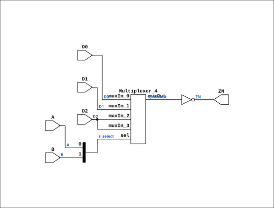

# MUX31LP

Source: `Verilog/Shared/ndlib/MUX31LP.v`

<!-- Generated by Verilog/tests/module_doc.py from the //! comments in the source. Do not edit by hand - edit the RTL comments and regenerate. -->

<!-- HIERARCHY-NAV:BEGIN - written by Verilog/tests/gen_hierarchy.py, do not edit -->

**Where it sits** (Simulation): [ND120_TOP](../../../doc/ND120_TOP.md) > [ND120_CORE](../../../doc/ND120_CORE.md) > [ND3202D](../../../CPU-BOARD-3202/circuit/doc/ND3202D.md) > [CPU_15](../../../CPU-BOARD-3202/circuit/doc/CPU_15.md) > [CPU_PROC_32](../../../CPU-BOARD-3202/circuit/doc/CPU_PROC_32.md) > [CPU_PROC_CGA_33](../../../CPU-BOARD-3202/circuit/doc/CPU_PROC_CGA_33.md) > [CGA](../../../DELILAH-CPU/CGA/circuit/doc/CGA.md) > [CGA_ALU](../../../DELILAH-CPU/CGA_ALU/circuit/doc/CGA_ALU.md) > [CGA_ALU_SHIFT](../../../DELILAH-CPU/CGA_ALU/circuit/doc/CGA_ALU_SHIFT.md) > **MUX31LP**
- instance path: `CORE.CPU_BOARD.CPU.PROC.CGA.DELILAH.ALU.ALU_SHIFT.RB0MUX`

**Used in:** [CGA_ALU_OUTMUX](../../../DELILAH-CPU/CGA_ALU/circuit/doc/CGA_ALU_OUTMUX.md) (all tops), [CGA_ALU_SHIFT](../../../DELILAH-CPU/CGA_ALU/circuit/doc/CGA_ALU_SHIFT.md) (all tops), [CGA_ALU_STS](../../../DELILAH-CPU/CGA_ALU/circuit/doc/CGA_ALU_STS.md) (all tops), [CGA_WRF_RBLOCK_PREG](../../../DELILAH-CPU/CGA_WRF/circuit/doc/CGA_WRF_RBLOCK_PREG.md) (all tops)

**Contains:** [Multiplexer_4](../../logisim/doc/Multiplexer_4.md)

[Module hierarchy](../../../HIERARCHY.md) - [All modules](../../../MODULES.md)

<!-- HIERARCHY-NAV:END -->


<!-- SCHEMATIC:BEGIN - written by Verilog/tests/gen_schematics.py, do not edit -->

## Schematic

Drawn from the Verilog: the yosys netlist of the Simulation (Verilator) build, instance `CORE.CPU_BOARD.CPU.PROC.CGA.DELILAH.ALU.ALU_SHIFT.RB0MUX`. Sub-modules are boxes (click the picture to open it full size; there every sub-module box links to its page, and every wire shows its Verilog name).

[](MUX31LP.svg)

<!-- SCHEMATIC:END -->

## Description

Component : MUX31LP
Manually cleaned up from logisim generator that creates wires not used..

## Ports

| Direction | Width | Name | Description |
|---|---|---|---|
| input | `1` | `B` |  |
| input | `1` | `D0` |  |
| input | `1` | `D1` |  |
| input | `1` | `D2` |  |
| output | `1` | `ZN` |  |

## Verilog source

[`Verilog/Shared/ndlib/MUX31LP.v`](https://github.com/RetroCoreLabs/nd-120/blob/main/Verilog/Shared/ndlib/MUX31LP.v) on GitHub.

<details markdown="1">
<summary>Show the Verilog of MUX31LP (40 lines)</summary>

```verilog
/******************************************************************************
 **                                                                          **
 ** Component : MUX31LP                                                      **
 **                                                                          **
 ** Manually cleaned up from logisim generator that creates wires not used.. **
 *****************************************************************************/

module MUX31LP( input A,
                input B,
                input D0,
                input D1,
                input D2,
                output ZN );

   wire [1:0] s_select;
   wire       s_d0;
   wire       s_d1;
   wire       s_d2;         

   wire       s_muxout;   

   assign s_select[0]   = A;
   assign s_select[1]   = B;
   assign s_d0          = D0;   
   assign s_d1          = D1;
   assign s_d2          = D2;

   assign ZN = ~s_muxout;


   Multiplexer_4   PLEXERS_1 (
                              .muxIn_0(s_d0),
                              .muxIn_1(s_d1),
                              .muxIn_2(s_d2),
                              .muxIn_3(s_d2),
                              .muxOut(s_muxout),
                              .sel(s_select[1:0]));


endmodule
```

</details>
