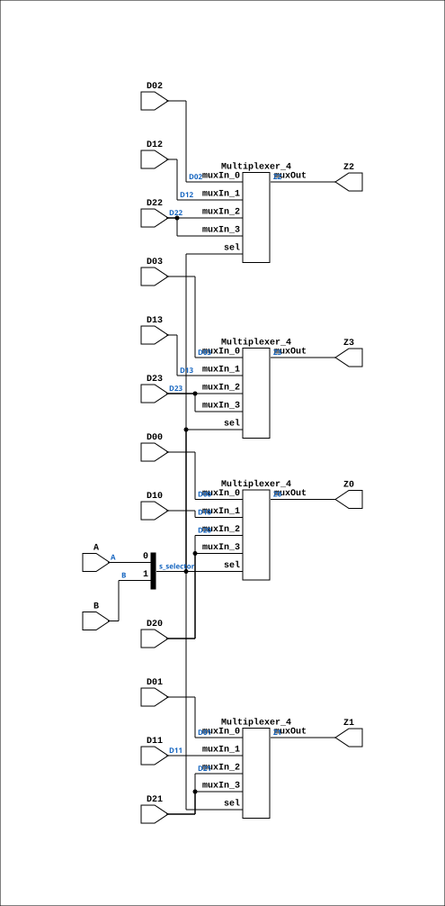

# MUX34P

Source: `Verilog/Shared/ndlib/MUX34P.v`

<!-- Generated by Verilog/tests/module_doc.py from the //! comments in the source. Do not edit by hand - edit the RTL comments and regenerate. -->

<!-- HIERARCHY-NAV:BEGIN - written by Verilog/tests/gen_hierarchy.py, do not edit -->

**Where it sits** (Simulation): [ND120_TOP](../../../doc/ND120_TOP.md) > [ND120_CORE](../../../doc/ND120_CORE.md) > [ND3202D](../../../CPU-BOARD-3202/circuit/doc/ND3202D.md) > [CPU_15](../../../CPU-BOARD-3202/circuit/doc/CPU_15.md) > [CPU_PROC_32](../../../CPU-BOARD-3202/circuit/doc/CPU_PROC_32.md) > [CPU_PROC_CGA_33](../../../CPU-BOARD-3202/circuit/doc/CPU_PROC_CGA_33.md) > [CGA](../../../DELILAH-CPU/CGA/circuit/doc/CGA.md) > [CGA_MIC](../../../DELILAH-CPU/CGA_MIC/circuit/doc/CGA_MIC.md) > **MUX34P**
- instance path: `CORE.CPU_BOARD.CPU.PROC.CGA.DELILAH.MIC.ILC_MUX`

**Used in:** [CGA_MIC](../../../DELILAH-CPU/CGA_MIC/circuit/doc/CGA_MIC.md) (all tops)

**Contains:** [Multiplexer_4](../../logisim/doc/Multiplexer_4.md) x4

[Module hierarchy](../../../HIERARCHY.md) - [All modules](../../../MODULES.md)

<!-- HIERARCHY-NAV:END -->


<!-- SCHEMATIC:BEGIN - written by Verilog/tests/gen_schematics.py, do not edit -->

## Schematic

Drawn from the Verilog: the yosys netlist of the Simulation (Verilator) build, instance `CORE.CPU_BOARD.CPU.PROC.CGA.DELILAH.MIC.ILC_MUX`. Sub-modules are boxes (click the picture to open it full size; there every sub-module box links to its page, and every wire shows its Verilog name).

[](MUX34P.svg)

<!-- SCHEMATIC:END -->

## Description

ND120 Shared
Component: MUX34P
Last reviewed: 2-FEB-2025
Ronny Hansen

## Ports

| Direction | Width | Name | Description |
|---|---|---|---|
| input | `1` | `A` |  |
| input | `1` | `B` |  |
| input | `1` | `D00` |  |
| input | `1` | `D01` |  |
| input | `1` | `D02` |  |
| input | `1` | `D03` |  |
| input | `1` | `D10` |  |
| input | `1` | `D11` |  |
| input | `1` | `D12` |  |
| input | `1` | `D13` |  |
| input | `1` | `D20` |  |
| input | `1` | `D21` |  |
| input | `1` | `D22` |  |
| input | `1` | `D23` |  |
| output | `1` | `Z0` |  |
| output | `1` | `Z1` |  |
| output | `1` | `Z2` |  |
| output | `1` | `Z3` |  |

## Verilog source

[`Verilog/Shared/ndlib/MUX34P.v`](https://github.com/RetroCoreLabs/nd-120/blob/main/Verilog/Shared/ndlib/MUX34P.v) on GitHub.

<details markdown="1">
<summary>Show the Verilog of MUX34P (124 lines)</summary>

```verilog
/**************************************************************************
** ND120 Shared                                                          **
**                                                                       **
** Component: MUX34P                                                     **
**                                                                       **
** Last reviewed: 2-FEB-2025                                             **
** Ronny Hansen                                                          **
***************************************************************************/

module MUX34P (
    input A,
    input B,
    input D00,
    input D01,
    input D02,
    input D03,
    input D10,
    input D11,
    input D12,
    input D13,
    input D20,
    input D21,
    input D22,
    input D23,


    output Z0,
    output Z1,
    output Z2,
    output Z3
);

  /*******************************************************************************
   ** The wires are defined here                                                 **
   *******************************************************************************/
  wire [1:0] s_selector;
  wire       s_d00;
  wire       s_d01;
  wire       s_d02;
  wire       s_d03;
  wire       s_d10;
  wire       s_d11;
  wire       s_d12;
  wire       s_d13;
  wire       s_d20;
  wire       s_d21;
  wire       s_d22;
  wire       s_d23;
  wire       s_muxout_1;
  wire       s_muxout_2;
  wire       s_muxout_3;
  wire       s_muxout_4;

  /*******************************************************************************
   ** Here all input connections are defined                                     **
   *******************************************************************************/
  assign s_selector[0] = A;
  assign s_selector[1] = B;
  assign s_d00    = D00;
  assign s_d01    = D01;
  assign s_d02    = D02;
  assign s_d03    = D03;
  assign s_d10    = D10;
  assign s_d11    = D11;
  assign s_d12    = D12;
  assign s_d13    = D13;
  assign s_d20    = D20;
  assign s_d21    = D21;
  assign s_d22    = D22;
  assign s_d23    = D23;

  /*******************************************************************************
   ** Here all output connections are defined                                    **
   *******************************************************************************/
  assign Z0 = s_muxout_1;
  assign Z1 = s_muxout_2;
  assign Z2 = s_muxout_3;
  assign Z3 = s_muxout_4;

  /*******************************************************************************
   ** Here all in-lined components are defined                                   **
   *******************************************************************************/

  /*******************************************************************************
   ** Here all normal components are defined                                     **
   *******************************************************************************/
  Multiplexer_4 PLEXERS_1 (
      .muxIn_0(s_d00),
      .muxIn_1(s_d10),
      .muxIn_2(s_d20),
      .muxIn_3(s_d20),
      .muxOut(s_muxout_1),
      .sel(s_selector[1:0])
  );

  Multiplexer_4 PLEXERS_2 (
      .muxIn_0(s_d01),
      .muxIn_1(s_d11),
      .muxIn_2(s_d21),
      .muxIn_3(s_d21),
      .muxOut(s_muxout_2),
      .sel(s_selector[1:0])
  );

  Multiplexer_4 PLEXERS_3 (
      .muxIn_0(s_d02),
      .muxIn_1(s_d12),
      .muxIn_2(s_d22),
      .muxIn_3(s_d22),
      .muxOut(s_muxout_3),
      .sel(s_selector[1:0])
  );

  Multiplexer_4 PLEXERS_4 (
      .muxIn_0(s_d03),
      .muxIn_1(s_d13),
      .muxIn_2(s_d23),
      .muxIn_3(s_d23),
      .muxOut(s_muxout_4),
      .sel(s_selector[1:0])
  );


endmodule
```

</details>
