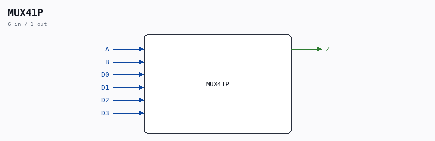

# MUX41P

Source: `Verilog/Shared/ndlib/MUX41P.v`

> Generated by `Verilog/tests/module_doc.py` from the `//!`
> comments in the source. Do not edit by hand - edit the RTL comments and regenerate.

<!-- HIERARCHY-NAV:BEGIN - written by Verilog/tests/gen_hierarchy.py, do not edit -->

**Where it sits** (Simulation): [ND120_TOP](../../../doc/ND120_TOP.md) > [ND120_CORE](../../../doc/ND120_CORE.md) > [ND3202D](../../../CPU-BOARD-3202/circuit/doc/ND3202D.md) > [CPU_15](../../../CPU-BOARD-3202/circuit/doc/CPU_15.md) > [CPU_PROC_32](../../../CPU-BOARD-3202/circuit/doc/CPU_PROC_32.md) > [CPU_PROC_CGA_33](../../../CPU-BOARD-3202/circuit/doc/CPU_PROC_CGA_33.md) > [CGA](../../../DELILAH-CPU/CGA/circuit/doc/CGA.md) > [CGA_MIC](../../../DELILAH-CPU/CGA_MIC/circuit/doc/CGA_MIC.md) > **MUX41P**
- instance path: `CORE.CPU_BOARD.CPU.PROC.CGA.DELILAH.MIC.M_LAA_3`

**Used in:** [CGA_ALU_GPR](../../../DELILAH-CPU/CGA_ALU/circuit/doc/CGA_ALU_GPR.md) (all tops), [CGA_ALU_QREG](../../../DELILAH-CPU/CGA_ALU/circuit/doc/CGA_ALU_QREG.md) (all tops), [CGA_ALU_RALU_LOGOP](../../../DELILAH-CPU/CGA_ALU/circuit/doc/CGA_ALU_RALU_LOGOP.md) (all tops), [CGA_ALU_SMUX](../../../DELILAH-CPU/CGA_ALU/circuit/doc/CGA_ALU_SMUX.md) (all tops), [CGA_ALU_STS](../../../DELILAH-CPU/CGA_ALU/circuit/doc/CGA_ALU_STS.md) (all tops), [CGA_CPU_ALU_CONTR](../../../DELILAH-CPU/CGA_ALU/circuit/doc/CGA_CPU_ALU_CONTR.md) (all tops), [CGA_MIC](../../../DELILAH-CPU/CGA_MIC/circuit/doc/CGA_MIC.md) (all tops)

**Contains:** [Multiplexer_4](../../logisim/doc/Multiplexer_4.md)

[Module hierarchy](../../../HIERARCHY.md) - [All modules](../../../MODULES.md)

<!-- HIERARCHY-NAV:END -->

## Description

Component : MUX41P

## Ports

| Direction | Width | Name | Description |
|---|---|---|---|
| input | `1` | `A` |  |
| output | `1` | `Z` |  |
| input | `1` | `B` | UNDECLARED in source |
| input | `1` | `D0` | UNDECLARED in source |
| input | `1` | `D1` | UNDECLARED in source |
| input | `1` | `D2` | UNDECLARED in source |
| input | `1` | `D3` | UNDECLARED in source |
