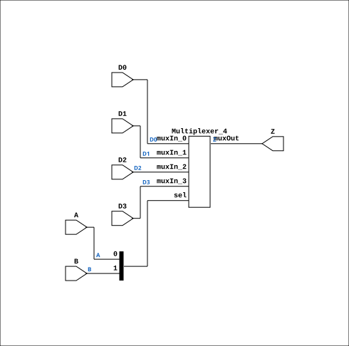

# MUX41P

Source: `Verilog/Shared/ndlib/MUX41P.v`

<!-- Generated by Verilog/tests/module_doc.py from the //! comments in the source. Do not edit by hand - edit the RTL comments and regenerate. -->

<!-- HIERARCHY-NAV:BEGIN - written by Verilog/tests/gen_hierarchy.py, do not edit -->

**Where it sits** (Simulation): [ND120_TOP](../../../doc/ND120_TOP.md) > [ND120_CORE](../../../doc/ND120_CORE.md) > [ND3202D](../../../CPU-BOARD-3202/circuit/doc/ND3202D.md) > [CPU_15](../../../CPU-BOARD-3202/circuit/doc/CPU_15.md) > [CPU_PROC_32](../../../CPU-BOARD-3202/circuit/doc/CPU_PROC_32.md) > [CPU_PROC_CGA_33](../../../CPU-BOARD-3202/circuit/doc/CPU_PROC_CGA_33.md) > [CGA](../../../DELILAH-CPU/CGA/circuit/doc/CGA.md) > [CGA_MIC](../../../DELILAH-CPU/CGA_MIC/circuit/doc/CGA_MIC.md) > **MUX41P**
- instance path: `CORE.CPU_BOARD.CPU.PROC.CGA.DELILAH.MIC.M_LAA_3`

**Used in:** [CGA_ALU_GPR](../../../DELILAH-CPU/CGA_ALU/circuit/doc/CGA_ALU_GPR.md) (all tops), [CGA_ALU_QREG](../../../DELILAH-CPU/CGA_ALU/circuit/doc/CGA_ALU_QREG.md) (all tops), [CGA_ALU_RALU_LOGOP](../../../DELILAH-CPU/CGA_ALU/circuit/doc/CGA_ALU_RALU_LOGOP.md) (all tops), [CGA_ALU_SMUX](../../../DELILAH-CPU/CGA_ALU/circuit/doc/CGA_ALU_SMUX.md) (all tops), [CGA_ALU_STS](../../../DELILAH-CPU/CGA_ALU/circuit/doc/CGA_ALU_STS.md) (all tops), [CGA_CPU_ALU_CONTR](../../../DELILAH-CPU/CGA_ALU/circuit/doc/CGA_CPU_ALU_CONTR.md) (all tops), [CGA_MIC](../../../DELILAH-CPU/CGA_MIC/circuit/doc/CGA_MIC.md) (all tops)

**Contains:** [Multiplexer_4](../../logisim/doc/Multiplexer_4.md)

[Module hierarchy](../../../HIERARCHY.md) - [All modules](../../../MODULES.md)

<!-- HIERARCHY-NAV:END -->


<!-- SCHEMATIC:BEGIN - written by Verilog/tests/gen_schematics.py, do not edit -->

## Schematic

Drawn from the Verilog: the yosys netlist of the Simulation (Verilator) build, instance `CORE.CPU_BOARD.CPU.PROC.CGA.DELILAH.MIC.M_LAA_3`. Sub-modules are boxes (click the picture to open it full size; there every sub-module box links to its page, and every wire shows its Verilog name).

[](MUX41P.svg)

<!-- SCHEMATIC:END -->

## Description

Component : MUX41P

## Ports

| Direction | Width | Name | Description |
|---|---|---|---|
| input | `1` | `A` |  |
| input | `1` | `B` |  |
| input | `1` | `D0` |  |
| input | `1` | `D1` |  |
| input | `1` | `D2` |  |
| input | `1` | `D3` |  |
| output | `1` | `Z` |  |

## Verilog source

[`Verilog/Shared/ndlib/MUX41P.v`](https://github.com/RetroCoreLabs/nd-120/blob/main/Verilog/Shared/ndlib/MUX41P.v) on GitHub.

<details markdown="1">
<summary>Show the Verilog of MUX41P (26 lines)</summary>

```verilog

/******************************************************************************
 **                                                                          **
 ** Component : MUX41P                                                       **
 **                                                                          **
 *****************************************************************************/

module MUX41P(A, B, D0, D1, D2, D3, Z);

   // Inputs
   input A, B, D0, D1, D2, D3;

   // Output
   output Z;

   // 4-to-1 Multiplexer
   Multiplexer_4 PLEXER (
      .muxIn_0(D0),
      .muxIn_1(D1),
      .muxIn_2(D2),
      .muxIn_3(D3),
      .muxOut(Z),
      .sel({B, A})
   );

endmodule
```

</details>
