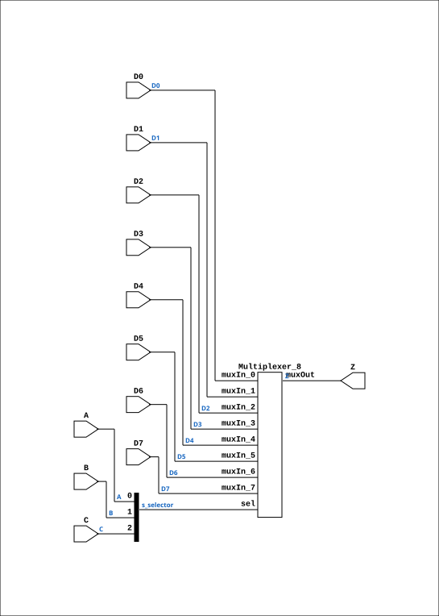

# MUX81

Source: `Verilog/Shared/ndlib/MUX81.v`

<!-- Generated by Verilog/tests/module_doc.py from the //! comments in the source. Do not edit by hand - edit the RTL comments and regenerate. -->

<!-- HIERARCHY-NAV:BEGIN - written by Verilog/tests/gen_hierarchy.py, do not edit -->

**Where it sits** (Simulation): [ND120_TOP](../../../doc/ND120_TOP.md) > [ND120_CORE](../../../doc/ND120_CORE.md) > [ND3202D](../../../CPU-BOARD-3202/circuit/doc/ND3202D.md) > [CPU_15](../../../CPU-BOARD-3202/circuit/doc/CPU_15.md) > [CPU_PROC_32](../../../CPU-BOARD-3202/circuit/doc/CPU_PROC_32.md) > [CPU_PROC_CGA_33](../../../CPU-BOARD-3202/circuit/doc/CPU_PROC_CGA_33.md) > [CGA](../../../DELILAH-CPU/CGA/circuit/doc/CGA.md) > [CGA_TESTMUX](../../../DELILAH-CPU/CGA_TESTMUX/circuit/doc/CGA_TESTMUX.md) > **MUX81**
- instance path: `CORE.CPU_BOARD.CPU.PROC.CGA.DELILAH.TESTMUX.TM2`

**Used in:** [CGA_TESTMUX](../../../DELILAH-CPU/CGA_TESTMUX/circuit/doc/CGA_TESTMUX.md) (all tops)

**Contains:** [Multiplexer_8](../../logisim/doc/Multiplexer_8.md)

[Module hierarchy](../../../HIERARCHY.md) - [All modules](../../../MODULES.md)

<!-- HIERARCHY-NAV:END -->


<!-- SCHEMATIC:BEGIN - written by Verilog/tests/gen_schematics.py, do not edit -->

## Schematic

Drawn from the Verilog: the yosys netlist of the Simulation (Verilator) build, instance `CORE.CPU_BOARD.CPU.PROC.CGA.DELILAH.TESTMUX.TM2`. Sub-modules are boxes (click the picture to open it full size; there every sub-module box links to its page, and every wire shows its Verilog name).

[](MUX81.svg)

<!-- SCHEMATIC:END -->

## Description

ND120 Shared
Component: MUX81
Last reviewed: 9-NOV-2024
Ronny Hansen

## Ports

| Direction | Width | Name | Description |
|---|---|---|---|
| input | `1` | `A` |  |
| input | `1` | `B` |  |
| input | `1` | `C` |  |
| input | `1` | `D0` |  |
| input | `1` | `D1` |  |
| input | `1` | `D2` |  |
| input | `1` | `D3` |  |
| input | `1` | `D4` |  |
| input | `1` | `D5` |  |
| input | `1` | `D6` |  |
| input | `1` | `D7` |  |
| output | `1` | `Z` |  |

## Verilog source

[`Verilog/Shared/ndlib/MUX81.v`](https://github.com/RetroCoreLabs/nd-120/blob/main/Verilog/Shared/ndlib/MUX81.v) on GitHub.

<details markdown="1">
<summary>Show the Verilog of MUX81 (81 lines)</summary>

```verilog
/**************************************************************************
** ND120 Shared                                                          **
**                                                                       **
** Component: MUX81                                                      **
**                                                                       **
** Last reviewed: 9-NOV-2024                                             **
** Ronny Hansen                                                          **
***************************************************************************/

module MUX81 (
    input A,
    input B,
    input C,
    input D0,
    input D1,
    input D2,
    input D3,
    input D4,
    input D5,
    input D6,
    input D7,

    output Z
);

  /*******************************************************************************
   ** The wires are defined here                                                 **
   *******************************************************************************/
  wire [2:0] s_selector;
  wire       s_d0;
  wire       s_d1;
  wire       s_d2;
  wire       s_d3;
  wire       s_d4;
  wire       s_d5;
  wire       s_d6;
  wire       s_d7;
  wire       s_mux_out;

  /*******************************************************************************
   ** The module functionality is described here                                 **
   *******************************************************************************/

  /*******************************************************************************
   ** Here all input connections are defined                                     **
   *******************************************************************************/
  assign s_selector[0] = A;
  assign s_selector[1] = B;
  assign s_selector[2] = C;
  assign s_d0    = D0;
  assign s_d1    = D1;
  assign s_d2    = D2;
  assign s_d3    = D3;
  assign s_d4    = D4;
  assign s_d5    = D5;
  assign s_d6    = D6;
  assign s_d7    = D7;

  /*******************************************************************************
   ** Here all output connections are defined                                    **
   *******************************************************************************/
  assign Z = s_mux_out;

  /*******************************************************************************
   ** Here all normal components are defined                                     **
   *******************************************************************************/
  Multiplexer_8 PLEXERS_1 (
      .muxIn_0(s_d0),
      .muxIn_1(s_d1),
      .muxIn_2(s_d2),
      .muxIn_3(s_d3),
      .muxIn_4(s_d4),
      .muxIn_5(s_d5),
      .muxIn_6(s_d6),
      .muxIn_7(s_d7),
      .muxOut(s_mux_out),
      .sel(s_selector[2:0])
  );


endmodule
```

</details>
