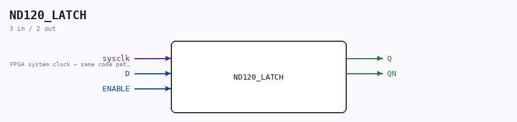
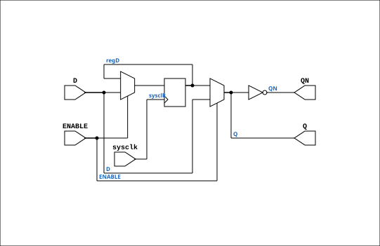

# ND120_LATCH

Source: `Verilog/Shared/ndlib/LATCH.v`

<!-- Generated by Verilog/tests/module_doc.py from the //! comments in the source. Do not edit by hand - edit the RTL comments and regenerate. -->

<!-- HIERARCHY-NAV:BEGIN - written by Verilog/tests/gen_hierarchy.py, do not edit -->

**Where it sits** (MiSTer): [emu](../../../fpga/mister/doc/emu.md) > [ND120_CORE](../../../doc/ND120_CORE.md) > [ND3202D](../../../CPU-BOARD-3202/circuit/doc/ND3202D.md) > [CPU_15](../../../CPU-BOARD-3202/circuit/doc/CPU_15.md) > [CPU_PROC_32](../../../CPU-BOARD-3202/circuit/doc/CPU_PROC_32.md) > [CPU_PROC_CGA_33](../../../CPU-BOARD-3202/circuit/doc/CPU_PROC_CGA_33.md) > [CGA](../../../DELILAH-CPU/CGA/circuit/doc/CGA.md) > [CGA_MIC](../../../DELILAH-CPU/CGA_MIC/circuit/doc/CGA_MIC.md) > [CGA_MIC_CSEL](../../../DELILAH-CPU/CGA_MIC/circuit/doc/CGA_MIC_CSEL.md) > **ND120_LATCH**
- instance path: `CORE.CPU_BOARD.CPU.PROC.CGA.DELILAH.MIC.CSEL.CSEL_LATCH`

**Used in:** [CGA_MIC_CSEL](../../../DELILAH-CPU/CGA_MIC/circuit/doc/CGA_MIC_CSEL.md) (MiSTer)

**Contains:** no other modules.

[Module hierarchy](../../../HIERARCHY.md) - [All modules](../../../MODULES.md)

<!-- HIERARCHY-NAV:END -->



<!-- SCHEMATIC:BEGIN - written by Verilog/tests/gen_schematics.py, do not edit -->

## Schematic

Drawn from the Verilog: the yosys netlist of the MiSTer build, instance `CORE.CPU_BOARD.CPU.PROC.CGA.DELILAH.MIC.CSEL.CSEL_LATCH`. Sub-modules are boxes (click the picture to open it full size; there every sub-module box links to its page, and every wire shows its Verilog name).

[](ND120_LATCH.svg)

<!-- SCHEMATIC:END -->

## Description

ND120 Shared
Component LATCH
Last reviewed: 24-NOV-2024
Ronny Hansen

## Ports

| Direction | Width | Name | Description |
|---|---|---|---|
| input | `1` | `sysclk` | FPGA system clock — same code path for sim and FPGA |
| input | `1` | `D` |  |
| input | `1` | `ENABLE` |  |
| output | `1` | `Q` |  |
| output | `1` | `QN` |  |

## Verilog source

[`Verilog/Shared/ndlib/LATCH.v`](https://github.com/RetroCoreLabs/nd-120/blob/main/Verilog/Shared/ndlib/LATCH.v) on GitHub.

<details markdown="1">
<summary>Show the Verilog of ND120_LATCH (77 lines)</summary>

```verilog
/**************************************************************************
** ND120 Shared                                                          **
**                                                                       **
** Component LATCH                                                       **
**                                                                       **
** Last reviewed: 24-NOV-2024                                            **
** Ronny Hansen                                                          **
***************************************************************************/

// QUARTUS_LATCH_RENAME (31-AUG-2026, MiSTer build 2): Quartus Prime has a
// built-in WYSIWYG primitive named exactly "LATCH" (3-port: d/ena/q) that
// silently wins over a same-named user module - "Port ENABLE does not exist
// in primitive LATCH" is Quartus telling you it resolved the instance to ITS
// primitive, not this one. A PLAIN rename was tried first and reverted: it
// broke every -y library build under Verilator (CPU_PROC_32/sim and others)
// - that tool's -y module search requires the FILENAME to match the module
// name, and this file stays LATCH.v for every other toolchain, so renaming
// the module alone made it go looking for a nonexistent ND120_LATCH.v.
// Gated instead: LATCH everywhere except a Quartus build, which defines
// QUARTUS_LATCH_RENAME (nd120.qsf) and gets ND120_LATCH. Only one real
// instantiation exists in the whole repo (CGA_MIC_CSEL.v), gated the same way.
`ifdef QUARTUS_LATCH_RENAME
module ND120_LATCH (
`else
module LATCH (
`endif
    input  wire sysclk,    //! FPGA system clock — same code path for sim and FPGA
    input  wire D,
    input  wire ENABLE,
    output wire Q,
    output wire QN
);

  // Level-sensitive sysclk capture (matches L4.v / L8.v).
  //
  // Replaces the previous `always @(posedge ENABLE)` pattern which routed
  // ENABLE through fabric as a clock signal — unsafe on FPGA (no clock
  // network, glitch-prone, hold-time analysis incomplete).
  //
  // Semantics: while ENABLE is high, regD tracks D on every sysclk edge
  // (effectively transparent on a 1-sysclk grain). When ENABLE is low,
  // regD holds. This is the closest synchronous approximation to the
  // original 74xx transparent-latch behaviour.
  //
  // Edge-detect was tried first and broke LCS loading, because during
  // LCS load `s_aluclk_n` is held high constantly — no rising edge ever
  // appears, so an edge-detect FF never fires and CSEL_Q stayed at its
  // init value. Level-sensitive capture has no such failure mode: it
  // tracks D throughout the high window.

  reg regD = 1'b0;

`ifdef USE_TRANSPARENT_LATCHES
  // TRUE transparent latch (the original 74xx behaviour): while ENABLE high, Q
  // follows D combinationally; when ENABLE falls, Q holds. This is the correct
  // reference model with no sysclk-sampling race. FPGA path below keeps the
  // synchronous approximation.
  always @(*) begin
    if (ENABLE) regD = D;
  end
`else
  always @(posedge sysclk) begin
    if (ENABLE) regD <= D;
  end
`endif

`ifdef USE_TRANSPARENT_LATCHES
  assign Q  = regD;
  assign QN = ~regD;
`else
  // FPGA: synthesizable transparent latch = mux + FF (Q follows D while ENABLE high)
  wire q = ENABLE ? D : regD;
  assign Q  = q;
  assign QN = ~q;
`endif

endmodule
```

</details>
